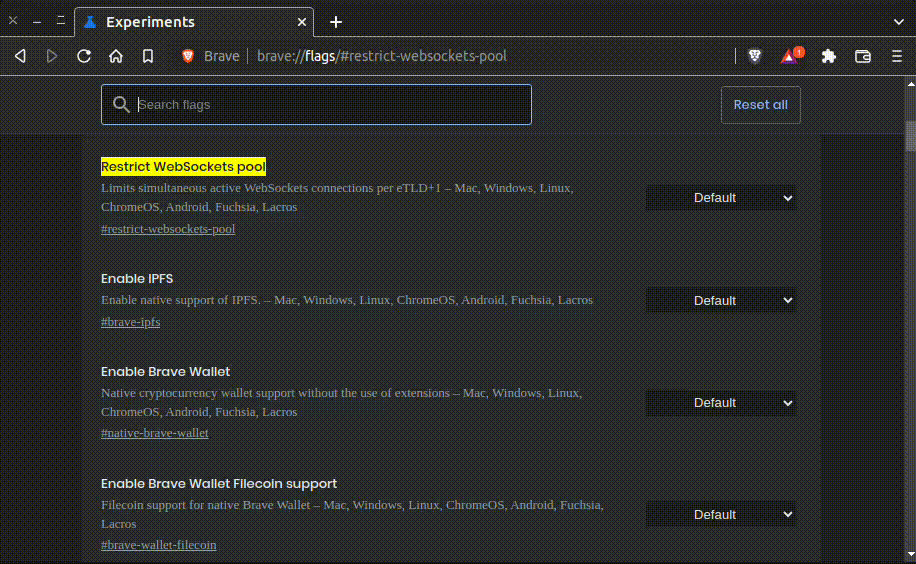

Substrate is a modular framework for creating use-case optimized blockchains at a low cost, by composing custom or pre-built components. Substrate is the backbone that powers Polkadot, a next-generation, heterogeneous, multi-chain network, and its ecosystem.

## Wasm Light Clients

Substrate-connect turns a browser into a node on a network allowing end-users of Web3 apps to interact with blockchains directly - without connecting to third-party remote nodes and other servers. Removing intermediary servers between network and its users improves security, simplifies infrastructure of a network and lowers its maintenance costs. Decentralized in-browser light clients are a unique feature of substrate-based networks.

[What is a light client and why you should care? by Thibault Sardan](https://www.parity.io/what-is-a-light-client/)

## Well known Networks

* [Polkadot](https://polkadot.network/) (`polkadot`)
* [Kusama](https://kusama.network/) (`ksmc33`)
* [Westend](https://wiki.polkadot.network/docs/en/maintain-networks#westend-test-network) (`westend2`)
* [Rococo](https://polkadot.network/rococo-v1-a-holiday-gift-to-the-polkadot-community/) (`rococo_v2_2`)

[WellKnownChain enumeration docs](https://paritytech.github.io/substrate-connect/api/enums/connect_src.WellKnownChain.html)

You have to provide a well-known chain name (`polkadot` for Polkadot, `ksmcc3` for Kusama, `westend2` for Westend and `rococo_v2_2` for Rococo). Note that these are the "real" names of the chains rather than the names they are more commonly known as (such as Kusama or Rococo). For example, "ksmcc3" is the name of Kusama. This is important for chains which have been hard forked. For example, "rococo_v2" and "rococo_v2_2" are two different chains.

## Usage with PolkadotJS API (PolkadotJS provider)

For using `substrate-connect` with the existing polkadotJS api, there is an rpc-provider that has `substrate-connect` already integrated. You can use that by installing in your app, the following packages:
#### **@polkadot/rpc-provider**
This package contains the `substrate-connect` rpc provider that integrates and uses substrate-connect:
```bash
yarn add @polkadot/rpc-provider
```
*or*
```bash
npm i @polkadot/rpc-provider
```

#### **@polkadot/api**

This library provides a clean wrapper around all the methods exposed by a Polkadot/Substrate network client. It is used with the outcome of rpc-provider above

```bash
yarn add @polkadot/api
```
*or*
```bash
npm i @polkadot/api
```

Below are some examples that shows how the rpc-provider can be used simply with the already integrated networks (e.g. polkadot, kusama, westend, rococo), or with a custom chain by using its chainspec, or connecting to a parachain."

*Simple usage (Using an integrated, suported chain)*
```js
import { ScProvider, WellKnownChain } from '@polkadot/rpc-provider/substrate-connect';
import { ApiPromise } from '@polkadot/api';
// Create the provider for a known chain
const provider = new ScProvider(WellKnownChain.westend2);
// Stablish the connection (and catch possible errors)
await provider.connect()
// Create the PolkadotJS api instance
const api = await ApiPromise.create({ provider });
await api.rpc.chain.subscribeNewHeads((lastHeader) => {
console.log(lastHeader.hash);
});
await api.disconnect();
```

*Simple usage (custom chain/chainspec)*
```js
import { ScProvider } from '@polkadot/rpc-provider/substrate-connect';
import { ApiPromise } from '@polkadot/api';
import jsonCustomSpec from './jsonCustomSpec.json';
// Create the provider for the custom chain
const customSpec = JSON.stringify(jsonCustomSpec);
const provider = new ScProvider(customSpec);
// Stablish the connection (and catch possible errors)
await provider.connect()
// Create the PolkadotJS api instance
const api = await ApiPromise.create({ provider });
await api.rpc.chain.subscribeNewHeads((lastHeader) => {
console.log(lastHeader.hash);
});
await api.disconnect();
```

*Parachains usage*

```js
import { ScProvider, WellKnownChain } from '@polkadot/rpc-provider/substrate-connect';
import { ApiPromise } from '@polkadot/api';
import jsonParachainSpec from './jsonParachainSpec.json';
// Create the provider for the relay chain
const relayProvider = new ScProvider(WellKnownChain.westend2);
// Create the provider for the parachain. Notice that
// we must pass the provider of the relay chain as the
// second argument
const parachainSpec = JSON.stringify(jsonParachainSpec);
const provider = new ScProvider(parachainSpec, relayProvider);
// Stablish the connection (and catch possible errors)
await provider.connect()
// Create the PolkadotJS api instance
const api = await ApiPromise.create({ provider });
await api.rpc.chain.subscribeNewHeads((lastHeader) => {
console.log(lastHeader.hash);
});
await api.disconnect();
```

## Advanced Usage

At the section above, `@polkadot/rpc-provider/substrate-connect` was used, because this provider makes if straightforward to create applications that interact with the chain using the Polkadot-JS API. For more advanced application development that doesn't depend on the Polkadot-JS API, you can install and use @substrate-connect. For example, if you are building your own application library or programming interfaces, you should install the Substrate Connect dependencies by running the following command:


```bash
yarn add @substrate/connect
```
or
```bash
npm i @substrate/connect
```

*Connecting to a `WellKnownChain`*

```js
import { WellKnownChain, createScClient } from '@substrate/connect';
// Create the client
const client = createScClient();
// Create the chain connection, while passing the `jsonRpcCallback` function.
const chain = await client.addWellKnownChain(
WellKnownChain.polkadot,
function jsonRpcCallback(response) {
console.log('response', response);
}
);
// send a RpcRequest
chain.sendJsonRpc(
'{"jsonrpc":"2.0","id":"1","method":"system_health","params":[]}'
);
```

*Connecting to a parachain*

```js
import { WellKnownChain, createScClient } from '@substrate/connect';
import jsonParachainSpec from './jsonParachainSpec.json';
// Create the client
const client = createScClient();
// Create the relay chain connection. There is no need to pass a callback
// function because we will sending and receiving messages through
// the parachain connection.
await client.addWellKnownChain(WellKnownChain.westend2);
// Create the parachain connection.
const parachainSpec = JSON.stringify(jsonParachainSpec);
const chain = await client.addChain(
parachainSpec,
function jsonRpcCallback(response) {
console.log('response', response);
}
);
// send a request
chain.sendJsonRpc(
'{"jsonrpc":"2.0","id":"1","method":"system_health","params":[]}'
);
```

## API Documentation

For learning more about substrate-connect`s API and usage follow [this link](https://paritytech.github.io/substrate-connect/api/).

## Browser Extension

For in-browser use, Substrate Connect provides a Browser Extension built upon the @substrate/light node module that is running the selected light clients inside the extension so that the end-user does not need to fire up a light node in every browser tab. This will also allow the light-node to keep syncing as long as the browser window stays open. You can download the Chrome and Firefox extensions [here](https://substrate.io/developers/substrate-connect/) or find more info on the [Github repo](https://github.com/paritytech/substrate-connect/tree/main/projects/extension).

## Projects

* [Burnr](https://paritytech.github.io/substrate-connect/burnr/) - Insecure redeemable wallet: A light-client-based, in-browser wallet for Substrate. It's meant to be quick and easy to use but less secure than other solutions. ([Github](https://github.com/paritytech/substrate-connect/tree/main/projects/burnr))
* [Multi-demo](https://paritytech.github.io/substrate-connect/demo/) - Simple Demo that covers multi and para chain examples ([Github](https://github.com/paritytech/substrate-connect/tree/main/projects/demo))
* [Smol-ads](https://paritytech.github.io/smoldot-ads/) - Classified Ads demo ([Github](https://github.com/paritytech/smoldot-ads/))

## Troubleshooting

### Brave browser WebSocket issue

As of <b>Brave v1.36</b>, extensions and web pages are limited to a maximum of 10 active WebSocket connections (more details concerning this change can be found at the <a href="https://github.com/brave/brave-browser/issues/19990" target="_blank" rel="noreferrer">respective repository</a> of Brave browser).



If an issue is identified concerning WebSockets, this setting can
be disabled following the next steps:
<ol>
  <li>
    Visit the brave settings (paste <a href="brave://flags/#restrict-websockets-pool" target="_blank">brave://flags/#restrict-websockets-pool</a> in a new tab - on Brave browser);
  </li>
  <li>
    Locate the setting: <b>Restrict WebSockets pool</b>;
  </li>
  <li>Switch the setting to `Disabled`;</li>
  <li>Relaunch the browser.</li>
</ol>

