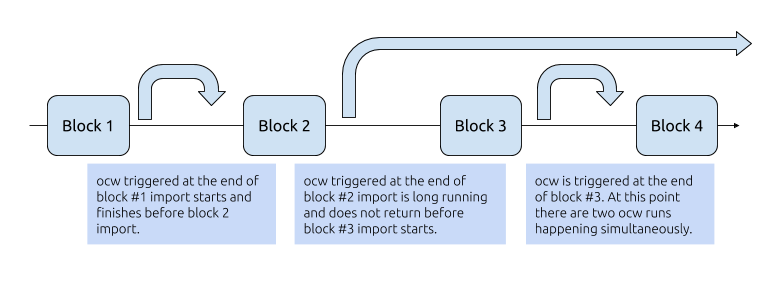

<Objectives data={[
  {
    title: 'Goal',
    description: `Be able to store data crunched from off-chain workers to local node storage that
doesn't require consensus among the blockchain network.`
  },
  {
    title: 'Use Cases',
    description: `After getting a result from off-chain workers, you may want to save it somewhere
for future access, yet the data may not be appropriate to save on-chain. Here we demonstrate how
to save it in local storage within the context of off-chain worker.`,
  },
]}/>

## Overview

Remember we mentioned that off-chain workers (**ocw** for short) cannot write directly to the blockchain state? This is why they have to submit transactions back on-chain. But there are also times we want to save those data somewhere for future access, yet not on-chain. Maybe they are temporary data, intermediate calculation that can be discarded once the computation is completed.

So in this chapter, we will introduce how to write to storage is only local to off-chain workers and is not passed among the blockchain network.

We also introduce a concept of **Storage Lock** to lock these storage before accessing them. This is because ocws are asynchronously run at the end of each block import by block producers, and they are not limited by how long they run. So at any instance there could be multiple ocw instances running, being initiated by previous block imports, as shown below.

The storage has a similar API as their on-chain counterpart with `get`, `set`, and `mutate`. `mutate` is using a [**compare-and-set pattern**](https://en.wikipedia.org/wiki/Compare-and-swap). It compares the contents of a memory location with a given value and, only if they are the same, modifies the contents of that memory location to a new given value. This is done as a single atomic operation. The atomicity guarantees that the new value is calculated based on up-to-date information; if the value had been updated by another thread in the meantime, the write would fail.

In this how-to guide, we will add a cache and lock over our previous http fetching example. If the cached value existed, we will return using the cached value. Otherwise we acquire the lock, fetch from the remote public endpoint, and save it to the cache.

## Steps

## Examples

## Related Material
