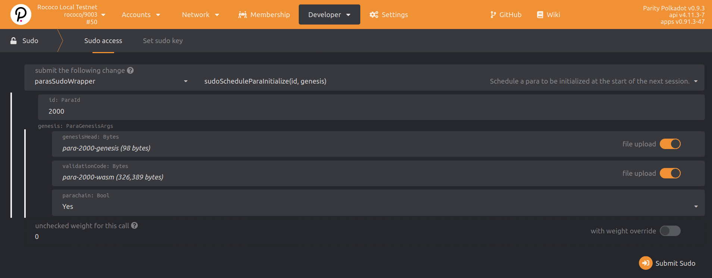
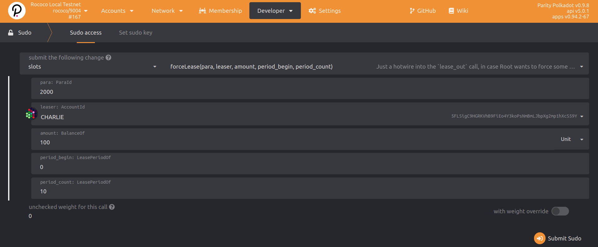
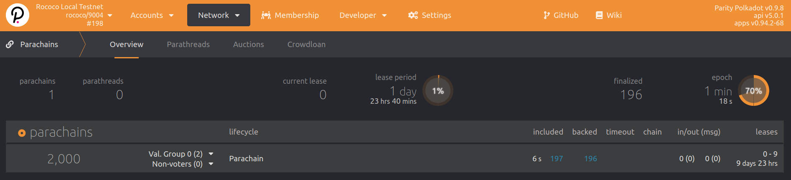
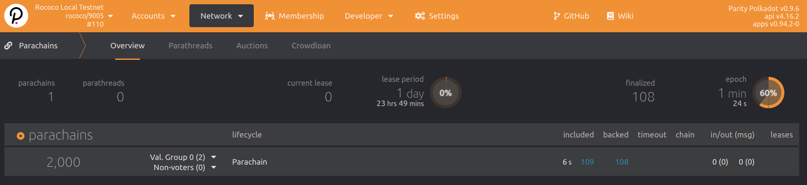

<Objectives
  data={[
    {
      title: 'Goal',
      description: 'Connect a parachain to a relay chain',
    },
    {
      title: 'Use Cases',
      description: `
  - Obtain a para ID
  - Register a parachain
  - Obtain a parachain slot
      `,
    },
    {
      title: 'Overview',
      description: `
  Launching a Parachain requires a series of steps to ensure that the Relay Chain
  knows exactly what is the Parachain Runtime Logic once this Parachain gets a
  slot on the Relay Chain. In order to achieve this, you will need to have
  previously successfully generated a **para ID, genesis state and Wasm runtime blob**.
  After successfully registering your Parachain, you will be able to obtain a parachain slot
  (in testing though \`sudo\`, and in production via auctions and crowdloans) and start
  producing blocks.
      `,
    },
  ]}
/>
<br />

<Message
  type={`gray`}
  title={`Cumulus tutorial`}
  text={`
The [Cumulus Tutorial](/tutorials/v3/cumulus/start-relay) is the best place to start if you are new
to parachain development. This guide is a quick reference and leaves out important details to
consider when performing these steps.
`}
/>

## Steps

### 1. Reserve a para ID

You need a para ID to perform any operation referencing your parachain/parathread for a specific
relay chain. For example, for providing the Wasm blob or genesis state, creating channels to other
parachains for XCM, starting a crowdloan, etc.

- Navigate to the `Network` -> `Parachains` section in the apps UI. If running a node with ws on port 9944, this
  will be:
  https://polkadot.js.org/apps/?rpc=ws%3A%2F%2F127.0.0.1%3A9944#/parachains/parathreads


- Go to the `Parathread` tab and click on `+ParaID` (a parachain always
  begins as a parathread with a para ID)

- Reserve the para ID. This operation requires a deposit that is relay chain specific.

<Message
  type={`gray`}
  title={`Make note of your para ID and registering account`}
  text={`
The para ID is unique to the relay chain you are connecting to, along with the account that reserved
it. **This is required to be specified in the following steps, and cannot generally be reused between**
**different relay chains!**
`}
/>

In the next steps it is assumed you use Cumulus, and thus have the proper commands for the `parachain-collator`
binary that is produced for your collator nodes.

### 2. Create a the chain spec

Create the [chain spec](/v3/runtime/chain-specs) plain `.json`file:
```bash
parachain-collator build-spec > chain-spec-plain.json
```

[Customize](/v3/runtime/chain-specs/#customizing-a-chain-spec) the plain `.json` chain-spec as necessary.
Then, create the [raw](/v3/runtime/chain-specs/#raw-chain-specifications):

```bash
parachain-collator build-spec --chain chain-spec-plain.json --raw > chain-spec-raw.json
```

### 3. Generate the genesis state

Create the [genesis state](/v3/runtime/chain-specs#the-genesis-state) file, hex-encoded.
Replace `<YOUR PARA ID>` with the para ID reserved above (for example `2000`):

```bash
parachain-collator export-genesis-state --parachain-id <YOUR PARA ID> > para-<YOUR PARA ID>-genesis
```

### 4. Generate Wasm runtime validation function

Replace `<YOUR PARA ID>` with the para ID reserved above (for example `2000`):

```bash
parachain-collator export-genesis-wasm > para-<YOUR PARA ID>-wasm
```

The Wasm blob does not depend on the para ID, so we do not provide that flag. If you are
launching multiple parachains using the **exact same runtime**, you do not need to regenerate the Wasm
blob each time. You do need to generate a new genesis state.

### 5. Start the collators

Note that we need to supply the same relay chain spec as our targe relay chain! replace that with
the proper file after the `-- ` separator in a command similar to:

```bash
# NOTE: this command assumes a para ID of 2000. Change as needed.
parachain-collator \
--alice \
--collator \
--force-authoring \
--parachain-id 2000 \
--base-path /tmp/parachain/alice \
--port 40333 \
--ws-port 8844 \
-- \
--execution wasm \
--chain <relay chain spec json> \
--port 30343 \
--ws-port 9977
```

You should see your collator running and peering with the already
running relay chain nodes. It has not start authoring parachain blocks yet.
Authoring will begin when the collator is actually **registered on the relay chain**.

### 6. Parachain registration

Depending on your target relay chain and authority there, you have options to register. Typically
for testing you will use `sudo` and for production
use parachain [auctions](https://wiki.polkadot.network/docs/learn-auction)
and [crowdloans](https://wiki.polkadot.network/docs/learn-crowdloans).

**This guide presently only covers the sudo testing case.**

<!-- FIXME TODO : add crowdloan auctions HTG or polkadot wiki page with this setp-by-step -->

#### Registration deposit calculation

Optionally, you can calculate the exact formulas for deposit calculation for Polkadot runtimes in the function:

```rust
pub const fn deposit(items: u32, bytes: u32) -> Balance {}
```

This is located in the `runtime/<RELAY CHAIN>/src/constants.rs`
files [in Polkadot](https://github.com/paritytech/polkadot/blob/master/runtime/).

#### Register Using `sudo`

We have our relay chain launched and our parachain collator ready to go. Now we have to register the
parachain on the relay chain. In the a production network, this will typically be accomplished
with on Polkadot and Kusama, but for this tutorial we will do it with `sudo` call.

##### Option 1: `paraSudoWrapper.sudoScheduleParaInitialize`

- Go to the [Polkadot Apps UI](https://polkadot.js.org/apps/#/explorer), connecting to your
  **relay chain**.

- Execute a sudo extrinsic on the relay chain by going to `Developer` -> `sudo` page.

- Pick `paraSudoWrapper` -> `sudoScheduleParaInitialize(id, genesis)` as the extrinsic type,
  shown below.



- In the extrinsics parameters, specify the correct para ID and files to use.

This dispatch, if successful, will emit the `sudo.Sudid` event, viewable in the relay chain explorer
page.

##### Option 2: `slots.forceLease`

- Go to the [Polkadot Apps UI](https://polkadot.js.org/apps/#/explorer), connecting to your
  **relay chain**.

- Execute a sudo extrinsic on the relay chain by going to `Developer` -> `sudo` page.

- Pick `slots`->`forceLease(para, leaser, amount, period_begin, period_end)` as the extrinsic type,
  shown below.



Be sure to set the begin period to the slot you wish to start at, in testing this very likely is the
already active slot `0` if you started from scratch. Extending this out to beyond the scope of
the time you wish to test this parachain is likely best, unless you wish to test onboarding and
offboarding cycles, then electing slot leases that have gaps for a para ID would be in order.
Once fully onboarded and after block production starts you should see:



### 7. Block production and finalization

The collator should start producing parachain blocks (aka collating) once the registration is
successful **and a new relay chain epoch has begun**!

> This may take a while! Be patient as you wait for a new epoch to begin.

We can keep track of what parachains are registered and what their latest head data is on the
`Network > Parachains` tab in the Apps UI.



## Examples

- [Cumulus tutorial](/tutorials/v3/cumulus/start-relay)
