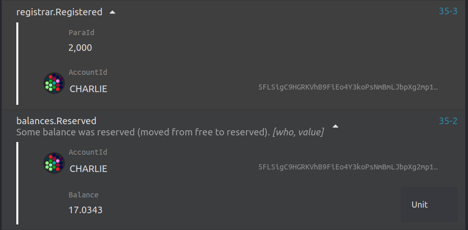
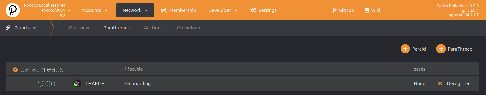

[Rococo](https://wiki.polkadot.network/docs/build-pdk#rococo-testnet) is a public test network for cumulus-based parachains maintained by Parity Technologies.
This guide steps through how you can onboard your parachain to it for a temporary slot.
Only existing parachains on Polkadot or Kusama are eligible for a permanent slot.

- **Permanent slots** are parachain slots assigned to teams who currently have a parachain slot on Polkadot or Kusama (following a successful slot lease auction) and thus have the needs for continuously testing their codebase for compatibility with the latest bleeding edge features in a real-world live environment (Rococo).
There is a limited number of permanent slots made available (see note below).

- **Temporary slots** are parachain slots that are dynamically allocated in a continuous rollover manner.
Concretely, at every start of a lease period, a certain number of parathreads (up to a maximum defined in the relay chain's configuration) will be automatically upgraded to parachains for a certain duration.
The parachains that were active during the ending lease period will be automatically downgraded to parathreads to free the slots for others to use in the subsequent one.
The temporary slots are meant to be used by teams who do not have a parachain slot yet on Polkadot, and are aiming for one in the near future.

The goal of this more dynamic allocations aims at helping teams to test their runtimes more often, and in a more streamlined manner.
Once the parachain is active as a parathread, you must [open a slot request](#register-as-a-parathread).

## Before you begin

**Make sure that you have completed the [Cumulus Tutorial](/tutorials/v3/cumulus/) and have fully tested your parachain on your local machine.**

This will ensure that:
- You are familiar with registering and reserving your unique paraID.
- You have your parachain's **genesis state exported as a JSON file**.
- You have your parachain's **runtime Wasm blob**.

## Preparation

You'll first need to obtain ROC tokens and set up your nodes before moving on to registering your parachain on Rococo.

1. Get ROCs from the [Rococo faucet](https://matrix.to/#/#rococo-faucet:matrix.org) using the following command:

```bash
  !drip <accountID>
```

1. Ensure your collator's peering ports for the embedded relay chain and your parachain are publicly accessible and discoverable.

Use the following CLI command for running both parachain and relay chain nodes:

```bash
  --port <collator node> --port <relay node>
```

This ensures you are able to peer with Rococo validator nodes, otherwise you will not be able to produce blocks.

Note: it's very likely you want at least your collator's `--ws-port <ws port>` port open as well to allow for yourself (and others) to connect with it via the Polkadot Apps UI or API calls.

## Register as a parathread

The easiest way to register as a parathread is by using Polkadot JS apps.

1. Go to [the Polkadot-JS Apps](https://polkadot.js.org/apps/?rpc=wss%3A%2F%2Frococo-rpc.polkadot.io#/parachains/parathreads) parathreads section for Rococo.

1. Reserve a unique paraID. You will be assigned to the next available ID.

   

1. After successfully reserving your paraID, you can now register as a **parathread**.

   

1. Once your extrinsic succeeds, you will see a `registrar.Registered` event emitted.

   

1. Go to the [Parachains -> Parathreads](https://polkadot.js.org/apps/#/parachains/parathreads) page and you will see that your parathread registration is **Onboarding**:

   

After the extrinsic succeeds, it takes 2 sessions for the chain to fully onboard as a parathread.

## Run public RPC nodes for your network

If you want a more broad audience to access have access to your parathread, having public RPC node(s) available to connect to is required.
As there are typically no incentives around running these, it likely needs to be your team that maintains this public testnet infrastructure for the duration of your testing on Rococo.
You will need to get the word out about these by publishing your endpoints for substrate clients like the Polkadot-JS [`apps`](https://github.com/polkadot-js/apps/) User Interface (UI) to connect to your parathread.

> NOTE: all nodes must sync fully with Rococo _before_ it can be connected to by client apps!
> All WS connections are expected to fail while this is processing, any takes typically hours to complete.
> Keep in mind that this time increases as the block height increases on Rococo as well.
> You may consider getting one node in sync and using it's relay chain DB as a snapshot to pass to other nodes to speed up their synchronization.
> For example [this snapshot export/import block process](https://substrate.stackexchange.com/questions/436/how-to-configure-a-substrate-network-with-injected-block-history-from-a-snapshot) could be used.

## Add your parachain details to the Polakdot-JS `apps` User Interface

So others can easily interact with your public RPC node(s), it is common practice to add your parachain to the [`apps`](https://github.com/polkadot-js/apps/) User Interface (UI) via a standardized PR.
Once merged, this will have your parathread appear in the listing of available networks under the Rococo section of the `Network Selection` navigation. It optionally can also include style just for your network as well.

> NOTE: Your collator endpoint _MUST_ be reachable on a daily basis.
> This is [verified by a `cron` job](https://github.com/polkadot-js/apps/blob/master/.github/chain-endpoints.md), and if your endpoints are down, they are removed (disabled) from the listing in the UI.
> You must submit another PR to to re-enable your listing after getting your endpoint back up if this occurs.

For reference, here are a few examples of PRs adding Rococo parathreads to the Apps UI:

- A full addition of logo, styling, and endpoint details from OriginTrail [here](https://github.com/polkadot-js/apps/pull/7544/files)
- A minimal addition of only the endpoint to appear in the left side nav-bar from Nodle [here](https://github.com/polkadot-js/apps/pull/7349/files)

This is not strictly required though, so long as you communicate to those that need access to your network how they can go about doing so in some other way.
For example, using the Apps UI with a static IP set in the `Development -> Custom` network.

## Request a Rococo parachain slot

Once you've gone through the above steps and are ready to connect, **open a request for a slot by filling out the [Rococo Slot Request Form](https://github.com/paritytech/subport/issues/new?assignees=&labels=Rococo&template=rococo.yaml)** for a **temporary** or **permanent** slot.
Presently, permanent slots are only allotted to parachains that already have a parachain with established paraID running on Kusama or Polkadot, that matches the Rococo request.

Rococo's runtime sets `AssignSlotOrigin` to `EnsureRoot<Self::AccountId>`, meaning that only someone with sudo access can assign slots.
The Rococo `sudo` key is controlled by Parity Technologies, thus all slots are assigned manually by them at this time.
In the long-term, the plan is to make it a community-driven process via Rococo's governance framework and remove the need to rely on a sudo key.

For reference: the `AssignSlotOrigin` origin can allot a temporary slot by doing the following:

1. Go to the [Polkadot-JS Apps for Rococo](https://polkadot.js.org/apps/?rpc=wss%3A%2F%2Frococo-rpc.polkadot.io#/extrinsics), under `Developer -> Extrinsics`.
1. Select the account with ROC balance that you wish to use to submit a transaction with. You will need at least 5 ROCs.
1. From the `assignedSlots` pallet, select the `assignTempParachainSlot` function.
1. Insert a reserved paraID with associated parathread and select `Current` for the `LeasePeriodStart`.
1. Sign and submit the transaction.

If the current slots are full, the parathread will be assigned and upgraded to a parachain with the next available slot.


🎉**_Congratulations!_**🎉

With your slot activated, you're now able to test your parachain on the Rococo testnet!
Please do note that when your temporary slot's lease ends, the parachain is **automatically downgraded** to a parathread.
Registered and approved slots are **cycled through automatically** in a round-robin fashion, so you will expect to come back online as a parachain from time to time.

Given a period lease duration of 1 day, the current settings for assigned parachain slots on Rococo are (subject to change, based on the needs of the community):

- **Permanent slot lease duration**: 1 year (365 days)
- **Temporary slot lease duration**: 3 days
- **Maximum number of permanent slots**: up to 25 permanent slots
- **Maximum number of temporary slots**: up to 20 temporary slots
- **Maximum temporary slots allocated per leased period**: up to 5 temporary slots per 3-day temporary lease periods

Here's an example with parathreads `3000`-`3010` registered for a temporary slot (including chain spec and Wasm blob), starting at lease period 0:

- On the first lease day (period 0), parathreads `3000`-`3005` will onboard as parachains and remain onboarded for 3 lease periods (3 days).
  At the end of lease period 3, parachains with IDs `3000` - `3005` will automatically be offboarded and will become parathreads again.
- At the start of the 4th lease day (period 4), the next batch of parathreads registered with IDs `3006`-`3010` will be onboarded as parachains for 3 days.
  Then by the end of lease period 6, parachains with IDs `3006` - `3010` will be offboarded and will become parathreads again.
- At the start of the 7th lease day (period 7), the next batch of registered parathreads to onboard will be `3000`-`3005`, which will automatically get onboarded as parachains for 3 days. And the cycle repeats.

If you are interested in discovering how this lease management is done, you can have a look at the [source code](https://github.com/paritytech/polkadot/blob/master/runtime/common/src/assigned_slots.rs).

## Related material

- [Rococo Revamp blog (October 15, 2021)](https://polkadot.network/blog/rococo-revamp-becoming-a-community-parachain-testbed/)
- [`assigned_slots` pallet](https://github.com/paritytech/polkadot/blob/master/runtime/common/src/assigned_slots.rs)
- [Example Rococo parachain endpoint & logo addition to `Polkadot-js Apps`](https://github.com/polkadot-js/apps/pull/7544/files)
- [How to export/import blocks from another node](https://substrate.stackexchange.com/questions/436/how-to-configure-a-substrate-network-with-injected-block-history-from-a-snapshot)
