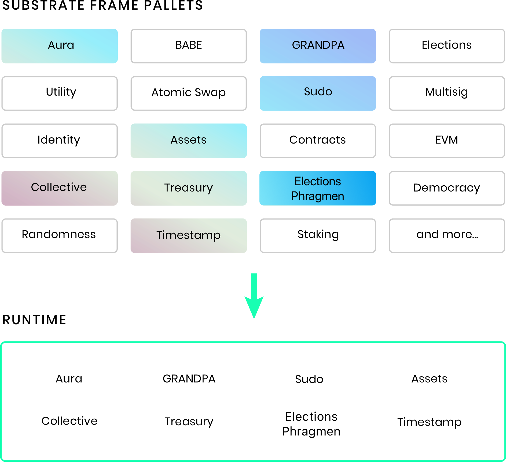

## Introduction

In this tutorial, you will learn to create a custom
["Proof of Existence"](https://en.wikipedia.org/wiki/Proof_of_Existence) dApp using the Substrate
blockchain development framework and the [FRAME](/v3/runtime/frame) library. From
[Wikipedia](https://en.wikipedia.org/wiki/Proof_of_Existence):

> "Proof of Existence is an online service that verifies the existence of computer files as of a
> specific time via timestamped transactions in the bitcoin blockchain."

Rather than uploading the entire file to the blockchain to "prove its existence", users submit a
[hash of the file](https://en.wikipedia.org/wiki/File_verification), known as a file digest or
checksum. These hashes are powerful because huge files can be uniquely represented by a small hash
value, which is efficient for storing on the blockchain. Any user with the original file can prove
that this file matches the one on the blockchain by simply recomputing the hash of the file and
comparing it with the hash stored on chain.


To add to this, blockchains also provide a robust identity system through accounts that map to
[public keys](https://en.wikipedia.org/wiki/Public-key_cryptography), and associations built on
top of those keys (see [FRAME's identity pallet](https://github.com/paritytech/substrate/tree/v3.0.0/frame/identity)).
So when a file digest is stored on the blockchain, we can also record which account uploaded that digest.
This allows that controller of that account to later prove that they were the original person to claim the file.

This tutorial should take you about **1 hour** to complete. We will be using the
[Rust programming language](https://www.rust-lang.org/) and [ReactJS](https://reactjs.org/), but you
do not need to know these to be able to complete this guide. We will provide you with working code
snippets and explain what all the code does at a high level.

We only expect that:

- You have completed the
  [Create Your First Substrate Chain Tutorial](/tutorials/v3/create-your-first-substrate-chain).
- You are generally familiar with software development, writing code, and running your code.
- You are open to learning about the bleeding edge of blockchain development.

<Message
  type={`green`}
  title={`We're here to help`}
  text={`If you run into an issue on this tutorial, **we are here to help!** You can
  [ask a question on Stack Overflow](https://stackoverflow.com/questions/tagged/substrate) and use the
  \`substrate\` tag or contact us on [Element](https://matrix.to/#/#substrate-technical:matrix.org).`}
/>

## What you will be doing

<TutorialObjective
  data={{
    textLineOne:
      '1. Launch a Substrate blockchain based on a node template.',
    url: '#prepare-to-build-a-dapp',
  }}
/>
<TutorialObjective
  data={{
    textLineOne:
      '2. Add our own custom PoE pallet from scratch and implement our PoE API.',
    url: '#building-a-custom-pallet',
  }}
/>
<TutorialObjective
  data={{
    textLineOne:
      '3. Add a custom user interface that interacts with our PoE API.',
    url: '#building-a-custom-frontend',
  }}
/>

## Learning outcomes
- Learn how to think about a Substrate node as a framework to create a decentralized application made of pallets
- Learn how to create and use a custom FRAME pallet 
- Learn how to modify the front-end node template to match your node's runtime items

## Prepare to build a dApp

<FastTrackPlayground
  header={`Use the Substrate Playground`}
  title={`Run the Front-end Template and edit right from your browser!`}
  description={`With Playground, you run the Front-end Template and edit it right from your browser!`}
  playgroundLink={`/playground?deploy=front-end-template#config`}
/>

For our PoE blockchain, we'll be customizing the Node Template so you'll need to make sure you have it installed.
We'll also be customizing the Front-end Template so you'll need to make sure you have that too. This part steps you
through just that and goes over our application design.

### Install the Node Template

You should already have version `v3.0.0+1` of the
[Substrate Developer Hub Node Template](https://github.com/substrate-developer-hub/substrate-node-template/tree/tutorials/solutions%2Fbuild-a-dapp-v3+1)
compiled on your computer from when you completed the
[Create Your First Substrate Chain Tutorial](/tutorials/v3/create-your-first-substrate-chain). If you do not,
please complete that tutorial. (v3.0.0 tag works as well, but comes with FRAME v1 templates,
v3.0.0+1 includes FRAME v2 templates that you can use for reference for mock and testing files.)

```bash
git clone -b v3.0.0+1 --depth 1 https://github.com/substrate-developer-hub/substrate-node-template
```

<Message
  type={`gray`}
  title={`Note`}
  text=
      "Experienced developers may prefer to skip that tutorial and install the Node Template according to
      the instructions in [its readme](https://github.com/substrate-developer-hub/substrate-node-template#getting-started)."
/>

### Install the Front-End Template

The **Create Your First Substrate Chain** Tutorial used the front-end template, so there is no
additional set-up required if you have already completed that tutorial.

<Message
  type={`green`}
  title={`Tip`}
  text=
  "Refer directly to the front-end setup instructions for the
  [Create Your First Chain Tutorial](/tutorials/v3/create-your-first-substrate-chain#install-the-front-end-template)
  if necessary.
  "
/>

### Application Design

Our PoE API will expose two callable functions:

- `create_claim()` - allows a user to claim the existence of a file by uploading a file digest.
- `revoke_claim()` - allows the current owner of a claim to revoke their ownership.

In order to implement this, we will only need to store information about the proofs that have been
claimed, and who made those claims.

Sounds simple enough, right? Let's get coding!

#### Next steps
1. Create a custom pallet from scratch
2. Implement pallet events, errors and storage items 
3. Implement callabe functions `create_claim()` and `revoke_claim()`

## Building a Custom Pallet

The Substrate Developer Hub Node Template, which is used as the starting point for this tutorial,
has a FRAME-based [runtime](/v3/concepts/runtime).
[FRAME](/v3/runtime/frame) is a library of code that allows
you to build a Substrate runtime by composing modules called "pallets". You can think of these
pallets as individual pieces of logic that define what your blockchain can do! Substrate provides
you with a number of pre-built pallets for use in FRAME-based runtimes.



To give some examples, FRAME includes:

- a [Balances](/rustdocs/latest/pallet_balances/)
  pallet that controls the underlying currency of your blockchain by managing the _balances_ of all the
  accounts in your system.
- a [Contracts](/rustdocs/latest/pallet_contracts/) pallet, designed to add smart contract functionality to your blockchain.
- pallets for on-chain governance capabilities such as [Democracy](/rustdocs/latest/pallet_democracy/),
  [Elections](/rustdocs/latest/pallet_elections/), and
  [Collective](/rustdocs/latest/pallet_collective/).

The goal of this tutorial is to teach you how to create your own FRAME pallet to include in your
custom blockchain. The Substrate Developer Hub Node Template comes with a template pallet that we
will use as a starting point to build our own custom runtime logic.

### Scaffolding with FRAME

<Message
  type={`gray`}
  title={`Note`}
  text={
      `The following sections will start _from scratch_ and assumes that you have cleared the contents inside
       \`pallet/template/src/lib.rs\` file.` 
  }
/>

Open the Node Template in your favorite code editor, then open the file
`pallets/template/src/lib.rs`.

```
substrate-node-template
|
+-- node
|
+-- pallets
|   |
|   +-- template
|       |
|       +-- Cargo.toml     <-- *Modify* this file
|       |
|       +-- src
|           |
|           +-- lib.rs     <-- *Remove* contents
|           |
|           +-- mock.rs    <-- *Remove* (optionally modify)
|           |
|           +-- tests.rs   <-- *Remove* (optionally modify)
|
+-- runtime
|
+-- scripts
|
+-- ...
```

You will see some pre-written code that acts as a template for a new pallet.
When writing your own pallets in the future, you will likely find the scaffolding
in this template pallet useful. But for the purposes of learning how a pallet
is constructed, **delete all contents of this file**.

<Message
  type={`yellow`}
  title={`Information`}
  text={`Have a look at [the skeleton of a FRAME pallet](/v3/runtime/frame#skeleton-of-a-pallet#frame-v2)
  from the knowledgebase to learn more about the basic structure of a FRAME pallet.`}
/>

This tutorial is using the latest version of FRAME so be sure to refer to that. We can start by scaffolding our pallet using the following code:

**`pallet/template/src/lib.rs`**

```rust
#![cfg_attr(not(feature = "std"), no_std)]

// Re-export pallet items so that they can be accessed from the crate namespace.
pub use pallet::*;

#[frame_support::pallet]
pub mod pallet {
	use frame_support::{dispatch::DispatchResultWithPostInfo, pallet_prelude::*};
	use frame_system::pallet_prelude::*;
	use sp_std::vec::Vec; // Step 3.1 will include this in `Cargo.toml`

    #[pallet::config]  // <-- Step 2. code block will replace this.

    #[pallet::event]   // <-- Step 3. code block will replace this.

    #[pallet::error]   // <-- Step 4. code block will replace this.

    #[pallet::pallet]
    #[pallet::generate_store(pub(super) trait Store)]
    pub struct Pallet<T>(_);

    #[pallet::storage] // <-- Step 5. code block will replace this.

    #[pallet::hooks]
    impl<T: Config> Hooks<BlockNumberFor<T>> for Pallet<T> {}

    #[pallet::call]   // <-- Step 6. code block will replace this.
}
```

By doing this, we've declared the dependencies and [macros](/v3/runtime/macros) our pallet will require to function.

Things like _events_, _storage_, and _callable functions_ may look familiar to you if you have done other
blockchain development. We will show you what each of these components looks like for a basic Proof
Of Existence pallet by providing you with the code blocks that go under each section.

<Message
  type={`red`}
  title={`Warning`}
  text=
    "The `no_std` feature is required for all pallets! This is because we are building a
    runtime_ module that _must_ compile to WASM, and therefore cannot depend on rust\'s `std` dependencies.
    If you take a look at the `pallets/template/Cargo.toml` file, you will see that the template already has
    `std` default feature disabled which is necessary in order to compile the runtime to WASM. Learn more about why this is
    necessary in the [Add a Pallet](/tutorials/v3/add-a-pallet) tutorial.
    You _can_ use `std` features in non-runtime components like `mock.rs` and `tests.rs` using
    `[dev-dependencies]` _ONLY_. Specifics and examples of this are outside the scope of this
    tutorial. Learn more about [testing in Substrate here](/v3/runtime/testing).
    "
/>

### Pallet Configuration Trait

Every pallet has a component called `Config` that is used for configuration. This component is a
[Rust "trait"](https://doc.rust-lang.org/book/ch10-02-traits.html): traits in Rust are similar to
interfaces in languages such as C++, Java and Go. For now, the only thing we will configure about
our pallet is that it will emit some Events. The `Config` interface is another topic that will be
covered in greater depth in the [Add a Pallet](/tutorials/v3/add-a-pallet) tutorial. To define the pallet's
`Config` trait, replace the `#[pallet::config]` line with this block:

**`pallet/template/src/lib.rs`**

```rust
	/// Configure the pallet by specifying the parameters and types on which it depends.
    #[pallet::config]
	pub trait Config: frame_system::Config {
		/// Because this pallet emits events, it depends on the runtime's definition of an event.
		type Event: From<Event<Self>> + IsType<<Self as frame_system::Config>::Event>;
	}
```

### Implement pallet Events

Now that we've configured our pallet to emit events, let's go ahead and define those events.
Our pallet will only emit an event in two circumstances:

1. When a new proof is added to the blockchain.
2. When a proof is removed.

The events can contain some additional data, in this case, each event will also display who
triggered the event (`AccountId`), and the proof data (as `Vec<u8>`) that is being stored or
removed. Note that convention is to include an array with descriptive names for these parameters at
the end of event documentation.

To implement this, replace `#[pallet::event]` with:

**`pallet/template/src/lib.rs`**

```rust
	// Pallets use events to inform users when important changes are made.
	// Event documentation should end with an array that provides descriptive names for parameters.
	// https://substrate.dev/docs/en/knowledgebase/runtime/events
	#[pallet::event]
	#[pallet::metadata(T::AccountId = "AccountId")]
	#[pallet::generate_deposit(pub(super) fn deposit_event)]
	pub enum Event<T: Config> {
		/// Event emitted when a proof has been claimed. [who, claim]
		ClaimCreated(T::AccountId, Vec<u8>),
    /// Event emitted when a claim is revoked by the owner. [who, claim]
		ClaimRevoked(T::AccountId, Vec<u8>),
	}
```

#### Include `sp-std` library

Notice here that we are using the `Vec<u8>` type, which is _normally_ included in the `std` Rust library. We _cannot_ use `std`!
So instead, we have included `use sp_std::vec::Vec;` in our `mod pallet`.
The [sp-std crate](/rustdocs/latest/sp_std/index.html) includes many common
things that we desire from `std`, but are `no_std` compatible. To use this though, we _must_
update our pallet's dependencies:

**`pallet/template/Cargo.toml`**

```toml
# add `sp-std` in the dependencies section of the toml file

[dependencies]
# -- snip --
sp-std = { default-features = false, version = '3.0.0' }
# -- snip --
```

### Include pallet Errors

The events we defined previously indicate when calls to the pallet have completed successfully.
Similarly, errors indicate when a call has failed, and why it has failed.

The first of these errors can occur when attempting to claim a new proof. Of course a user cannot
claim a proof that has already been claimed. The latter two can occur when attempting to revoke a
proof.

To implement this, replace the `#[pallet::error]` line with:

**`pallet/template/src/lib.rs`**

```rust
    #[pallet::error]
    pub enum Error<T> {
            /// The proof has already been claimed.
            ProofAlreadyClaimed,
            /// The proof does not exist, so it cannot be revoked.
            NoSuchProof,
            /// The proof is claimed by another account, so caller can't revoke it.
            NotProofOwner,
        }
```

### Implement a `StorageMap` storage item

To add a new proof to the blockchain, we will simply store that proof in our pallet's storage. To
store that value, we will create a [hash map](https://en.wikipedia.org/wiki/Hash_table) from the
proof to the owner of that proof and the block number the proof was made. We'll be using FRAME's [`StorageMap`](/rustdocs/latest/frame_support/storage/types/struct.StorageMap.html) to keep track of this information.

To implement this, replace the `#[pallet::storage]` line with:

**`pallet/template/src/lib.rs`**

```rust
    #[pallet::storage]
    pub(super) type Proofs<T: Config> = StorageMap<_, Blake2_128Concat, Vec<u8>, (T::AccountId, T::BlockNumber), ValueQuery>;
```

### Implement callable functions

As implied by our pallet's events and errors, we will have two "dispatchable functions" the user can
call in this FRAME pallet:

1. `create_claim()`: Allow a user to claim the existence of a file with a proof.
2. `revoke_claim()`: Allow the owner of a claim to revoke their claim.

These functions will be based on using the `StorageMap` based on the following logic: if a proof has an owner and a block number, then we know that it has been claimed. Otherwise, the
proof is available to be claimed (and written to storage).

To implement this, replace the `#[pallet::call]` line with:

**`pallet/template/src/lib.rs`**

```rust
    // Dispatchable functions allows users to interact with the pallet and invoke state changes.
    // These functions materialize as "extrinsics", which are often compared to transactions.
    // Dispatchable functions must be annotated with a weight and must return a DispatchResult.
        #[pallet::call]
        impl<T: Config> Pallet<T> {
            #[pallet::weight(1_000)]
            pub(super) fn create_claim(
                origin: OriginFor<T>,
                proof: Vec<u8>,
            ) -> DispatchResultWithPostInfo {

                // Check that the extrinsic was signed and get the signer.
                // This function will return an error if the extrinsic is not signed.
                // https://substrate.dev/docs/en/knowledgebase/runtime/origin
                let sender = ensure_signed(origin)?;

                // Verify that the specified proof has not already been claimed.
                ensure!(!Proofs::<T>::contains_key(&proof), Error::<T>::ProofAlreadyClaimed);

                // Get the block number from the FRAME System module.
                let current_block = <frame_system::Module<T>>::block_number();

                // Store the proof with the sender and block number.
                Proofs::<T>::insert(&proof, (&sender, current_block));

                // Emit an event that the claim was created.
                Self::deposit_event(Event::ClaimCreated(sender, proof));

                Ok(().into())
            }

            #[pallet::weight(10_000)]
            fn revoke_claim(
                origin: OriginFor<T>,
                proof: Vec<u8>,
            ) -> DispatchResultWithPostInfo {
                // Check that the extrinsic was signed and get the signer.
                // This function will return an error if the extrinsic is not signed.
                // https://substrate.dev/docs/en/knowledgebase/runtime/origin
                let sender = ensure_signed(origin)?;

                // Verify that the specified proof has been claimed.
                ensure!(Proofs::<T>::contains_key(&proof), Error::<T>::NoSuchProof);

                // Get owner of the claim.
                let (owner, _) = Proofs::<T>::get(&proof);

                // Verify that sender of the current call is the claim owner.
                ensure!(sender == owner, Error::<T>::NotProofOwner);

                // Remove claim from storage.
                Proofs::<T>::remove(&proof);

                // Emit an event that the claim was erased.
                Self::deposit_event(Event::ClaimRevoked(sender, proof));

                Ok(().into())
            }
        }
```

### Build Your New Pallet

After you've copied all of the parts of this pallet correctly into your `pallets/template/lib.rs`
file, you should be able to recompile your node without warning or error. Run this command in the
root directory of the `substrate-node-template` repository to build and run the node:

```bash
# Compile your node
cargo build --release
# Launch your chain in dev mode
./target/release/node-template --dev --tmp
```

If everything worked out properly, your node should be producing blocks.
And now it is time to interact with our new Proof of Existence pallet!

<Message
  type={`yellow`}
  title={`Information`}
  text=
    "There is a full node template solution
    [here](https://github.com/substrate-developer-hub/substrate-node-template/tree/tutorials/solutions/build-a-dapp-v3+1)
    to use as a reference if you're stuck. Check the commit diff from the base `v3.0.0+1` template for the exact changes.
    "
/>

#### Next steps

1. Install the Substrate Front-end Template
2. Add a custom React component to interact with your node's runtime 
3. Submit a proof and check that your dApp works

## Building a Custom Front End

If you have made it this far, that means you _should_ have a brand new blockchain with custom
functionality up and running.

In this section, we will get the front-end up and running and add a custom React component
designed to make use of our PoE pallet's capabilities.

The first thing you'll need to do is to clone a copy of the
[Front-End Template](https://github.com/substrate-developer-hub/substrate-front-end-template)
**specifically with the `v3.0.0` tag** as a base, if you haven't already.

```bash
git clone -b v3.0.0 --depth 1 https://github.com/substrate-developer-hub/substrate-front-end-template
```

#### Yarn V2

The Frontend Template is expected to work with `yarn 2.4.1`.
To ensure you have the right version, use:

```bash
# use yarn 2+
yarn set version berry
# update to latest yarn 2
yarn set version latest
```

### Explore the Front-End Template

To start the Front-End Template, navigate to its directory and run:

```bash
# Install dependencies if this is the first time you run front-end template
yarn install
# Start the template
yarn start
```

A new tab should open in your web browser and you'll see the following interface.


You'll see a list of pre-funded accounts, and you can make token transfers between those accounts.


### Add your custom react component

In the Front-End Template project, edit the `TemplateModule.js` file in the `/src/` folder:

**`src/TemplateModule.js`**

```
substrate-front-end-template
|
+-- src
|   |
|   +-- index.js
|   |
|   +-- App.js
|   |
|   +-- TemplateModule.js  <-- Edit this file
|   |
|   +-- ...
+-- ...
```

**Delete the entire contents of that file, and replace it with the following:**

```javascript
// React and Semantic UI elements.
import React, { useState, useEffect } from 'react'
import { Form, Input, Grid, Message } from 'semantic-ui-react'
// Pre-built Substrate front-end utilities for connecting to a node
// and making a transaction.
import { useSubstrate } from './substrate-lib'
import { TxButton } from './substrate-lib/components'
// Polkadot-JS utilities for hashing data.
import { blake2AsHex } from '@polkadot/util-crypto'

// Our main Proof Of Existence Component which is exported.
export function Main(props) {
  // Establish an API to talk to our Substrate node.
  const { api } = useSubstrate()
  // Get the selected user from the `AccountSelector` component.
  const { accountPair } = props
  // React hooks for all the state variables we track.
  // Learn more at: https://reactjs.org/docs/hooks-intro.html
  const [status, setStatus] = useState('')
  const [digest, setDigest] = useState('')
  const [owner, setOwner] = useState('')
  const [block, setBlock] = useState(0)

  // Our `FileReader()` which is accessible from our functions below.
  let fileReader

  // Takes our file, and creates a digest using the Blake2 256 hash function.
  const bufferToDigest = () => {
    // Turns the file content to a hexadecimal representation.
    const content = Array.from(new Uint8Array(fileReader.result))
      .map(b => b.toString(16).padStart(2, '0'))
      .join('')

    const hash = blake2AsHex(content, 256)
    setDigest(hash)
  }

  // Callback function for when a new file is selected.
  const handleFileChosen = file => {
    fileReader = new FileReader()
    fileReader.onloadend = bufferToDigest
    fileReader.readAsArrayBuffer(file)
  }

  // React hook to update the owner and block number information for a file.
  useEffect(() => {
    let unsubscribe

    // Polkadot-JS API query to the `proofs` storage item in our pallet.
    // This is a subscription, so it will always get the latest value,
    // even if it changes.
    api.query.templateModule
      .proofs(digest, result => {
        // Our storage item returns a tuple, which is represented as an array.
        setOwner(result[0].toString())
        setBlock(result[1].toNumber())
      })
      .then(unsub => {
        unsubscribe = unsub
      })

    return () => unsubscribe && unsubscribe()
    // This tells the React hook to update whenever the file digest changes
    // (when a new file is chosen), or when the storage subscription says the
    // value of the storage item has updated.
  }, [digest, api.query.templateModule])

  // We can say a file digest is claimed if the stored block number is not 0.
  function isClaimed() {
    return block !== 0
  }

  // The actual UI elements which are returned from our component.
  return (
    <Grid.Column>
      <h1>Proof Of Existence</h1>
      {/* Show warning or success message if the file is or is not claimed. */}
      <Form success={!!digest && !isClaimed()} warning={isClaimed()}>
        <Form.Field>
          {/* File selector with a callback to `handleFileChosen`. */}
          <Input
            type="file"
            id="file"
            label="Your File"
            onChange={e => handleFileChosen(e.target.files[0])}
          />
          {/* Show this message if the file is available to be claimed */}
          <Message success header="File Digest Unclaimed" content={digest} />
          {/* Show this message if the file is already claimed. */}
          <Message
            warning
            header="File Digest Claimed"
            list={[digest, `Owner: ${owner}`, `Block: ${block}`]}
          />
        </Form.Field>
        {/* Buttons for interacting with the component. */}
        <Form.Field>
          {/* Button to create a claim. Only active if a file is selected,
          and not already claimed. Updates the `status`. */}
          <TxButton
            accountPair={accountPair}
            label={'Create Claim'}
            setStatus={setStatus}
            type="SIGNED-TX"
            disabled={isClaimed() || !digest}
            attrs={{
              palletRpc: 'templateModule',
              callable: 'createClaim',
              inputParams: [digest],
              paramFields: [true],
            }}
          />
          {/* Button to revoke a claim. Only active if a file is selected,
          and is already claimed. Updates the `status`. */}
          <TxButton
            accountPair={accountPair}
            label="Revoke Claim"
            setStatus={setStatus}
            type="SIGNED-TX"
            disabled={!isClaimed() || owner !== accountPair.address}
            attrs={{
              palletRpc: 'templateModule',
              callable: 'revokeClaim',
              inputParams: [digest],
              paramFields: [true],
            }}
          />
        </Form.Field>
        {/* Status message about the transaction. */}
        <div style={{ overflowWrap: 'break-word' }}>{status}</div>
      </Form>
    </Grid.Column>
  )
}

export default function TemplateModule(props) {
  const { api } = useSubstrate()
  return api.query.templateModule && api.query.templateModule.proofs ? (
    <Main {...props} />
  ) : null
}
```

We won't walk you step by step through the creation of this component, but do look over the code
comments to learn what each part is doing.

<Message
  type={`yellow`}
  title={`Information`}
  text=
      "There is a full node template solution
      [here](https://github.com/substrate-developer-hub/substrate-node-template/tree/tutorials/solutions/build-a-dapp-v3+1)
      to use as a reference if you're stuck. Check the commit diff from the base `v3.0.0+1` template for the exact changes.
      "
/>

### Submit a proof

Your Front-End Template should reload when you save your changes, and you'll notice our new
component. Now we're ready to try out our new dApp. Select any file on your computer, and you will
see that you can create a claim with its file digest:


If you press "Create Claim", a transaction will be dispatched to your custom Proof of Existence
pallet, where this digest and the selected user account will be stored on chain.


If all went well, you should see a new `ClaimCreated` event appear in the Events component. The
front-end automatically recognizes that your file is now claimed, and even gives you the option to
revoke the claim if you want.

Remember, only the owner can revoke the claim! If you select another user account at the top, and
you will see that the revoke option is disabled!

## Next steps

This is the end of our journey into creating a Proof of Existence blockchain.

You have seen firsthand how simple it can be to develop a brand new pallet and launch a custom
blockchain using Substrate and FRAME. Furthermore, we have shown you that the Substrate ecosystem
provides you with the tools to quickly create responsive front-end experiences so users can interact
with your blockchain.

This tutorial chose to omit some of the specific details around development in order to keep this
experience short and satisfying. However, we want you to keep learning!

#### Learn more
To learn more about building your own pallets, explore the
[Substrate Recipes](https://substrate.dev/recipes/) and the [How-to Guides](/how-to-guides)

Complete the [Add a Pallet](/tutorials/v3/add-a-pallet/) tutorial to learn how to extend the Node Template with
additional capabilities from Substrate's set of
[core FRAME pallets](/v3/runtime/frame).

Substrate is written in the Rust programming language, which has a great community and many helpful
resources. If you would like to learn more about this powerful and
[beloved](https://stackoverflow.blog/2020/01/20/what-is-rust-and-why-is-it-so-popular/) programming
language, check out the information-packed [Rust Book](https://doc.rust-lang.org/book/) and the fun
[Rustlings](https://github.com/rust-lang/rustlings) course.

If you experienced any issues with this tutorial or want to provide feedback, you can
[ask a question on Stack Overflow](https://stackoverflow.com/questions/tagged/substrate) (using the
`substrate` tag) or ask any questions in the [Substrate Technical Channel on Element](https://matrix.to/#/#substrate-technical:matrix.org). We're here to help!

We can't wait to see what you build next.
