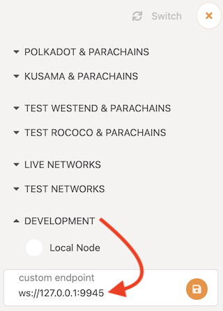
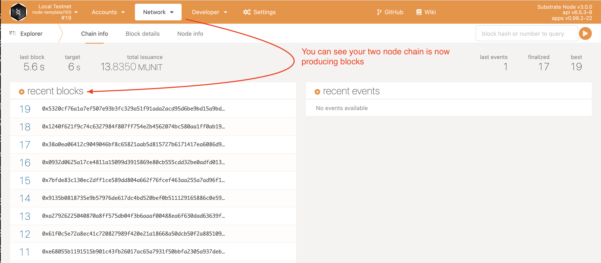

This tutorial provides a basic introduction to the **consensus** model used in the Substrate node template and how to start a blockchain network with an **authority set** of private **validators**.

All blockchains require the nodes in the network to agree on the set of messages and their order to successfully create blocks and progress from one block to the next.
Each block represents the state of data at a specific point in time and the nodes' agreement on the state is called **consensus**.
There are several different algorithms used to reach consensus, including the following:

- Proof of work consensus depends on the computational work done by validator nodes to add valid blocks to the chain.

- Proof of stake consensus selects the validators to add valid blocks to the chain based on the cryptocurrency holdings that they have locked up as a stake in the network.

- Proof of authority consensus relies on a set of approved account identities to act as validators. The nodes associated with approved accounts have the authority to put transactions into blocks.

The Substrate node template uses a proof of authority consensus model also referred to as **authority round** or **Aura** consensus.
The Aura consensus protocol limits block production to a rotating list of authorized accounts—**authorities**—that create blocks in a round robin fashion.

In this tutorial, you'll see how this consensus model works in practice, first, by using the predefined accounts that are part of the node template, then by adding a new authority to the approved set.

## Before you begin

Before you begin, verify the following:

- You have configured your environment for Substrate development by installing [Rust and the Rust toolchain](/v3/getting-started/installation).

- You have completed [Create your first Substrate blockchain](/tutorials/v3/create-your-first-substrate-chain) and have the Substrate node template installed locally.

- You are generally familiar with software development and using command-line interfaces.

- You are generally familiar with blockchains and smart contract platforms.

## Tutorial objectives

By completing this tutorial, you will accomplish the following objectives:

- Start peer blockchain nodes using predefined accounts.

- Generate key pairs for use as a network authority.

- Create a custom chain specification file.

- Launch a private two-node blockchain network.

## Start the blockchain using predefined accounts

Before you generate keys to start your own private Substrate network, you can learn the fundamental principles using a predefined network specification called `local` and running under predefined user accounts.

This part of the tutorial simulates a private network by running two Substrate nodes on a single local computer using predefined accounts that are named `alice` and `bob`.

### Start the first blockchain node

To start the blockchain:

1. Open a terminal shell on your computer.

1. Change to the root directory where you compiled the Substrate node template.

1. Purge old chain data by running the following command:

   ```bash
   ./target/release/node-template purge-chain --base-path /tmp/alice --chain local
   ```

   The command prompts you to confirm the operation:

   ```bash
   Are you sure to remove "/tmp/alice/chains/local_testnet/db"? [y/N]:
   ```

1. Type `y` to confirm that you want to remove the chain data.

   You should always remove old chain data when starting a new network.

1. Start the local blockchain node using the alice account by running the following command:

   ```bash
   ./target/release/node-template \
   --base-path /tmp/alice \
   --chain local \
   --alice \
   --port 30333 \
   --ws-port 9945 \
   --rpc-port 9933 \
   --node-key 0000000000000000000000000000000000000000000000000000000000000001 \
   --telemetry-url "wss://telemetry.polkadot.io/submit/ 0" \
   --validator
   ```

#### Review the command-line options

Before moving on, have a look at how the following options are used to start the node template.

| :<div style="min-width:110pt;font-weight:bold;">Option</div> | :<div style="font-weight:bold;">Description</div>                                                                                                                                                                                          |
| :----------------------------------------------------------- | :----------------------------------------------------------------------------------------------------------------------------------------------------------------------------------------------------------------------------------------- |
| `--base-path`                                                | Specifies the directory for storing all of the data related to this chain.                                                                                                                                                                 |
| `--chain local`                                              | Specifies the chain specification to use. Valid predefined chain specifications include `local`, `development`, and `staging`.                                                                                                             |
| `--alice`                                                    | Adds the predefined keys for the `alice` account to the node's keystore. With this setting, the `alice` account is used for block production and finalization.                                                                             |
| `--port 30333`                                               | Specifies the port to listen on for peer-to-peer (`p2p`) traffic. Because this tutorial uses two nodes running on the same physical computer to simulate a network, you must explicitly specify a different port for at least one account. |
| `--ws-port 9945`                                             | Specifies the port to listen on for incoming WebSocket traffic. The default port is `9944`. This tutorial uses a custom web socket port number (`9945`).                                                                                   |
| `--rpc-port 9933`                                            | Specifies the port to listen on for incoming RPC traffic. The default port is `9933`.                                                                                                                                                      |
| `--node-key <key>`                                           | Specifies the Ed25519 secret key to use for `libp2p` networking. You should only use this option for development and testing.                                                                                                              |
| `--telemetry-url`                                            | Specifies where to send telemetry data. For this tutorial, you can send telemetry data to a server hosted by Parity that is available for anyone to use.                                                                                   |
| `--validator`                                                | Specifies that this node participates in block production and finalization for the network.                                                                                                                                                |

For more information about the command-line options that are available for the node template, see the usage help by running the following command:

`./target/release/node-template --help`

#### Review the node messages displayed

If the node starts successfully, the terminal displays messages describing network operations.
For example, you should see output similar to this:

```
2021-03-10 17:34:27  Substrate Node
2021-03-10 17:34:27  ✌️  version 3.0.0-1c5b984-x86_64-linux-gnu
2021-03-10 17:34:27  ❤️  by Substrate DevHub <https://github.com/substrate-developer-hub>, 2017-2021
2021-03-10 17:34:27  📋 Chain specification: Local Testnet
2021-03-10 17:34:27  🏷 Node name: Alice
2021-03-10 17:34:27  👤 Role: AUTHORITY
2021-03-10 17:34:27  💾 Database: RocksDb at /tmp/alice/chains/local_testnet/db
2021-03-10 17:34:27  ⛓  Native runtime: node-template-100 (node-template-1.tx1.au1)
2021-03-10 17:34:27  🔨 Initializing Genesis block/state (state: 0xea47…9ba8, header-hash: 0x9d07…7cce)
2021-03-10 17:34:27  👴 Loading GRANDPA authority set from genesis on what appears to be first startup.
2021-03-10 17:34:27  ⏱  Loaded block-time = 6000 milliseconds from genesis on first-launch
2021-03-10 17:34:27  Using default protocol ID "sup" because none is configured in the chain specs
2021-03-10 17:34:27  🏷 Local node identity is: 12D3KooWEyoppNCUx8Yx66oV9fJnriXwCcXwDDUA2kj6vnc6iDEp
2021-03-10 17:34:27  📦 Highest known block at #0
2021-03-10 17:34:27  〽️ Prometheus server started at 127.0.0.1:9615
2021-03-10 17:34:27  Listening for new connections on 127.0.0.1:9945.
2021-03-10 17:34:32  💤 Idle (0 peers), best: #0 (0x9d07…7cce), finalized #0 (0x9d07…7cce), ⬇ 0 ⬆ 0
2021-03-10 17:34:37  💤 Idle (0 peers), best: #0 (0x9d07…7cce), finalized #0 (0x9d07…7cce), ⬇ 0 ⬆ 0
...
```

In particular, you should note the following messages in the output:

- `🔨 Initializing Genesis block/state (state: 0xea47…9ba8, header-hash: 0x9d07…7cce)` identifies the initial or **genesis block** that the node is using.
  When you start the next node, verify that these values are the same.

- `🏷 Local node identity is: 12D3KooWEyoppNCUx8Yx66oV9fJnriXwCcXwDDUA2kj6vnc6iDEp` specifies a string that uniquely identifies this node.
  This string is determined by the `--node-key` that was used to start the node using the `alice` account.
  You use this string to identify the node to connect to when you start a second node.
- `2021-03-10 17:34:37 💤 Idle (0 peers), best: #0 (0x9d07…7cce), finalized #0 (0x9d07…7cce), ⬇ 0 ⬆ 0` indicates that there are no other nodes in the network and that no blocks are being produced.
  Another node must join the network before blocks can start to be produced.

### Attach a frontend to see information about the node

You can see a lot of information about node operations by watching the output it produces in your terminal.
You can also view information about node operations by using a web browser to access the Polkadot-JS graphical user interface.

To view node operations using the Polkadot-JS application:

1. Open a web browser.

1. Navigate to the
   [Polkadot-JS Explorer](https://polkadot.js.org/apps/?rpc=ws%3A%2F%2F127.0.0.1%3A9945#/explorer).

The Polkadot-JS Explorer link uses the `rpc` URL parameter to connect to the local node.

Some browsers have ad blocking features that prevent connecting to a local node.
If you have trouble connecting to the local node, see if you have ad blocking enabled and disable it, as needed.
If your browser prevents connections to a local node, try using another browser, like Chromium or downloading and hosting the [Polkadot-JS application](https://github.com/polkadot-js/apps#development) locally.

1. Click the network icon displayed in the top left corner of the Polkadot-JS Explorer page.


1. Expand **DEVELOPMENT** in the list of networks available.



1. Verify the custom endpoint is set to your local host and the port number you specified for incoming WebSocket traffic.

   You can use a single instance of the Polkadot-JS application to connect to different networks, nodes, and endpoints.

   

   You should now see something like this displayed in the Polkadot-JS Explorer **Network** page.

   

### Add a second node to the blockchain network

Now that the node you started using the `alice` account keys is running, you can add another node to the network using the `bob` account.
Because you are joining a network that is already running, you can use the running node to identify the network for the new node to join.
The commands are similar to the ones you used before, but with a few important differences.

To add a node to the running blockchain:

1. Open a **new** terminal shell on your computer.

1. Change to the root directory where you compiled the Substrate node template.

1. Purge old chain data by running the following command:

   ```bash
   ./target/release/node-template purge-chain --base-path /tmp/bob --chain local -y
   ```

   By adding `-y` to the command, you can remove chain data without being prompted you to confirm the operation.

1. Start a second local blockchain node using the `bob` account by running the following command:

   ```bash
   ./target/release/node-template \
   --base-path /tmp/bob \
   --chain local \
   --bob \
   --port 30334 \
   --ws-port 9946 \
   --rpc-port 9934 \
   --telemetry-url "wss://telemetry.polkadot.io/submit/ 0" \
   --validator \
   --bootnodes /ip4/127.0.0.1/tcp/30333/p2p/12D3KooWEyoppNCUx8Yx66oV9fJnriXwCcXwDDUA2kj6vnc6iDEp
   ```

   Note the following differences between this command and the previous one:

   - Because the two nodes are running on the same physical computer, you must specify different values for the `--base-path`, `--port`, `--ws-port`, and `--rpc-port` options.

   - This command includes the `--bootnodes` option and specifies a single boot node, the node started by `alice`.

   The `--bootnodes` option specifies the following information:

   - `ip4` indicates that the IP address for the node uses the IPv4 format
   - `127.0.0.1` specifies the IP address for the running node.
     In this case, the address for the `localhost`.
   - `tcp` specifies TCP as the protocol used for peer-to-peer communication.
   - `30333` specifies the port number used for peer-to-peer communication.
     In this case, the port number for TCP traffic.
   - `12D3KooWEyoppNCUx8Yx66oV9fJnriXwCcXwDDUA2kj6vnc6iDEp` identifies the running node to communicate with for this network.
     In this case, the identifier for the node started using the `alice` account.

## Verify blocks are produced and finalized

After you start the second node, the nodes should connect to each other as peers and start producing blocks.

To verify blocks are being finalized:

1. Verify that you see lines similar to the following in the terminal where you started the first node:

   ```
   ...
   2021-03-10 17:47:32  🔍 Discovered new external address for our node: /ip4/127.0.0.1/tcp/30333/p2p/12D3KooWEyoppNCUx8Yx66oV9fJnriXwCcXwDDUA2kj6vnc6iDEp
   2021-03-10 17:47:32  🔍 Discovered new external address for our node: /ip4/<your computer's LAN IP>/tcp/30333/p2p/12D3KooWEyoppNCUx8Yx66oV9fJnriXwCcXwDDUA2kj6vnc6iDEp
   2021-03-10 17:47:33  💤 Idle (1 peers), best: #0 (0x9d07…7cce), finalized #0 (0x9d07…7cce), ⬇ 1.0kiB/s ⬆ 1.0kiB/s
   2021-03-10 17:47:36  🙌 Starting consensus session on top of parent 0x9d07d1757a9ca248e58141ce52a11fca37f71007dec16650b87a853f0d4c7cce
   2021-03-10 17:47:36  🎁 Prepared block for proposing at 1 [hash: 0x727826a5e6fba9a13af11422d4677b5f0743cc733c382232328e69fd307d1d2f; parent_hash: 0x9d07…7cce; extrinsics (1): [0x768a…a9e2]]
   2021-03-10 17:47:36  🔖 Pre-sealed block for proposal at 1. Hash now 0x4841d8b2e62483fa4702b3ddcd1b603803842374dcdc1e9533ad407708b33dd8, previously 0x727826a5e6fba9a13af11422d4677b5f0743cc733c382232328e69fd307d1d2f.
   2021-03-10 17:47:36  ✨ Imported #1 (0x4841…3dd8)
   2021-03-10 17:47:36  ✨ Imported #1 (0xb241…2ae8)
   2021-03-10 17:47:38  💤 Idle (1 peers), best: #1 (0x4841…3dd8), finalized #0 (0x9d07…7cce), ⬇ 0.8kiB/s ⬆ 0.8kiB/s
   2021-03-10 17:47:42  ♻️  Reorg on #1,0x4841…3dd8 to #2,0x8b6a…dce6, common ancestor #0,0x9d07…7cce
   2021-03-10 17:47:42  ✨ Imported #2 (0x8b6a…dce6)
   2021-03-10 17:47:43  💤 Idle (1 peers), best: #2 (0x8b6a…dce6), finalized #0 (0x9d07…7cce), ⬇ 0.8kiB/s ⬆ 0.7kiB/s
   2021-03-10 17:47:48  🙌 Starting consensus session on top of parent 0x8b6a3ab2fe9891b1af008ea0d92dae9bc84cfa5578231e81066d47928822dce6
   2021-03-10 17:47:48  🎁 Prepared block for proposing at 3 [hash: 0xb887aef2097eff5869e38ccec0302bce372ad05ac2cdf9cc4725c38ec071fb7a; parent_hash: 0x8b6a…dce6; extrinsics (1): [0x82ac…2f20]]
   2021-03-10 17:47:48  🔖 Pre-sealed block for proposal at 3. Hash now 0x34d608dd8be6b82bef4a7aaae1ec80930a5c4b8cf9bdc99013410e91544f3a2a, previously 0xb887aef2097eff5869e38ccec0302bce372ad05ac2cdf9cc4725c38ec071fb7a.
   2021-03-10 17:47:48  ✨ Imported #3 (0x34d6…3a2a)
   2021-03-10 17:47:48  💤 Idle (1 peers), best: #3 (0x34d6…3a2a), finalized #0 (0x9d07…7cce), ⬇ 0.7kiB/s ⬆ 0.8kiB/s
   2021-03-10 17:47:53  💤 Idle (1 peers), best: #3 (0x34d6…3a2a), finalized #1 (0xb241…2ae8), ⬇ 0.6kiB/s ⬆ 0.7kiB/s
   2021-03-10 17:47:54  ✨ Imported #4 (0x2b8a…fdc4)
   2021-03-10 17:47:58  💤 Idle (1 peers), best: #4 (0x2b8a…fdc4), finalized #2 (0x8b6a…dce6), ⬇ 0.7kiB/s ⬆ 0.6kiB/s
   ...
   ```

   These lines show that the first node started by `alice` has a one peer (`1 peers`), they have produced some blocks (`best: #4 (0x2b8a…fdc4)`), and that the blocks are being finalized (`finalized #2 (0x8b6a…dce6)`).

1. Verify that you see similar output in the terminal where you started the second node.

1. Open the [Polkadot-JS Explorer](https://polkadot.js.org/apps/?rpc=ws%3A%2F%2F127.0.0.1%3A9945#/explorer) to verify the network is producing and finalizing blocks.

   

1. Shut down both nodes by pressing Control-c in each terminal shell.

## Generate your own keys

Now that you know how to start and connect running nodes as peers using command-line options, you are ready to generate your own secret keys instead of using the predefined account keys.
It's important to remember that each participant in the blockchain network is responsible for generating unique keys.

### Key generation options

There are several ways you can generate keys.
For example, you can generate key pairs using a `node-template` subcommand, the standalone <a target="_blank" href="/v3/tools/subkey">Subkey</a> command-line program, the Polkadot-JS application, or third-party key generation utilities.

Although you could use predefined key pairs to complete this tutorial, you would never use those keys in a production environment.
Instead of using predefined keys or the more secure `subkey` program, this tutorial illustrates how to generate keys locally using the Substrate node template and the `key` subcommand.

### Generate local keys using the node template

You have already used the some command-line options to start your local blockchain node using the predefined `alice` and `bob` accounts.
You can also use command-line options to generate random keys to use with Substrate.

For this tutorial, you can remain connected to the internet and use your local node to generate your keys.
As a best practice, you should use an air-gapped computer that has never been connected to the internet when you generate keys for a production blockchain.
At a minimum, you should disconnect from the internet before you generate any keys you intend to use on a public blockchain.

To generate keys using the node template:

1. Open a terminal shell on your computer.

1. Change to the root directory where you compiled the Substrate node template.

1. Generate a random secret phrase and keys by running the following command:

   ```bash
   ./target/release/node-template key generate --scheme Sr25519 --password-interactive
   ```

1. Type a password for the generated keys.

   The command generates keys and displays output similar to the following:

   ```bash
   Secret phrase:  pig giraffe ceiling enter weird liar orange decline behind total despair fly
   Secret seed:       0x0087016ebbdcf03d1b7b2ad9a958e14a43f2351cd42f2f0a973771b90fb0112f
   Public key (hex):  0x1a4cc824f6585859851f818e71ac63cf6fdc81018189809814677b2a4699cf45
   Account ID:        0x1a4cc824f6585859851f818e71ac63cf6fdc81018189809814677b2a4699cf45
   Public key (SS58): 5CfBuoHDvZ4fd8jkLQicNL8tgjnK8pVG9AiuJrsNrRAx6CNW
   SS58 Address:      5CfBuoHDvZ4fd8jkLQicNL8tgjnK8pVG9AiuJrsNrRAx6CNW
   ```

   You now have the Sr25519 key for producing blocks using `aura` for one node.
   In this example, the Sr25519 public key for the account is:

   `5CfBuoHDvZ4fd8jkLQicNL8tgjnK8pVG9AiuJrsNrRAx6CNW`

1. Use the **secret seed** for the account you just generated to derive keys using the Ed25519 signature scheme by running the following command:

   ```bash
   ./target/release/node-template key inspect --password-interactive --scheme Ed25519 0x0087016ebbdcf03d1b7b2ad9a958e14a43f2351cd42f2f0a973771b90fb0112f
   ```

1. Type the password you used to the generated keys.

   The command displays output similar to the following:

   ```bash
   Secret Key URI `0x0087016ebbdcf03d1b7b2ad9a958e14a43f2351cd42f2f0a973771b90fb0112f` is account:
   Secret seed:       0x0087016ebbdcf03d1b7b2ad9a958e14a43f2351cd42f2f0a973771b90fb0112f
   Public key (hex):  0x2577ba03f47cdbea161851d737e41200e471cd7a31a5c88242a527837efc1e7b
   Account ID:        0x2577ba03f47cdbea161851d737e41200e471cd7a31a5c88242a527837efc1e7b
   Public key (SS58): 5CuqCGfwqhjGzSqz5mnq36tMe651mU9Ji8xQ4JRuUTvPcjVN
   SS58 Address:      5CuqCGfwqhjGzSqz5mnq36tMe651mU9Ji8xQ4JRuUTvPcjVN
   ```

   You now have the Ed25519 key for finalizing blocks using `grandpa` for one node.
   In this example, the Ed25519 public key for the account is:

   `5CuqCGfwqhjGzSqz5mnq36tMe651mU9Ji8xQ4JRuUTvPcjVN`

### Generate a second set of keys

For this tutorial, the private network consists of just two nodes, so you need two sets of keys.
You have a few options to continue the tutorial:

- You can use the keys for one or two of the predefined accounts.

- You can repeat the steps in the previous section using a different identity on another computer to generate a second key pair.

- You can recruit other participants to generate the keys required to join your private network.

For illustration purposes, the second set of keys used in this tutorial are:

- Sr25519: 5EJPj83tJuJtTVE2v7B9ehfM7jNT44CBFaPWicvBwYyUKBS6 for `aura`.
- Ed25519: 5FeJQsfmbbJLTH1pvehBxrZrT5kHvJFj84ZaY5LK7NU87gZS for `grandpa`.

## Create a custom chain specification

After you generate the keys to use with your blockchain, you are ready to create a custom **chain specification** using those key pairs then share your custom chain specification with trusted network participants called **validators**.

To enable others to participate in your blockchain network, you should ensure that they generate their own keys.
If other participants have generated their key pairs, you can create a custom chain specification to replace the `local` chain specification that you used previously.

This tutorial illustrates how to create a two-node network.
You can follow the same steps to add more nodes to your network.

### Modify an existing chain specification

Previously, you added nodes to the blockchain using the predefined `local` chain specification using the `--chain local` command-line option.
Instead of writing a completely new chain specification, you can modify the one that you have used before.

To create a new chain specification based on an existing specification:

1. Open a terminal shell on your computer.

1. Change to the root directory where you compiled the Substrate node template.

1. Export the local chain specification to a file named `customSpec.json` by running the following command:

   ```bash
   ./target/release/node-template build-spec --disable-default-bootnode --chain local > customSpec.json
   ```

   If you open the `customSpec.json` file in a text editor, you would see that it contains several fields, including a large blob that contains the Wasm binary for the runtime you built using the `cargo build --release` command.
   Instead of viewing the entire file, you can preview the first and last few lines to see the fields you need to change.

1. Preview the first few fields in the `customSpec.json` file by running the following command:

   ```bash
   head customSpec.json
   ```

   The command displays the first fields from the file.
   For example:

   ```bash
   {
     "name": "Local Testnet",
     "id": "local_testnet",
     "chainType": "Local",
     "bootNodes": [],
     "telemetryEndpoints": null,
     "protocolId": null,
     "properties": null,
     "consensusEngine": null,
     "codeSubstitutes": {},
   ```

1. Preview the last fields in the `customSpec.json` file by running the following command:

   ```bash
   tail -n 80 customSpec.json
   ```

   This command displays the last sections following the Wasm binary field, including the details for several of the pallets—such as the `sudo` and `balances` pallets—that are used in the runtime.

1. Open the `customSpec.json` file in a text editor.

1. Modify the `name` field to identify this chain specification as a custom chain specification.

   For example:

   ```json
   "name": "My Custom Testnet",
   ```

1. Modify `aura` field to specify the nodes with the authority to create blocks by adding the Sr25519 SS58 address keys for each network participant.

   ```json
   "aura": {
       "authorities": [
         "5CfBuoHDvZ4fd8jkLQicNL8tgjnK8pVG9AiuJrsNrRAx6CNW",
         "5EJPj83tJuJtTVE2v7B9ehfM7jNT44CBFaPWicvBwYyUKBS6"
       ]
     },
   ```

1. Modify the `grandpa` field to specify the nodes with the authority to finalize blocks by adding the Ed25519 SS58 address keys for each network participant.

   ```json
   "grandpa": {
       "authorities": [
         [
           "5CuqCGfwqhjGzSqz5mnq36tMe651mU9Ji8xQ4JRuUTvPcjVN",
           1
         ],
         [
           "5FeJQsfmbbJLTH1pvehBxrZrT5kHvJFj84ZaY5LK7NU87gZS",
           1
         ]
       ]
     },
   ```

   Note that there are two data values for the `authorities` field in the `grandpa` section.
   The first value is the address key.
   The second value is used to support **weighted votes**.
   In this example, each validator has a weight of **1** vote.

1. Save your changes and close the file.

### Add validators

As you have just seen, you can add and change the authority addresses in a chain specification by modifying the `aura` and `grandpa` sections.
You can use this technique to add as many validators as you like.

To add validators:

- Modify the `aura` section to include **Sr25519** addresses.

- Modify the `grandpa` section to include **Ed25519** addresses and a voting weight.

Be sure to use unique keys for each validator.
If two validators have the same keys, they produce conflicting blocks.

For additional information about working with key pairs and signatures, see [Public-Key cryptography](/v3/advanced/cryptography#public-key-cryptography).

### Convert the chain specification to use the raw format

After you prepare a chain specification with the information you want to use, you must convert it into a raw specification before it can be used.
The raw chain specification includes the same information as the unconverted specification.
However, the raw chain specification also contains encoded storage keys that the node uses to reference the data in its local storage.
Distributing a raw chain specification ensures that each node stores the data using the proper storage keys.

To convert a chain specification to use the raw format:

1. Open a terminal shell on your computer.

1. Change to the root directory where you compiled the Substrate node template.

1. Convert the `customSpec.json` chain specification to the raw format with the file name `customSpecRaw.json` by running the following command:

   ```bash
   ./target/release/node-template build-spec --chain=customSpec.json --raw --disable-default-bootnode > customSpecRaw.json
   ```

### Share the chain specification with others

If you are creating a private blockchain network to share with other participants, ensure that only one person creates the chain specification and shares the resulting raw version of that specification—for example, the `customSpecRaw.json` file—with all of the other validators in the network.

Because the Rust compiler produces optimized WebAssembly binaries that aren't deterministically reproducible, each person who generates the Wasm runtime produces a slightly different Wasm blob.
To ensure determinism, all participants in the blockchain network must use exactly the same raw chain specification file.
For more information about this issue, see [Hunting down a non-determinism-bug in our Rust Wasm build](https://dev.to/gnunicorn/hunting-down-a-non-determinism-bug-in-our-rust-wasm-build-4fk1).

## Launch the private network

After you distribute the custom chain specification to all network participants, you're ready to launch your own private blockchain.
The steps are similar to the steps you followed in [Start the blockchain using predefined accounts](#Start-the-blockchain-using-predefined-accounts).
To continue with this part of the tutorial, you are no longer using a single physical computer or a single binary.

To continue, verify the following:

- You have generated or collected the account keys for at least two authority accounts.
- You have updated your custom chain specification to include the keys for block production (`aura`) and block finalization (`grandpa`).
- You have converted your custom chain specification to raw format and distributed the raw chain specification to the nodes participating in the private network.

If you have completed these steps, you are ready to start the first node in the private blockchain.

### Start the first node

As the first participant in the private blockchain network, you are responsible for starting the first node, called the **bootnode**.

To start the first node:

1. Open a terminal shell on your computer.

1. Change to the root directory where you compiled the Substrate node template.

1. Purge old chain data, if needed, by running the following command:

   ```bash
   ./target/release/node-template purge-chain --base-path /tmp/node01 --chain local -y
   ```

1. Start the first node using the custom chain specification by running the following command:

   ```bash
   ./target/release/node-template \
   --base-path /tmp/node01 \
   --chain ./customSpecRaw.json \
   --port 30333 \
   --ws-port 9945 \
   --rpc-port 9933 \
   --telemetry-url "wss://telemetry.polkadot.io/submit/ 0" \
   --validator \
   --rpc-methods Unsafe \
   --name MyNode01
   ```

   Note the following changes to the command you are running to start the node:

   - Instead of the predefined `--alice` account, you are using your own keys.
     You'll add your keys to the keystore in a separate step.

   - The `--chain` command-line option specifies the custom chain specification.

   - The `--name` command-line option enables you to give your node a human-readable name in the telemetry UI.

   - The `--rpc-methods Unsafe` command-line option allows you to continue the tutorial using an unsafe communication mode because your blockchain is not being used in a production setting.

1. Verify that you see output similar to the following:

   ```bash
   2021-11-03 15:32:14 Substrate Node
   2021-11-03 15:32:14 ✌️  version 3.0.0-monthly-2021-09+1-bf52814-x86_64-macos
   2021-11-03 15:32:14 ❤️  by Substrate DevHub <https://github.com/substrate-developer-hub>, 2017-2021
   2021-11-03 15:32:14 📋 Chain specification: My Custom Testnet
   2021-11-03 15:32:14 🏷 Node name: MyNode01
   2021-11-03 15:32:14 👤 Role: AUTHORITY
   2021-11-03 15:32:14 💾 Database: RocksDb at /tmp/node01/chains/local_testnet/db
   2021-11-03 15:32:14 ⛓  Native runtime: node-template-100 (node-template-1.tx1.au1)
   2021-11-03 15:32:15 🔨 Initializing Genesis block/state (state: 0x2bde…8f66, header-hash: 0x6c78…37de)
   2021-11-03 15:32:15 👴 Loading GRANDPA authority set from genesis on what appears to be first startup.
   2021-11-03 15:32:15 ⏱  Loaded block-time = 6s from block 0x6c78abc724f83285d1487ddcb1f948a2773cb38219c4674f84c727833be737de
   2021-11-03 15:32:15 Using default protocol ID "sup" because none is configured in the chain specs
   2021-11-03 15:32:15 🏷 Local node identity is: 12D3KooWLmrYDLoNTyTYtRdDyZLWDe1paxzxTw5RgjmHLfzW96SX
   2021-11-03 15:32:15 📦 Highest known block at #0
   2021-11-03 15:32:15 〽️ Prometheus exporter started at 127.0.0.1:9615
   2021-11-03 15:32:15 Listening for new connections on 127.0.0.1:9945.
   2021-11-03 15:32:20 💤 Idle (0 peers), best: #0 (0x6c78…37de), finalized #0 (0x6c78…37de), ⬇ 0 ⬆ 0
   ```

   Take note of the following information:

   - The output shows the genesis block being initialized with the block hash `(state: 0x2bde…8f66, header-hash: 0x6c78…37de)`.

   - The output specifies the **Local node identity** for your node.
     In this example, the node identity is `12D3KooWLmrYDLoNTyTYtRdDyZLWDe1paxzxTw5RgjmHLfzW96SX`.

   - The output specifies the **IP address** used for the node is the local host `127.0.0.1`.

   These values are for this specific tutorial example.
   The values will be different for your node and you must provide the values for your node to other network participants to connect to the bootnode.

### Add keys to the keystore

After you start the first node, no blocks are yet produced.
The next step is to add two types of keys to the keystore for each node in the network.

For each node:

- Add the `aura` authority keys to enable [block _production_](/v3/getting-started/glossary#author).

- Add the `grandpa` authority keys to enable [block _finalization_](/v3/getting-started/glossary#finality).

There are several ways you can insert keys into the keystore.
For this tutorial, you can use the `key` subcommand to insert locally-generated secret keys.

To insert keys into the keystore:

1. Open a terminal shell on your computer.

1. Change to the root directory where you compiled the Substrate node template.

1. Insert the `aura` secret key generated from the `key` subcommand by running a command similar to the following:

   ```bash
   ./target/release/node-template key insert --base-path /tmp/node01 \
   --chain customSpecRaw.json \
   --suri <your-secret-seed> \
   --password-interactive \
   --key-type aura
   ```

   This example uses the secret seed generated from the `key` subcommand into the keystore.
   In this tutorial, the secret seed generated was `0x563d22ef5f00e589e07445a3ad88bb92efaa897d7f73a4543d9ac87476434e65`, so the `--suri` command-line option specifies that string to insert the key into the keystore:

   ```bash
   --suri 0x563d22ef5f00e589e07445a3ad88bb92efaa897d7f73a4543d9ac87476434e65
   ```

   You can also insert a key from a specified file location.
   For information about the command-line options available, run the following command:

   ```bash
   ./target/release/node-template key insert --help
   ```

1. Insert the `grandpa` secret key generated from the `key` subcommand by running a command similar to the following:

   ```bash
   ./target/release/node-template key insert --base-path /tmp/node01 \
   --chain customSpecRaw.json \
   --suri <your-secret-key> \
   --password-interactive \
   --key-type gran
   ```

1. Verify that your keys are in the keystore for `node01` by running the following command:

   ```bash
   ls /tmp/node01/chains/local_testnet/keystore
   ```

   The command displays output similar to the following:

   ```bash
   617572611441ddcb22724420b87ee295c6d47c5adff0ce598c87d3c749b776ba9a647f04
   6772616e1441ddcb22724420b87ee295c6d47c5adff0ce598c87d3c749b776ba9a647f04
   ```

### Enable other participants to join

You can now allow other validators to join the network using the `--bootnodes` and `--validator` command-line options.

To add a second validator to the private network:

1. Open a terminal shell on a second computer.

1. Change to the root directory where you compiled the Substrate node template.

1. Purge old chain data, if needed, by running the following command:

   ```bash
   ./target/release/node-template purge-chain --base-path /tmp/node02 --chain local -y
   ```

1. Start a second blockchain node by running the following command:

   ```bash
   ./target/release/node-template \
   --base-path /tmp/node02 \
   --chain ./customSpecRaw.json \
   --port 30334 \
   --ws-port 9946 \
   --rpc-port 9934 \
   --telemetry-url "wss://telemetry.polkadot.io/submit/ 0" \
   --validator \
   --rpc-methods Unsafe \
   --name MyNode02 \
   --bootnodes /ip4/127.0.0.1/tcp/30333/p2p/12D3KooWLmrYDLoNTyTYtRdDyZLWDe1paxzxTw5RgjmHLfzW96SX
   ```

   Be sure to set the correct `bootnode` identifier in the command.

   If you don't set the correct `bootnode` identifier, you see errors like this:

   `💔 The bootnode you want to connect to at ... provided a different peer ID than the one you expect: ...`

   Note that the command includes the `base-path` and `name` command-line options plus an additional `validator` option to specify that this node is a validator for the private network.
   Also note that all validators must be using _identical chain specifications_ to peer.

1. Add the `aura` secret key generated from the `key` subcommand by running a command similar to the following:

   ```bash
   ./target/release/node-template key insert --base-path /tmp/node02 \
   --chain customSpecRaw.json \
   --suri <second-participant-secret-seed> \
   --password-interactive \
   --key-type aura
   ```

   Note that this command uses the second participant's secret key and that the `aura` key type is required to enable block production.

1. Add the `grandpa` secret key generated from the `key` subcommand to the local keystore by running a command similar to the following:

   ```bash
   ./target/release/node-template key insert --base-path /tmp/node02 \
   --chain customSpecRaw.json \
   --suri <second-participant-secret-seed> \
   --password-interactive \
   --key-type gran
   ```

   Note that this command uses the second participant's secret key and that the `gran` key type is required to enable block finalization.

   Block finalization requires at least two-thirds of the validators to add their keys to their respective keystores.
   Because this network is configured with two validators in the chain specification, block finalization starts after the second node has added its keys.

1. Verify that your keys are in the keystore for `node02` by running the following command:

   ```bash
   ls /tmp/node02/chains/local_testnet/keystore
   ```

   The command displays output similar to the following:

   ```bash
   617572611a4cc824f6585859851f818e71ac63cf6fdc81018189809814677b2a4699cf45
   6772616e1a4cc824f6585859851f818e71ac63cf6fdc81018189809814677b2a4699cf45
   ```

   Substrate nodes require a restart after inserting a `grandpa` key, so you must shut down and restart nodes before you see blocks being finalized.

1. Shut down the node by pressing Control-c.

1. Restart the second blockchain node by running the following command:

   ```bash
   ./target/release/node-template \
   --base-path /tmp/node02 \
   --chain ./customSpecRaw.json \
   --port 30334 \
   --ws-port 9946 \
   --rpc-port 9934 \
   --telemetry-url "wss://telemetry.polkadot.io/submit/ 0" \
   --validator \
   --rpc-methods Unsafe \
   --name MyNode02 \
   --bootnodes /ip4/127.0.0.1/tcp/30333/p2p/12D3KooWLmrYDLoNTyTYtRdDyZLWDe1paxzxTw5RgjmHLfzW96SX
   ```

   Note that the command includes the `base-path` and `name` command-line options plus an additional `validator` option to specify that this node is a validator for the private network.
   Also note that all validators must be using _identical chain specifications_ to peer.

   Be sure to set the correct `bootnode` identifier in the command.
   If you don't set the correct `bootnode` identifier, you see errors like this:

   `💔 The bootnode you want to connect to at ... provided a different peer ID than the one you expect: ...`

   After both nodes have added their keys to their respective keystores and been restarted, you should see the same genesis block and state root hashes.

   You should also see that each node has one peer (`1 peers`), and they have produced a block proposal (`best: #2 (0xe111…c084)`).
   After a few seconds, you should see new blocks being finalized.

## Next steps

You have now seen how you can start a private blockchain with trusted participants.

In this tutorial you learned:

- How to start and stop peer blockchain nodes.

- How to generate your own secret key pairs.

- How to create a custom chain specification that uses the keys you generated.

- How to add validators to a private network that uses your custom chain specification.

To learn more about the topics introduced in this tutorial, see the following sections:

- [Executor](/v3/advanced/executor) for more information about the WebAssembly runtime that is a core component of the chain specification.

- [Accounts](https://wiki.polkadot.network/docs/learn-accounts) and [Key management](https://wiki.polkadot.network/docs/learn-account-generation) for more information about key generation and storage options.

- [Cryptography](https://docs.substrate.io/v3/advanced/cryptography/) for more information about the signature schemes used for different keys.

<!-- TODO link to the followup tutorial about starting a 3 node network using the demo substrate node
Details in https://github.com/substrate-developer-hub/tutorials/issues/16 -->
