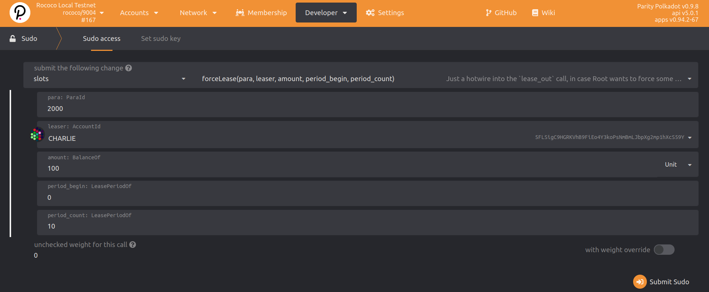
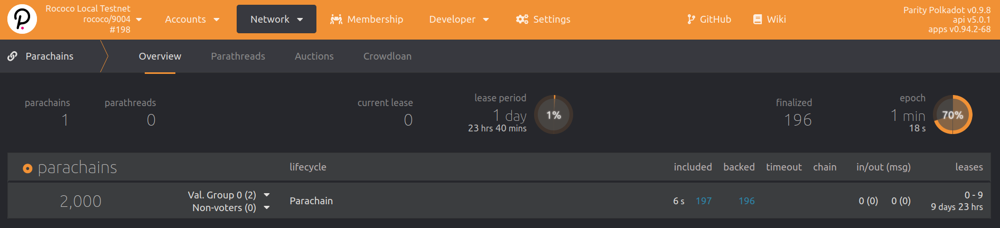

In this part of the workshop, we'll connect a parachain to our relay chain and add additional nodes.

<TutorialObjective
  data={{
    textLineOne: '1. Launching a Parachain',
    url: '#launching-a-parachain',
  }}
/>
<TutorialObjective
  data={{
    textLineOne: '2. Interact with a Parachain',
    url: '#interact-with-a-parachain',
  }}
/>
<TutorialObjective
  data={{
    textLineOne: '3. Parachain Registration',
    url: '#parachain-registration',
  }}
/>
<TutorialObjective
  data={{
    textLineOne: '4. Connecting Additional Parachain Nodes',
    url: '#connecting-additional-parachain-nodes',
  }}
/>

## Learning outcomes

- Register a Para ID
- Start a collator node
- Submit transactions with XCMP
- Connect additional parachain nodes

## Launching a Parachain

### Reserve a Para ID
 
To connect to any relay chain, you must first reserve a Para ID for your parathread that will
become a parachain. It is called Para ID, because the same ID can be seen as its parachain ID or
parathread ID, depending on your current chain to relay-chain connection state. To do this, you need
to have sufficient amount of the currency on the network to
reserve the ID. This is 20 "units" on the testnets. Check for the amount on your relay chain.
The relay chain is responsible for allotting all Para IDs (they can no longer
be user selected) and will be simply the increment starting at `2000` for all chains connecting
that are not "systems parachains" that use a different method to obtain the Para ID.

The easiest way to reserve your Para ID is via the <ExternalLink url="https://polkadot.js.org/apps/?rpc=ws%3A%2F%2F127.0.0.1%3A9944#/parachains/parathreads">Polkadot-JS Apps</ExternalLink>
under the _Network_ -> **Parachains** sub-page, click on **Parathreads** tab and use the
**+ ParaId** button.


<Message
  type={`yellow`}
  title={`Information`}
  text={`You will need to connect to a relay chain to submit this extrinsic! In testnets, your Parachain
    ID will be 2000 for your first parathread registration.`}
/>

Note that the account used to register the Para ID must also be the origin for using this
Para ID. Once you submit this extrinsic successfully (you must see a successful `registrar.Reserved`
event with your `paraID`), you can now launch your parachain or parathread using this reserved ID.

### Deploying the chain

We'll begin by deploying <ExternalLink url="https://github.com/substrate-developer-hub/substrate-parachain-template">Parachain Template</ExternalLink>
with Para ID `2000`. These instructions are written specifically for Para ID 2000.

The `parachain-collator` binary used below comes from compiling the Parachain Template successfully.
Refer to [Building the Parachain Template](../pt1#3-building-the-parachain-template)
section for details.

### Generate Parachain Genesis State

To register a parachain, the relay chain needs to know the parachain's genesis state. The collator
node can export that state to a file for us. The following command will create a file containing the
parachain's entire genesis state, hex-encoded.

```bash
parachain-collator export-genesis-state --parachain-id 2000 > para-2000-genesis
```

### Obtain Wasm Runtime Validation Function

The relay chain also needs the parachain-specific runtime validation logic to validate
parachain blocks. The collator node also has a command to produce this Wasm blob:

```bash
parachain-collator export-genesis-wasm > para-2000-wasm
```

> The Wasm blob does not depend on the Para ID, so we do not provide that flag. If you are
> launching multiple parachains using the exact same runtime, you do not need to regenerate the Wasm
> blob each time.

> This is for the _genesis_ block only. You cannot, at this time, connect a parachian with any
> previous state to a relay chain. All parachains must start from block 0 on the relay chain.

### Start the Collator Node

We can now start the collator node with the following command. Notice that we need to supply the same
relay chain spec we used when launching relay chain nodes, at the second half of the command.

```bash
# NOTE: this command assumes a Para ID of 2000. Change as needed.
parachain-collator \
--alice \
--collator \
--force-authoring \
--parachain-id 2000 \
--base-path /tmp/parachain/alice \
--port 40333 \
--ws-port 8844 \
-- \
--execution wasm \
--chain <relay chain spec json> \
--port 30343 \
--ws-port 9977
```

The first thing to notice about this command is that several arguments are passed before the lone
`--`, and several more arguments passed after it. A cumulus collator contains the actual
collator node and also an **embedded relay chain node**. The arguments before the `--` are for the
collator, and the arguments after the `--` are for the embedded relay chain node.

We give the collator a base path and ports as we did for the relay chain node previously. We also
specify the Para ID.

Remember to change the collator-specific values if you are executing these instructions a second
time for a second parachain. You will use the same relay chain chain spec, but need different ports
exposed.

Currently, a parachain node runs both a parachain collator (or full node) tightly coupled with a relay chain full node in the same process.
There is presently no way to run a parachain node without the embedded relay chain node, but it is expected
that this will become possible for non-collator nodes eventually.

### Checking if it Works

At this point your _collator's logs_ should look something like this:

```bash
2021-05-30 16:57:39 Parachain Collator Template
2021-05-30 16:57:39 ✌️  version 3.0.0-acce183-x86_64-linux-gnu
2021-05-30 16:57:39 ❤️  by Anonymous, 2017-2021
2021-05-30 16:57:39 📋 Chain specification: Local Testnet
2021-05-30 16:57:39 🏷 Node name: Alice
2021-05-30 16:57:39 👤 Role: AUTHORITY
2021-05-30 16:57:39 💾 Database: RocksDb at /tmp/parachain/alice/chains/local_testnet/db
2021-05-30 16:57:39 ⛓  Native runtime: template-parachain-1 (template-parachain-0.tx1.au1)
2021-05-30 16:57:41 Parachain id: Id(2000)
2021-05-30 16:57:41 Parachain Account: 5Ec4AhPUwPeyTFyuhGuBbD224mY85LKLMSqSSo33JYWCazU4
2021-05-30 16:57:41 Parachain genesis state: 0x0000000000000000000000000000000000000000000000000000000000000000000a96f42b5cb798190e5f679bb16970905087a9a9fc612fb5ca6b982b85783c0d03170a2e7597b7b7e3d84c05391d139a62b157e78786d8c082f29dcf4c11131400
2021-05-30 16:57:41 Is collating: yes
2021-05-30 16:57:41 [Parachain] 🔨 Initializing Genesis block/state (state: 0x0a96…3c0d, header-hash: 0xd42b…f271)
2021-05-30 16:57:41 [Parachain] ⏱  Loaded block-time = 12s from block 0xd42bb78354bc21770e3f0930ed45c7377558d2d8e81ca4d457e573128aabf271
2021-05-30 16:57:43 [Relaychain] 🔨 Initializing Genesis block/state (state: 0xace1…1b62, header-hash: 0xfa68…cf58)
2021-05-30 16:57:43 [Relaychain] 👴 Loading GRANDPA authority set from genesis on what appears to be first startup.
2021-05-30 16:57:44 [Relaychain] ⏱  Loaded block-time = 6s from block 0xfa68f5abd2a80394b87c9bd07e0f4eee781b8c696d0a22c8e5ba38ae10e1cf58
2021-05-30 16:57:44 [Relaychain] 👶 Creating empty BABE epoch changes on what appears to be first startup.
2021-05-30 16:57:44 [Relaychain] 🏷 Local node identity is: 12D3KooWBjYK2W4dsBfsrFA9tZCStb5ogPb6STQqi2AK9awXfXyG
2021-05-30 16:57:44 [Relaychain] 📦 Highest known block at #0
2021-05-30 16:57:44 [Relaychain] 〽️ Prometheus server started at 127.0.0.1:9616
2021-05-30 16:57:44 [Relaychain] Listening for new connections on 127.0.0.1:9945.
2021-05-30 16:57:44 [Parachain] Using default protocol ID "sup" because none is configured in the chain specs
2021-05-30 16:57:44 [Parachain] 🏷 Local node identity is: 12D3KooWADBSC58of6ng2M29YTDkmWCGehHoUZhsy9LGkHgYscBw
2021-05-30 16:57:44 [Parachain] 📦 Highest known block at #0
2021-05-30 16:57:44 [Parachain] Unable to listen on 127.0.0.1:9945
2021-05-30 16:57:44 [Parachain] Unable to bind RPC server to 127.0.0.1:9945. Trying random port.
2021-05-30 16:57:44 [Parachain] Listening for new connections on 127.0.0.1:45141.
2021-05-30 16:57:45 [Relaychain] 🔍 Discovered new external address for our node: /ip4/192.168.42.204/tcp/30334/ws/p2p/12D3KooWBjYK2W4dsBfsrFA9tZCStb5ogPb6STQqi2AK9awXfXyG
2021-05-30 16:57:45 [Parachain] 🔍 Discovered new external address for our node: /ip4/192.168.42.204/tcp/30333/p2p/12D3KooWADBSC58of6ng2M29YTDkmWCGehHoUZhsy9LGkHgYscBw
2021-05-30 16:57:48 [Relaychain] ✨ Imported #8 (0xe60b…9b0a)
2021-05-30 16:57:49 [Relaychain] 💤 Idle (2 peers), best: #8 (0xe60b…9b0a), finalized #5 (0x1e6f…567c), ⬇ 4.5kiB/s ⬆ 2.2kiB/s
2021-05-30 16:57:49 [Parachain] 💤 Idle (0 peers), best: #0 (0xd42b…f271), finalized #0 (0xd42b…f271), ⬇ 2.0kiB/s ⬆ 1.7kiB/s
2021-05-30 16:57:54 [Relaychain] ✨ Imported #9 (0x1af9…c9be)
2021-05-30 16:57:54 [Relaychain] ✨ Imported #9 (0x6ed8…fdf6)
2021-05-30 16:57:54 [Relaychain] 💤 Idle (2 peers), best: #9 (0x1af9…c9be), finalized #6 (0x3319…69a2), ⬇ 1.8kiB/s ⬆ 0.5kiB/s
2021-05-30 16:57:54 [Parachain] 💤 Idle (0 peers), best: #0 (0xd42b…f271), finalized #0 (0xd42b…f271), ⬇ 0.2kiB/s ⬆ 0.2kiB/s
2021-05-30 16:57:59 [Relaychain] 💤 Idle (2 peers), best: #9 (0x1af9…c9be), finalized #7 (0x5b50…1e5b), ⬇ 0.6kiB/s ⬆ 0.4kiB/s
2021-05-30 16:57:59 [Parachain] 💤 Idle (0 peers), best: #0 (0xd42b…f271), finalized #0 (0xd42b…f271), ⬇ 0 ⬆ 0
2021-05-30 16:58:00 [Relaychain] ✨ Imported #10 (0xc9c9…1ca3)
```

You should see your collator node running (alone) and peering with the already
running relay chain nodes. It has not start authoring parachain blocks yet.
Authoring will begin when the collator is actually **registered on the relay chain**.

## Interact with the Parachain

The entire point of launching and registering parachains is that we can submit transactions to the
parachains and interact with them.

### Connecting with the Apps UI

We've already connected the Apps UI to the relay chain node. Now we can also connect to the
parachain collator. Open another instance of Apps in a new browser window, and connect it to the
appropriate endpoint. If you have followed these instructions so far, you can connect to the
parachain node at:

https://polkadot.js.org/apps/?rpc=ws%3A%2F%2Flocalhost%3A9945#/

### Submit Transactions

You can make some simple token transfers to ensure that the parachain is operating normally. You can
also make some on-chain remarks by going to the `Extrinsics` page, choosing `System` pallet and
`remark` extrinsic.

If the transaction go through as expected, you have a working parachain!

### Cross-chain Message Passing (XCMP)

A parachain is it's own chain, but one key feature of connecting to a _common_ relaychain is the
ability to communicate _between_ the connected chains. This area of functionality at the cutting
edge development, and for now is not implemented in this workshop. A few things to keep
in mind when interacting with various connected chains:

- The relay chain has no parachain state, so you cannot query parachain data through the relay chain.
  Only Proof of Validity (PoV) information resides in relay chain storage: the Wasm runtime
  validation functions and the PoV headers.

- The relaychain is not the place to submit extrinsics or gather events data about parachains
  and vice versa. You should communicate with a collator node directly for parachain operations.
  Systems and possibly common-good parachains maybe accessible directly from relaychain for
  extrinsics and events. But in general, this is more of the exception rather than the rule.

- Vertical message passing (VMP) will eventually be allowed for.

For a detailed overview, see the <ExternalLink url="https://wiki.polkadot.network/docs/en/learn-crosschain">Polkadot wiki on XCMP </ExternalLink>

## Parachain Registration

### Register Using `Sudo`

We have our relay chain launched and our parachain collator ready to go. Now we have to register the
parachain on the relay chain. In the live Polkadot network, this will be accomplished with <ExternalLink url="https://wiki.polkadot.network/docs/en/learn-auction">parachain auctions</ExternalLink>. But today we will do it
with `Sudo` call.

### Registration Transaction

The transaction can be submitted **on a relay chain node** via Polkadot Apps UI. There are options
for you to accomplish different types of registration that we cover below, only _one_ is needed.
Note that all methods here depend on a [`paraID` being reserved](#1-reserve-a-para-id) - so be
sure to do that first.

If you are running a network with more than two validators you can add more parachains through the
same interface with the parameters adjusted accordingly using any mix of these options. More details
on this can be found [in here](../pt1#3-starting-additional-validators-optional).

#### Option 1: `paraSudoWrapper.sudoScheduleParaInitialize`

<Message
  type={`yellow`}
  title={`Information`}
  text={`
 This option bypasses the slot lease mechanics entirely to onboard a parachain or parathread for a
 reserved \`paraID\` starting on the next relay chain session. This is the simplest and fastest way to
 go about testing, but note that it also will be automatically off-boarded at the next slot, where any
 parachains without a lease are downgraded to parathreads, so make note of the next slot
 ending period and be sure to re-register as needed.
 `}
/>

- Go to <ExternalLink url="https://polkadot.js.org/apps/#/explorer">Polkadot Apps UI</ExternalLink>, connecting to your **relay chain**.

- Execute a sudo extrinsic on the relay chain by going to `Developer` -> `sudo` page.

- Pick `paraSudoWrapper` -> `sudoScheduleParaInitialize(id, genesis)` as the extrinsic type,
  shown below.


- In the extrinsics parameters, specify:

  - Set the `id: ParaId` to 2,000
  - `genesisHead`: upload the file `para-2000-genesis` (from the previous step)
  - `validationCode`: upload the file `para-2000-wasm` (from the previous step)
  - Set the `parachain: Bool` option to **Yes**.

This dispatch, if successful, will emit the `sudo.Sudid` event, viewable in the relay chain explorer
page.

#### Option 2: Register Parathread -> `slots.forceLease`

<Message
  type={`yellow`}
  title={`Information`}
  text={`This is the more formal flow for registration used in production (with the exception of the use of
  sudo to force a slot lease): you register your reserved \`paraID\` with the _same_ account that
  reserved it, or use \`sudo\` with a \`registrar.forceRegister\` extrinsic if you wish.
  `}
/>

Please first follow the [Rococo registration](../pt3#3-register-as-a-parathread)
instructions, with the exception of asking for a slot lease to be awarded or participating in a slot auction on a
public testnet or mainnet. Here we will use `sudo` to grant ourselves a lease instead. You should
have an onboarded parathread:


- Go to <ExternalLink url="https://polkadot.js.org/apps/#/explorer">Polkadot Apps UI</ExternalLink>,
  connecting to your **relay chain**.

- Execute a sudo extrinsic on the relay chain by going to `Developer` -> `sudo` page.

- Pick `slots`->`forceLease(para, leaser, amount, period_begin, period_end)` as the extrinsic type,
  shown below.



Be sure to set the begin period to the slot you wish to start at, in testing this very likely is the
already active slot `0` if you started from scratch. Extending this out to beyond the scope of
the time you wish to test this parachain is likely best, unless you wish to test onboarding and
offboarding cycles, then electing slot leases that have gaps for a `paraID` would be in order.
Once fully onboarded and after [block production](#block-production) starts you should see:



### Block Production

The collator should start producing parachain blocks (aka collating) once the registration is
successful **and a new relay chain epoch has begun**!

> This may take a while! Be patient as you wait for a new epoch to begin first.
> This is 10 blocks for the [rococo `chain-spec.json`](../pt1#1-chain-specification)
> included in this workshop.

Finally, the collator should start producing log messages like the following:

```bash
# Notice the relay epoch change! Only then do we start parachain collating!
#
2021-05-30 17:00:04 [Relaychain] 💤 Idle (2 peers), best: #30 (0xfc02…2a2a), finalized #28 (0x10ff…6539), ⬇ 1.0kiB/s ⬆ 0.3kiB/s
2021-05-30 17:00:04 [Parachain] 💤 Idle (0 peers), best: #0 (0xd42b…f271), finalized #0 (0xd42b…f271), ⬇ 0 ⬆ 0
2021-05-30 17:00:06 [Relaychain] 👶 New epoch 3 launching at block 0x68bc…0605 (block slot 270402601 >= start slot 270402601).
2021-05-30 17:00:06 [Relaychain] 👶 Next epoch starts at slot 270402611
2021-05-30 17:00:06 [Relaychain] ✨ Imported #31 (0x68bc…0605)
2021-05-30 17:00:06 [Parachain] Starting collation. relay_parent=0x68bcc93d24a31a2c89800a56c7a2b275fe9ca7bd63f829b64588ae0d99280605 at=0xd42bb78354bc21770e3f0930ed45c7377558d2d8e81ca4d457e573128aabf271
2021-05-30 17:00:06 [Parachain] 🙌 Starting consensus session on top of parent 0xd42bb78354bc21770e3f0930ed45c7377558d2d8e81ca4d457e573128aabf271
2021-05-30 17:00:06 [Parachain] 🎁 Prepared block for proposing at 1 [hash: 0xf6507812bf60bf53af1311f775aac03869be870df6b0406b2969784d0935cb92; parent_hash: 0xd42b…f271; extrinsics (2): [0x1bf5…1d76, 0x7c9b…4e23]]
2021-05-30 17:00:06 [Parachain] 🔖 Pre-sealed block for proposal at 1. Hash now 0x80fc151d7ccf228b802525022b6de257e42388ec7dc3c1dd7de491313650ccae, previously 0xf6507812bf60bf53af1311f775aac03869be870df6b0406b2969784d0935cb92.
2021-05-30 17:00:06 [Parachain] ✨ Imported #1 (0x80fc…ccae)
2021-05-30 17:00:06 [Parachain] Produced proof-of-validity candidate. block_hash=0x80fc151d7ccf228b802525022b6de257e42388ec7dc3c1dd7de491313650ccae
2021-05-30 17:00:09 [Relaychain] 💤 Idle (2 peers), best: #31 (0x68bc…0605), finalized #29 (0xa6fa…9e16), ⬇ 1.2kiB/s ⬆ 129.9kiB/s
2021-05-30 17:00:09 [Parachain] 💤 Idle (0 peers), best: #0 (0xd42b…f271), finalized #0 (0xd42b…f271), ⬇ 0 ⬆ 0
2021-05-30 17:00:12 [Relaychain] ✨ Imported #32 (0x5e92…ba30)
2021-05-30 17:00:12 [Relaychain] Moving approval window from session 0..=2 to 0..=3
2021-05-30 17:00:12 [Relaychain] ✨ Imported #32 (0x8144…74eb)
2021-05-30 17:00:14 [Relaychain] 💤 Idle (2 peers), best: #32 (0x5e92…ba30), finalized #29 (0xa6fa…9e16), ⬇ 1.4kiB/s ⬆ 0.2kiB/s
2021-05-30 17:00:14 [Parachain] 💤 Idle (0 peers), best: #0 (0xd42b…f271), finalized #0 (0xd42b…f271), ⬇ 0 ⬆ 0
2021-05-30 17:00:18 [Relaychain] ✨ Imported #33 (0x8c30…9ccd)
2021-05-30 17:00:18 [Parachain] Starting collation. relay_parent=0x8c30ce9e6e9867824eb2aff40148ac1ed64cf464f51c5f2574013b44b20f9ccd at=0x80fc151d7ccf228b802525022b6de257e42388ec7dc3c1dd7de491313650ccae
2021-05-30 17:00:19 [Relaychain] 💤 Idle (2 peers), best: #33 (0x8c30…9ccd), finalized #30 (0xfc02…2a2a), ⬇ 0.7kiB/s ⬆ 0.4kiB/s
2021-05-30 17:00:19 [Parachain] 💤 Idle (0 peers), best: #1 (0x80fc…ccae), finalized #0 (0xd42b…f271), ⬇ 0 ⬆ 0
2021-05-30 17:00:22 [Relaychain] 👴 Applying authority set change scheduled at block #31
2021-05-30 17:00:22 [Relaychain] 👴 Applying GRANDPA set change to new set [(Public(88dc3417d5058ec4b4503e0c12ea1a0a89be200fe98922423d4334014fa6b0ee (5FA9nQDV...)), 1), (Public(d17c2d7823ebf260fd138f2d7e27d114c0145d968b5ff5006125f2414fadae69 (5GoNkf6W...)), 1)]
2021-05-30 17:00:22 [Relaychain] 👴 Imported justification for block #31 that triggers command Changing authorities, signaling voter.
2021-05-30 17:00:24 [Relaychain] ✨ Imported #34 (0x211b…febf)
2021-05-30 17:00:24 [Parachain] Starting collation. relay_parent=0x211b3c53bebeff8af05e8f283d59fe171b7f91a5bf9c4669d88943f5a42bfebf at=0x80fc151d7ccf228b802525022b6de257e42388ec7dc3c1dd7de491313650ccae
2021-05-30 17:00:24 [Parachain] 🙌 Starting consensus session on top of parent 0x80fc151d7ccf228b802525022b6de257e42388ec7dc3c1dd7de491313650ccae
2021-05-30 17:00:24 [Parachain] 🎁 Prepared block for proposing at 2 [hash: 0x10fcb3180e966729c842d1b0c4d8d2c4028cfa8bef02b909af5ef787e6a6a694; parent_hash: 0x80fc…ccae; extrinsics (2): [0x4a6c…1fc6, 0x6b84…7cea]]
2021-05-30 17:00:24 [Parachain] 🔖 Pre-sealed block for proposal at 2. Hash now 0x5087fd06b1b73d90cfc3ad175df8495b378fffbb02fea212cc9e49a00fd8b5a0, previously 0x10fcb3180e966729c842d1b0c4d8d2c4028cfa8bef02b909af5ef787e6a6a694.
2021-05-30 17:00:24 [Parachain] ✨ Imported #2 (0x5087…b5a0)
2021-05-30 17:00:24 [Parachain] Produced proof-of-validity candidate. block_hash=0x5087fd06b1b73d90cfc3ad175df8495b378fffbb02fea212cc9e49a00fd8b5a0
2021-05-30 17:00:24 [Relaychain] 💤 Idle (2 peers), best: #34 (0x211b…febf), finalized #31 (0x68bc…0605), ⬇ 1.0kiB/s ⬆ 130.1kiB/s
2021-05-30 17:00:24 [Parachain] 💤 Idle (0 peers), best: #1 (0x80fc…ccae), finalized #0 (0xd42b…f271), ⬇ 0 ⬆ 0
2021-05-30 17:00:29 [Relaychain] 💤 Idle (2 peers), best: #34 (0x211b…febf), finalized #32 (0x5e92…ba30), ⬇ 0.2kiB/s ⬆ 0.1kiB/s
2021-05-30 17:00:29 [Parachain] 💤 Idle (0 peers), best: #1 (0x80fc…ccae), finalized #0 (0xd42b…f271), ⬇ 0 ⬆ 0
2021-05-30 17:00:30 [Relaychain] ✨ Imported #35 (0xee07…38a0)
2021-05-30 17:00:34 [Relaychain] 💤 Idle (2 peers), best: #35 (0xee07…38a0), finalized #33 (0x8c30…9ccd), ⬇ 0.9kiB/s ⬆ 0.3kiB/s
2021-05-30 17:00:34 [Parachain] 💤 Idle (0 peers), best: #1 (0x80fc…ccae), finalized #1 (0x80fc…ccae), ⬇ 0 ⬆ 0
2021-05-30 17:00:36 [Relaychain] ✨ Imported #36 (0xe8ce…4af6)
2021-05-30 17:00:36 [Parachain] Starting collation. relay_parent=0xe8cec8015c0c7bf508bf3f2f82b1696e9cca078e814b0f6671f0b0d5dfe84af6 at=0x5087fd06b1b73d90cfc3ad175df8495b378fffbb02fea212cc9e49a00fd8b5a0
2021-05-30 17:00:39 [Relaychain] 💤 Idle (2 peers), best: #36 (0xe8ce…4af6), finalized #33 (0x8c30…9ccd), ⬇ 0.6kiB/s ⬆ 0.1kiB/s
2021-05-30 17:00:39 [Parachain] 💤 Idle (0 peers), best: #2 (0x5087…b5a0), finalized #1 (0x80fc…ccae), ⬇ 0 ⬆ 0
```

### Chains Purge

<Message
  type={`yellow`}
  title={`Information`}
  text={`Your sole collator is the _only home of the parachain data_ as there is only one node
  on your entire network. Relay chains only store _header_ information. If the parachian data is lost
  you will **not** be able to recover the chain!
  `}
/>{' '}

If you _must_ purge your chain database, you need to deregister and re-register it. It may be easier
in testing to instead just purge all the chains. To purge the collator, run:

```bash
# Purge the collator(s)
parachain-collator purge-chain\
  --base-path <your collator DB path set above>

# Purge the validator(s)
polkadot purge-chain\
  --base-path <your relay chain DB path set above>
```

Then register from a [blank slate](#registration-transaction) again.

### Parachian Block Finalization

The relay chain tracks the latest blocks (the heads) of each parachain. When a relay chain block
is finalized, any parachain blocks that have completed the <ExternalLink url="https://polkadot.network/the-path-of-a-parachain-block/">validation process</ExternalLink>
are also finalized.
This is how Polkadot achieves shared security.

We can keep track of what parachains are registered and what their latest head data is on the
`Network > Parachains` tab in the Apps UI.


## Connecting Additional Parachain Nodes

A parachain can work with only a single collator as we've shown already. But that configuration is
not very decentralized. An adversary would only need to take down a single node to stall the
parachain.

> You should have _at least_ 2 **validators** (relay chain nodes) running for every **collator**
> (parachain nodes) on your network. This is why we have included a prebuilt 3 and 4 validator
> chain spec for you in [the workshop assets](https://github.com/substrate-developer-hub/cumulus-workshop/tree/latest/shared/chainspecs), and you
> can add more as needed, described there.

### Start the Second Collator

The command to run additional collators is as follows. This command is nearly identical to the one
we used to start the first collator, but we need to avoid conflicting ports and `base-path` directories.

```bash
parachain-collator \
--bob \
--collator \
--force-authoring \
--parachain-id 2000 \
--base-path /tmp/parachain/bob \
--bootnodes <a running collator node> \
--port 40334 \
--ws-port 9946 \
-- \
--execution wasm \
--chain <relay-chain chain spec> \
--port 30344 \
--ws-port 9978
--bootnodes <other relay chain node>
```

### Non-Collating Parachain Full Nodes

It is also possible to start non-collating full node for a parachain. In this case, simply
leave out the `--collator` flag.

```bash
parachain-collator \
  --base-path <a DB base path> \
  --bootnodes <Your first collator> \
  --ws-port <Your chosen websocket port> \
  --port <Your chosen libp2p port> \
  --parachain-id <Your ID> \
  -- \
  --chain <relay-chain chain spec> \
  --bootnodes <other relay chain node>
```
