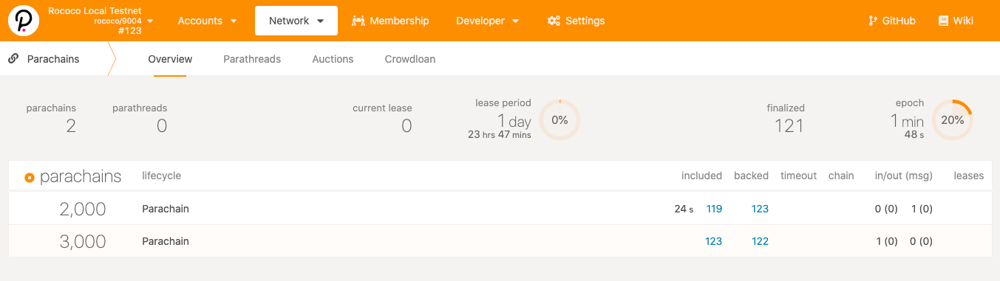
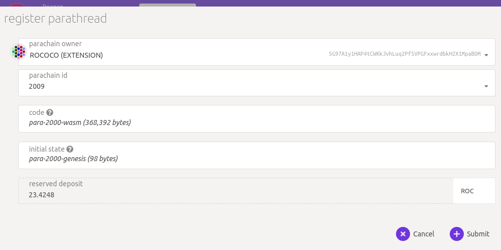
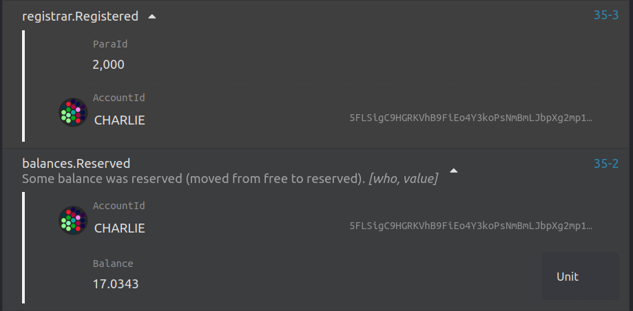
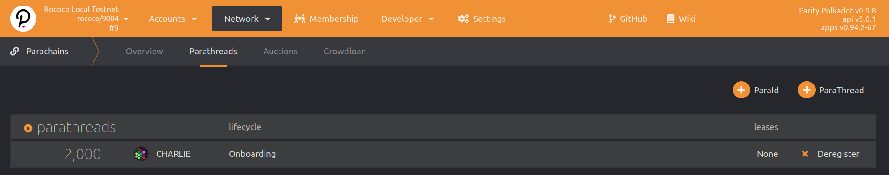
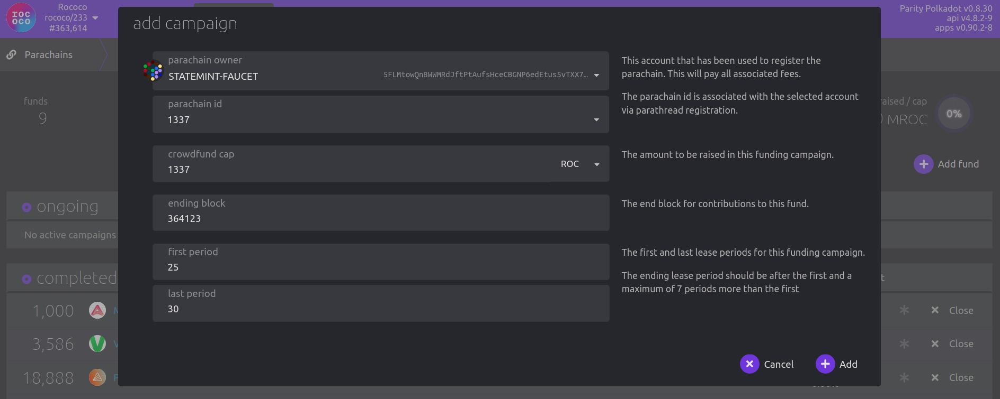
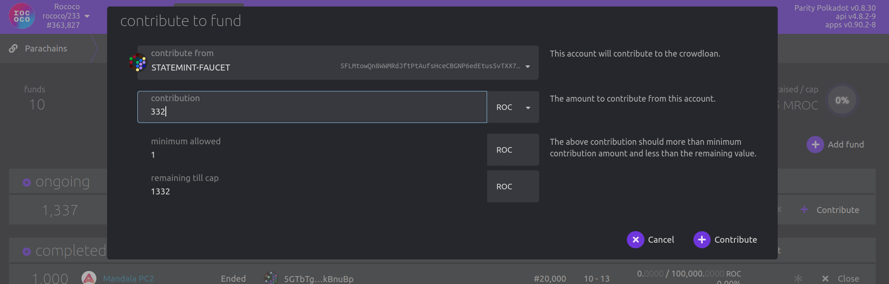

The final part of the workshop will step you through how to use Polkadot Launch to test a parachain
in a development environment.

<TutorialObjective
  data={{
    textLineOne: '1. Using Polkadot Launch',
    url: '#using-polkadot-launch',
  }}
/>
<TutorialObjective
  data={{
    textLineOne: '2. Launching a Testnet with Docker',
    url: '#launching-a-testnet-with-docker',
  }}
/>
<TutorialObjective
  data={{
    textLineOne: '3. Parachain Node Template',
    url: '#parachain-node-template',
  }}
/>
<TutorialObjective
  data={{
    textLineOne: '4. Rococo Testnet Registration',
    url: '#rococo-testnet-registration',
  }}
/>

## Learning outcomes

- Use `polkadot-launch` to run a parachain environment

## Using Polkadot Launch

Now that we have gone through the procedure of manually launching a relay chain of a few nodes, and
a parachain, you can automate testnets for development and testing.

<ExternalLink url="https://github.com/paritytech/polkadot-launch">
  polkadot-launch
</ExternalLink> is a Node utility script that does this for you, allowing for some
custom configurations to setup networks very simply.

Note that this isn't a replacement for the manual process, as this script is not a perfect fit for
all use cases and may fail for yours, so when things go wrong, you know the [manual
steps](../pt1#build-environment--compilation) that this script is executing for you to troubleshoot.

Now, let's install the utility script and try it out.

### 1. Installation

#### Global Install (Option A)

For most cases, you do not need to edit `polkadot-launch`. Run the following command to install the
script globally in your environment:

```bash
yarn global add polkadot-launch
# Check install:
polkadot-launch --version
# 1.7.0
```

#### Clone & Local Build (Option B)

If you find you need to edit the script, or otherwise would like to build this yourself, do:

```bash
git clone git@github.com:paritytech/polkadot-launch.git
cd polkadot-launch
# You need node v14+ -- https://www.geeksforgeeks.org/how-to-update-node-js-and-npm-to-next-version/
yarn install
# The entry point is `cl.js`
node dist/cli.js --version
# 1.7.0
```

If you think your edits are valuable, please consider <ExternalLink url="https://github.com/paritytech/polkadot-launch">opening a PR</ExternalLink>.

### 2. Basic Configuration

In this exercise, we will launch a **Polkadot relay chain of three nodes and two parachains, each with one node only**.

#### Prerequisites

1. We first get our Polkadot and Parachain Template cloned, and compiled.

   1. Build Polkadot, instructions [here](../pt1#2-building-the-polkadot-relay-chain-node)
   2. Build a Parachain, instructions [here](../pt1#3-building-the-parachain-template)

2. Write a config file for `polkadot-launch` to fit your needs.
   - **Here is one to get us started:**
     <a
       target="_blank"
       href="/assets/tutorials/cumulus-workshop/polkadot-launch-config/relay-3-validators--2paras-1collator.json"
     >
       relay-3-validators--2paras-1collator.json
     </a>

<!-- for some reason this links can't be markdown. See https://github.com/substrate-developer-hub/cumulus-workshop/issues/16 -->

Let take a brief look at the file. Inside the `relaychain` key, we see:

- `bin`: specifying where the relay chain binary is
- `chain`: the type of the relay chain we are launching
- `nodes`: number of nodes we have

As mentioned 3 nodes with the respective well known address as the session keys, its
respective websocket port (`wsPort`) and TCP port (`port`) listening to.

Inside `parachains` key, we see **two parachains** are defined, each with:

- `bin`: where the parachain binary is located
- `id`: the Para ID of each chain
- `balance`: Initial balance to be set for key-known account
- `nodes`: the nodes setting for the corresponding parachains

We see that each parachain has one node setup.

3. Update the `bin` location for the relaychain and parachains to an absolute path where your
   binaries are located. For the two parachains, use the same Parachain Template binary.

#### Launch a Network

Now you can start your network with the next commands:

```bash
mkdir <some empty working directory for log files and new chainspecs>
cd <your logfile & chainspec dir>
polkadot-launch relay-3-2para-1.json
```

If everything go well, you should see messages similar to the following:


Now open your working directory to find the relay chain node log are written to `alice.log`,
`bob.log`, and `charlie.log` for your three validators, respectively. While the parachain log is
indicated with the websocket port numbers they are listening to, so you should see `9988.log`and
`9999.log` there for each unique instance of your parachains. There are also the customized chain
spec files used to launch each network, including the change of `paraID` used for each instance of
the parachain used in your file.

If you wish to monitor the logs in real time, you can do so with:

```bash
# While `polkadot-launch` is running...
# Open a new terminal for each node and monitor logs with:
tail -f <logfile>
```

Another way to verify the setup is correct, is by going to <ExternalLink url="https://polkadot.js.org/apps/#/parachains"> Polkadot-JS Apps **Network** -
**Parachains** tab</ExternalLink> , after configure to connect to a
**relay chain node**, you should see the UI showing two parachains being connected to the relay chain.



Congratulation! You have automated the launch of a 3-node relay chain, and two parachains with a
single node using `polkadot-launch` CLI utility.

Next, we will go through in details the configuration parameters that `polkadot-launch` recognizes in the config file.

### 3. `polkadot-launch` Configuration

The config file can broadly divided into five sections, shown below.

```json
{
  "relaychain": {
    //...
  },
  "parachains": [
    {
      //...
    },
    {
      //...
    }
  ],
  "simpleParachains": [
    {
      //...
    },
    {
      //...
    }
  ],
  "hrmpChannels": [
    {
      //...
    }
  ],
  "types": {},
  "finalization": false
}
```

#### `relaychain` Section

This section of JSON specifies how the relaychain should be launched. The full config looks like the following:

```json
"relaychain": {
  "bin": "./bin/polkadot",
  "chain": "rococo-local",
  "nodes": [
    {
      "name": "alice",
      "wsPort": 9944,
      "port": 30444,
      "basePath": "/tmp/alice",
      "flags": ""
    },
    {
      //...
    }
  ],
  "genesis": {
    "runtime": {
      "runtime_genesis_config": {
        "parachainsConfiguration": {
          "config": {
            "validation_upgrade_frequency": 1,
            "validation_upgrade_delay": 1
          }
        }
      }
    }
  }
}
```

We have gone through the `bin`, `chain`, and `nodes` [above](#kickstart).

For each node inside `nodes`, you could have the following keys:

- `name`: Must be one of `alice`, `bob`, `charlie`, or `dave`.
- `wsPort`: The websocket port for this node.
- `port`: The TCP port of this node.
- `basePath`: Where the chain database are going to be saved.If unspecified, the chain is run with `--tmp` flag.
- `flags`: Any addition flags that would be passed to the relay chain.

Finally, there is `genesis`. It is a JSON object of the properties you want to modify from the genesis configuration. Non-specified properties will be unchanged from the original genesis configuration. Regarding the `genesis` value, it is the same as all the values shown in the chainspec when generated by the following commands:

```bash
./polkadot build-spec --chain=rococo-local --disable-default-bootnode
```

#### `parachains` Section

`parachains` is an array of objects, configuring how one or more parachains are to be launched. It looks like the following:

```json
"parachains": [
  {
    "bin": "./bin/parachain-collator",
    "id": "2000",
    "balance": "1000000000000000000000",
    "nodes": [
      {
        "wsPort": 9988,
        "port": 31200,
        "name": "alice",
        "flags": ["--", "--execution=wasm"]
      }
    ]
  },
  {
    // ...
  }
]
```

- `bin`: The path of the collator node binary. Use an absolute path here.
- `id`: The Para ID assigned to this parachain. Must be unique.
- `balance`: (Optional) Configure a starting amount of balance on the relay chain for this chain's account ID.
- For each node in `nodes`, it has the same configuration as node config in the relay chain.

#### `simpleParachains` Section

This is similar to parachains but for "simple" collators like the <ExternalLink url="https://github.com/paritytech/polkadot/tree/master/parachain/test-parachains/adder/collator">adder-collator</ExternalLink>,
a very simple collator that lives in the polkadot repo and is meant for simple testing. It supports a subset of configuration values, and is meant to run with a single node only:

`simpleParachains` section is similar to `parachains` section:

```json
"simpleParachains": [
  {
    "bin": "./bin/adder-collator",
    "id": "400",
    "port": "31400",
    "name": "alice",
    "balance": "1000000000000000000000"
  }
]
```

- `bin`: The path to the collator binary.
- `id`: The id to assign to this parachain. Must be unique.
- `port`: The TCP port for this node.
- `balance`: (Optional) Configure a starting amount of balance on the relay chain for this chain's account ID.

#### `hrmpChannels` Section

This section specifies HRMP channels to be open between the specified parachains so that it's possible to send messages between those. Keep in mind that an HRMP channel is unidirectional and in case you need to communicate both ways you need to open channels in both directions.

`hrmpChannels` looks similar to the following:

```json
"hrmpChannels": [
  {
    "sender": 2000,
    "recipient": 3000,
    "maxCapacity": 8,
    "maxMessageSize": 512
  }
]
```

#### Remaining

Finally, we have `types`, and `finalization`.

- `types`: The custom Polkadot-JS custom types to be fed to Polkadot-JS API.
- `finalization`: either `true` or `false`, whether you want transaction submitted from `polkadot-launch` to wait for block finalization.

### 4. How It Works

This tool just automates the steps you learned previously to spin up multiple relay chain nodes and parachain nodes in order to create a local test network. It also leverage on Polkadot-JS API to connect to these spawned nodes over their WebSocket endpoints.

### 5. Conclusion

In this chapter we have covered about `polkadot-launch` Node utility. You are now able to build up your own config file, and launch a relay chain and parachains set all in just a single command.

This is a good basis to get to our next subject, actual parachain development.

<!-- FIXME - docker for this is presently not maintained. this was simply copied from the compilation page. Needs to be updated to be used! -->

<!--

## Launching a Testnet with Docker

If you intend to use this material for a live workshop you may shorten it by cutting steps off of
the end. If your workshop will not cover writing your own parachains, you may skip all the
compilation by using the provided docker images.

If you prefer to focus primarily on development in your workshop, you may also skip initial relay
chain setup by performing those steps yourself in preparation for the workshop or using the public
rococo testnet. See [Setting Up The Bootnode](../SettingUpTheBootnode.md) for notes on setting up a
cloud-based relay chain.

---

#### Using the Docker Images

> You may skip this step if you have built the nodes locally

The two docker images available for this workshop run the exact same binaries that we described
building in the previous section.

- `joshyorndorff/cumulus-workshop-polkadot` is the relay chain node.
- `joshyorndorff/cumulus-workshop-parachain-collator` is the parachain node.

Because these containers will need to communicate with each other, you will need to handle
networking. <ExternalLink url="https://docs.docker.com/network/">Networking in Docker</ExternalLink> is beyond the scope of this
tutorial, and there are many valid options. I'll briefly describe one simple option here that will
help many beginners get up and running fast.

"Host Networking" is the simplest technique and allows commands that look most similar to the ones
given in the workshop. It tells docker to run the nodes without isolating the containers; just like
if you were running local binaries.

```bash
# Instead of running
polkadot --my-args

# You should run
docker run --network host joshyorndorff/cumulus-workshop-polkadot --my-args
```

```bash
# Instead of running
parachain-collator --para-args -- --relay-args

# You should run
docker run --network host joshyorndorff/cumulus-workshop-parachain-collator --para-args -- --relay-args
```

Throughout this workshop when we need to run nodes we will refer to them simply as `polkadot` and
`parachain-collator`. You will need to transform these commands into appropriate docker commands.

-->

## Parachain Node Template

Substrate developers who are familiar with
the <ExternalLink url="https://github.com/substrate-developer-hub/substrate-node-template">Substrate Node Template</ExternalLink> will
find the <ExternalLink url="https://github.com/substrate-developer-hub/substrate-parachain-template">Substrate Parachain Template </ExternalLink>
familiar. They have the same general structure featuring `node`, `runtime`, and `pallets`
directories. Their runtimes are similar and feature many of the same pallets. Apart from a few new
traits, the `pallet-template` itself is essentially identical. Many of the [Substrate devhub tutorials](/tutorials/v3)
can be used with few modifications on the Parachain Template.

The similarities between these two templates should give you confidence, that if you've built a
Substrate chain, you will have no problem building a parachain!

### 1. Differences from the Node Template

There are, however, a few important differences between the two templates that are worth observing at
the outset.

#### Parachain Info Pallet

This pallet is designed to inject information about the parachain's registration into its own
runtime. Currently it just injects the Para ID that the chain is registered at. This allows the
runtime to know which cross-chain messages are intended for it.

#### Message Broker Pallet

This pallet is responsible for distributing cross-chain messages received over the network to the
pallets that they are intended for. If you intend to receive cross chain messages, you should use
this pallet.

#### `register_validate_block!` Macro

Each parachain must supply a `validate_block` function, expressed as a Wasm blob, to the relay chain
when registering. The node template does not provide this function, but the parachain template does.
Thanks to cumulus, creating this function for a Substrate runtime is as simple as adding one line of
code at the bottom of your runtime:

```rust
cumulus_pallet_parachain_system::register_validate_block!(
  Runtime = Runtime,
  BlockExecutor = cumulus_pallet_aura_ext::BlockExecutor::<Runtime, Executive>,
  CheckInherents = CheckInherents,
);
```

#### No GRANDPA Pallet

Many popular Substrate runtimes including the node template feature a finality-related GRANDPA
pallet and its associated `GrandpaApi`. These are both missing from the parachain template.

This is because parachains follow the finality of the relay chain rather than running their own
finality gadget. This is fundamental to Polkadot's architecture and will not change.

#### Service

The collator's service is entirely different from the node template's. While you can find
similarities, the structure of the service is much different. This new service is the primary change
that cumulus provides.

<Message
  type={`gray`}
  title={`Note`}
  text={`When modifying an existing Substrate chain to use Cumulus, it is generally best to copy the
  service code from the template.
  `}
/>

### 2. Using the Template

<Message
  type={`yellow`}
  title={`Important`}
  text={`
  The instructions in the following sections walk through a few basic exercises using the parachain
  template. They may be followed in any order and do not build on one another.
  They assume that you have already
  [compiled the Parachain Template](../pt1#3-building-the-parachain-template) on your local system. If you haven't,
  please go back and do that.
  `}
/>

The Parachain Template comes with a template pallet at `pallets/template` just like the Node
Template.

Modify this pallet by adding storage items.

Follow the [PoE tutorial](/tutorials/v3/proof-of-existence). Although it was
written for the node template, it works effectively identically here.

### 3. Adding an External Pallet

<!-- TODO: add more content and gotchas about pallets in the para-context -->

**Note:** This section is a _work in progress_ and will be fleshed out later.

Add Substrate's `nicks` pallet to your runtime.

**Remember to match substrate commits exactly in your dependencies!**

Reference the [**Add a Pallet** tutorial](/tutorials/v3/add-a-pallet) for
inspiration.

## Rococo Testnet Registration

### 1. Parathread Registration

Rococo is Parity's official test network for cumulus-based parachains.

<Message
  type={`yellow`}
  title={`Important`}
  text={`As parachains are being developed at a fast pace, you need to use the
  corresponding tagged version of Cumulus and Polkadot for the relay-chain and parachain
  compatible to each others.
  
  Please test registering your parachain locally before attempting to connect to Rococo!
  `}
/>

<ExternalLink url="https://github.com/paritytech/polkadot/tree/release-v0.9.8">
  Polkadot `release-v0.9.8` branch
</ExternalLink>
<p></p>
<ExternalLink url="https://github.com/paritytech/cumulus/tree/polkadot-v0.9.8">
  Cumulus `polkadot-v0.9.8` branch
</ExternalLink>

### 2. Request ROC Tokens

ROC is the native currency on the Rococo test network. You will need some ROC in order to
register your Rococo parachain.

You need to register on Rococo as a parathread before able to experiment on Rococo testnet.

<Message
  type={`gray`}
  title={`Note`}
  text={`If you have any questions and comments regarding Rococo testnet, please join the
  [Rococo channel](https://matrix.to/#/#rococo:matrix.parity.io).
  On requesting the ROC tokens, please join the [Rococo faucet channel](https://matrix.to/#/#rococo-faucet:matrix.org).
  `}
/>

### 3. Register as a Parathread

All parachains will need to register as a parathread first. You will need:

- **5 ROCs** deposit to register a Para ID.

- [Reserve a unique Para ID](../pt2#1-reserve-a-para-id). This will be assigned to the next
  available ID. This integer will be greater than `2000`, as `0-999` are reserved for <ExternalLink url="https://wiki.polkadot.network/docs/learn-common-goods#system-level-chains">system parachains</ExternalLink> and
  `1000-1999` are reserved for <ExternalLink url="https://wiki.polkadot.network/docs/learn-common-goods#public-utility-chains">public utility parachains</ExternalLink>.

- Your parachain genesis state. Refer to the
  [genesis state export process](../pt2#3-generate-parachain-genesis-state).

- Your parachain Wasm runtime. Refer to the
  [Wasm runtime export process](../pt2#4-obtain-wasm-runtime-validation-function).

The procedure will be as followed:

- Goto Polkadot-JS Apps <ExternalLink url="https://polkadot.js.org/apps/?rpc=wss%3A%2F%2Frococo-rpc.polkadot.io#/parachains/parathreads">here</ExternalLink>

- Reserve for the next available Para ID.

  

- After successfully reserving your Para ID, you can now register as a **Parathread**.

  

- Once your extrinsic succeeds, you will see the `registrar.Registered` event being emitted.

  

- Also in the Polkadot-JS Apps <ExternalLink url="https://polkadot.js.org/apps/#/parachains/parathreads">**Parachains > Parathreads** page</ExternalLink>
  you will see your parathread registration is **Onboarding**:

  

After the extrinsic succeeds, it takes [**2 sessions**](#relevant-settings) for the chain to
fully onboard as a parathread.

### 4. Parachain Slot Auction

Parathead can then be transformed to parachain by winning a parachain slot auction. This guarantees
the now parachain will always have their block data hashed and included in the relay chain block
(called Proof of Validation, or short for **PoV**), during the slot duration they are alloted.

Only fully-onboarded Rococo parathreads are eligible to bid in a Rococo parachain slot auction. Common
goods chains can bypass auctions and become parachains through on-chain governance decision.

#### Relevant Settings

Following are setting in the Rococo testnet that affect timing behavior on some parachain operations,
and are subject to change.

- Session length: 10 mins
- Lease Period Length: 14,400 Blocks (1 day)
- Ending Period: 600 Blocks (60 mins)
- Current Lease Period Index = Current Block Number / 14400

Note that transitions of a parachain/Parathread into a different state will take at least 2 sessions,
including on-boarding, off-boarding, upgrading, downgrading, etc.

#### Bidding

Anyone with a fully onboarded parathread can make a bid to win a parachain slot for their Para ID.
They need to out-bid all others participating in the slot auction.

You can do so in Polkadot-JS App <ExternalLink url="https://polkadot.js.org/apps/?rpc=wss%3A%2F%2Frococo-rpc.polkadot.io#/parachains/auctions">**Network** > **Parachains** > **Auctions** page</ExternalLink>.

Pick your Para ID, how much you want to bid, and the slots you want to bid for:


### 5. Crowdloans

You may also choose to harness your community and get their supports in winning the parachain
slot auction. In this case, you would start a crowdloan campaign so your supporters can
loan your project their tokens to win the auction. These tokens will be held in custody during the
auction process, and if won, the whole slot leasing duration also.

You will not do this for a testnet parachain slot, but you may consider this option for a mainnet
parachain slot.

#### Start a Crowdloan Campaign

In the following, we are getting ready to submit an extrinsic to start a crowdloan.



Notes on the parameters:

- `parachain id`: You can only create a crowdloan campaign for a Para ID that you registered.

- `crowdfund cap`: The maximum amount your crowdloan campaign can collect. This is just a responsible
  measure for getting external support.

- `ending block`: This is when you want your crowdloan to end. If you know an auction will start in
  3 days, and last for 5 days, you probably want to set your crowdloan to end in 10 days, a time with
  a little buffer at the end. This way you will be sure that your crowdloan is active during the
  entire auction process. On the other hand, you don't want to set your crowdloan period to be too
  long, or else prolong the community funds lock up period unnecessarily and discouraging them to
  participate in your campaign.

- `first period` / `last period`: The slot duration you want to bid for. So if the current auction
  has slots 3 - 6 open, these values can be any number in between.

- You can cancel a crowdloan as long as you have not received a contribution.

If your extrinsic succeeds, you can see your new crowdloan entry in

<ExternalLink url="https://polkadot.js.org/apps/#/parachains/crowdloan">
  **Network** > **Parachains** > **Crowdloan** page
</ExternalLink>
:


#### Fund a Crowdloan Campaign

Any accounts with a free balance and elect to contribute to your campaign, including the
same account that started this campaign.

You can goto the same <ExternalLink url="https://polkadot.js.org/apps/#/parachains/crowdloan">**Crowdloan** page</ExternalLink> above, and choose **+ Contribute** on the campaign you want to support.

You will see an extrinsic pop up similar to the following:



Input the funding amount your want to support and submit the transaction.
