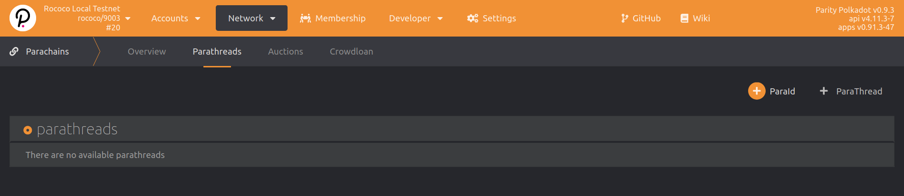

To connect to any relay chain, you must first reserve a Para ID for your parathread that will
become a parachain. It is called Para ID, because the same ID can be seen as its parachain ID or
parathread ID, depending on your current chain to relay-chain connection state. To do this, you need
to have sufficient amount of the currency on the network to
reserve the ID. This is 20 "units" on the testnets. Check for the amount on your relay chain.
The relay chain is responsible for allotting all Para IDs (they can no longer
be user selected) and will be simply the increment starting at `2000` for all chains connecting
that are not "systems parachains" that use a different method to obtain the Para ID.

The easiest way to reserve your Para ID is via the
[Polkadot-JS Apps](https://polkadot.js.org/apps/?rpc=ws%3A%2F%2F127.0.0.1%3A9944#/parachains/parathreads)
under the _Network_ -> **Parachains** subpage, click on **Parathreads** tab and use the
**+ ParaId** button.

> You will need to connect to a relay chain to submit this extrinsic! In testnets, your Parachain
> ID will be 2000 for your first parathread registration.

Note that the account used to register the Para ID must also be the origin for using this
Para ID. Once you submit this extrinsic successfully (you must see a sucessful `registrar.Reserved`
event with your `paraID`), you can now launch your parachain or parathread using this reserved ID.
