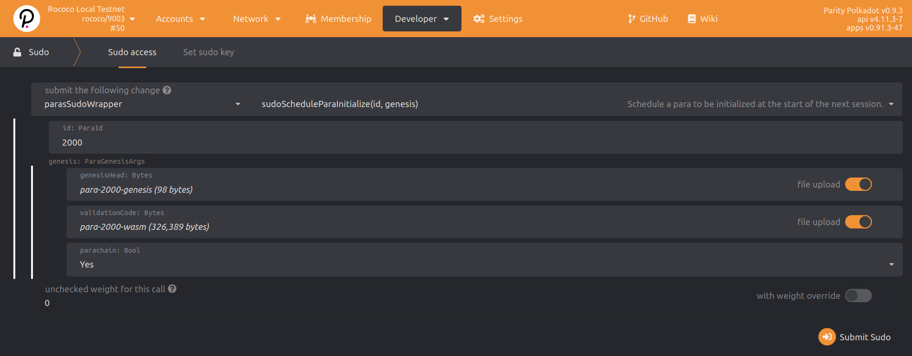

# Parachain Registration

We have our relay chain launched and our parachain collator ready to go. Now we have to register the
parachain on the relay chain. In the live Polkadot network, this will be accomplished with
[parachain auctions](https://wiki.polkadot.network/docs/en/learn-auction). But today we will do it
with `Sudo` call.

## Registration Transaction

The transaction can be submitted **on a relay chain node** via Polkadot Apps UI. There are options
for you to accomplish different types of registration that we cover below, only _one_ is needed.
Note that all methods here depend on a [`paraID` being reserved](en/2-relay-chain/reserve) - so be
sure to do that first.

If you are running a network with more than two validators you can add more parachains through the
same interface with the parameters adjusted accordingly using any mix of these options. More details
on this can be found [latter on in this tutorial](en/3-parachains/4-more-nodes).

### Option 1: `paraSudoWrapper.sudoScheduleParaInitialize`

> This option bypasses the slot lease mechanics entirely to onboard a parachain or parathread for a
> reserved `paraID` starting on the next relay chain session. This is the simplest and fastest way to
> go about testing, but note that it also will be automatically off-boarded at the next slot, where any
> parachains without a lease are downgraded to parathreads, so make note of the next slot
> ending period and be sure to re-register as needed.

- Go to [Polkadot Apps UI](https://polkadot.js.org/apps/#/explorer), connecting to your **relay chain**.

- Execute a sudo extrinsic on the relay chain by going to `Developer` -> `sudo` page.

- Pick `paraSudoWrapper` -> `sudoScheduleParaInitialize(id, genesis)` as the extrinsic type,
  shown below.



- In the extrinsics parameters, specify:

  - Set the `id: ParaId` to 2,000
  - `genesisHead`: upload the file `para-2000-genesis` (from the previous step)
  - `validationCode`: upload the file `para-2000-wasm` (from the previous step)
  - Set the `parachain: Bool` option to **Yes**.

This dispatch, if successful, will emit the `sudo.Sudid` event, viewable in the relay chain explorer
page.

### Option 2: Register Parathread -> `slots.forceLease`

> This is the more formal flow for registration used in production (with the exception of the use of
> sudo to force a slot lease): you register your reserved `paraID` with the _same_ account that
> reserved it, or use `sudo` with a `registrar.forceRegister` extrinsic if you wish.

Please first follow the [Rococo registration](en/5-rococo-registration/1-register?id=_2-register-as-a-parathread)
instructions, with the exception of asking for a slot lease to be awarded or participating in a slot auction on a
public testnet or mainnet. Here we will use `sudo` to grant ourselves a lease instead. You should
have an onboarded parathread:


- Go to [Polkadot Apps UI](https://polkadot.js.org/apps/#/explorer),
  connecting to your **relay chain**.

- Execute a sudo extrinsic on the relay chain by going to `Developer` -> `sudo` page.

- Pick `slots`->`forceLease(para, leaser, amount, period_begin, period_end)` as the extrinsic type,
  shown below.


Be sure to set the begin period to the slot you wish to start at, in testing this very likely is the
already active slot `0` if you started from scratch. Extending this out to beyond the scope of
the time you wish to test this parachain is likely best, unless you wish to test onboarding and
offboarding cycles, then electing slot leases that have gaps for a `paraID` would be in order.
Once fully onboarded and after [block production](#block-production) starts you should see:


## Block Production

The collator should start producing parachain blocks (aka collating) once the registration is
successful **and a new relay chain epoch has begun**!

> This may take a while! Be patient as you wait for a new epoch to begin first.
> This is 10 blocks for the [rococo `chain-spec.json`](en/1-prep/2-chain-spec?id=_1a-using-a-prebuilt-chain-spec)
> included in this workshop.

Finally, the collator should start producing log messages like the following:

```bash
# Notice the relay epoch change! Only then do we start parachain collating!
#
2021-05-30 17:00:04 [Relaychain] 💤 Idle (2 peers), best: #30 (0xfc02…2a2a), finalized #28 (0x10ff…6539), ⬇ 1.0kiB/s ⬆ 0.3kiB/s
2021-05-30 17:00:04 [Parachain] 💤 Idle (0 peers), best: #0 (0xd42b…f271), finalized #0 (0xd42b…f271), ⬇ 0 ⬆ 0
2021-05-30 17:00:06 [Relaychain] 👶 New epoch 3 launching at block 0x68bc…0605 (block slot 270402601 >= start slot 270402601).
2021-05-30 17:00:06 [Relaychain] 👶 Next epoch starts at slot 270402611
2021-05-30 17:00:06 [Relaychain] ✨ Imported #31 (0x68bc…0605)
2021-05-30 17:00:06 [Parachain] Starting collation. relay_parent=0x68bcc93d24a31a2c89800a56c7a2b275fe9ca7bd63f829b64588ae0d99280605 at=0xd42bb78354bc21770e3f0930ed45c7377558d2d8e81ca4d457e573128aabf271
2021-05-30 17:00:06 [Parachain] 🙌 Starting consensus session on top of parent 0xd42bb78354bc21770e3f0930ed45c7377558d2d8e81ca4d457e573128aabf271
2021-05-30 17:00:06 [Parachain] 🎁 Prepared block for proposing at 1 [hash: 0xf6507812bf60bf53af1311f775aac03869be870df6b0406b2969784d0935cb92; parent_hash: 0xd42b…f271; extrinsics (2): [0x1bf5…1d76, 0x7c9b…4e23]]
2021-05-30 17:00:06 [Parachain] 🔖 Pre-sealed block for proposal at 1. Hash now 0x80fc151d7ccf228b802525022b6de257e42388ec7dc3c1dd7de491313650ccae, previously 0xf6507812bf60bf53af1311f775aac03869be870df6b0406b2969784d0935cb92.
2021-05-30 17:00:06 [Parachain] ✨ Imported #1 (0x80fc…ccae)
2021-05-30 17:00:06 [Parachain] Produced proof-of-validity candidate. block_hash=0x80fc151d7ccf228b802525022b6de257e42388ec7dc3c1dd7de491313650ccae
2021-05-30 17:00:09 [Relaychain] 💤 Idle (2 peers), best: #31 (0x68bc…0605), finalized #29 (0xa6fa…9e16), ⬇ 1.2kiB/s ⬆ 129.9kiB/s
2021-05-30 17:00:09 [Parachain] 💤 Idle (0 peers), best: #0 (0xd42b…f271), finalized #0 (0xd42b…f271), ⬇ 0 ⬆ 0
2021-05-30 17:00:12 [Relaychain] ✨ Imported #32 (0x5e92…ba30)
2021-05-30 17:00:12 [Relaychain] Moving approval window from session 0..=2 to 0..=3
2021-05-30 17:00:12 [Relaychain] ✨ Imported #32 (0x8144…74eb)
2021-05-30 17:00:14 [Relaychain] 💤 Idle (2 peers), best: #32 (0x5e92…ba30), finalized #29 (0xa6fa…9e16), ⬇ 1.4kiB/s ⬆ 0.2kiB/s
2021-05-30 17:00:14 [Parachain] 💤 Idle (0 peers), best: #0 (0xd42b…f271), finalized #0 (0xd42b…f271), ⬇ 0 ⬆ 0
2021-05-30 17:00:18 [Relaychain] ✨ Imported #33 (0x8c30…9ccd)
2021-05-30 17:00:18 [Parachain] Starting collation. relay_parent=0x8c30ce9e6e9867824eb2aff40148ac1ed64cf464f51c5f2574013b44b20f9ccd at=0x80fc151d7ccf228b802525022b6de257e42388ec7dc3c1dd7de491313650ccae
2021-05-30 17:00:19 [Relaychain] 💤 Idle (2 peers), best: #33 (0x8c30…9ccd), finalized #30 (0xfc02…2a2a), ⬇ 0.7kiB/s ⬆ 0.4kiB/s
2021-05-30 17:00:19 [Parachain] 💤 Idle (0 peers), best: #1 (0x80fc…ccae), finalized #0 (0xd42b…f271), ⬇ 0 ⬆ 0
2021-05-30 17:00:22 [Relaychain] 👴 Applying authority set change scheduled at block #31
2021-05-30 17:00:22 [Relaychain] 👴 Applying GRANDPA set change to new set [(Public(88dc3417d5058ec4b4503e0c12ea1a0a89be200fe98922423d4334014fa6b0ee (5FA9nQDV...)), 1), (Public(d17c2d7823ebf260fd138f2d7e27d114c0145d968b5ff5006125f2414fadae69 (5GoNkf6W...)), 1)]
2021-05-30 17:00:22 [Relaychain] 👴 Imported justification for block #31 that triggers command Changing authorities, signaling voter.
2021-05-30 17:00:24 [Relaychain] ✨ Imported #34 (0x211b…febf)
2021-05-30 17:00:24 [Parachain] Starting collation. relay_parent=0x211b3c53bebeff8af05e8f283d59fe171b7f91a5bf9c4669d88943f5a42bfebf at=0x80fc151d7ccf228b802525022b6de257e42388ec7dc3c1dd7de491313650ccae
2021-05-30 17:00:24 [Parachain] 🙌 Starting consensus session on top of parent 0x80fc151d7ccf228b802525022b6de257e42388ec7dc3c1dd7de491313650ccae
2021-05-30 17:00:24 [Parachain] 🎁 Prepared block for proposing at 2 [hash: 0x10fcb3180e966729c842d1b0c4d8d2c4028cfa8bef02b909af5ef787e6a6a694; parent_hash: 0x80fc…ccae; extrinsics (2): [0x4a6c…1fc6, 0x6b84…7cea]]
2021-05-30 17:00:24 [Parachain] 🔖 Pre-sealed block for proposal at 2. Hash now 0x5087fd06b1b73d90cfc3ad175df8495b378fffbb02fea212cc9e49a00fd8b5a0, previously 0x10fcb3180e966729c842d1b0c4d8d2c4028cfa8bef02b909af5ef787e6a6a694.
2021-05-30 17:00:24 [Parachain] ✨ Imported #2 (0x5087…b5a0)
2021-05-30 17:00:24 [Parachain] Produced proof-of-validity candidate. block_hash=0x5087fd06b1b73d90cfc3ad175df8495b378fffbb02fea212cc9e49a00fd8b5a0
2021-05-30 17:00:24 [Relaychain] 💤 Idle (2 peers), best: #34 (0x211b…febf), finalized #31 (0x68bc…0605), ⬇ 1.0kiB/s ⬆ 130.1kiB/s
2021-05-30 17:00:24 [Parachain] 💤 Idle (0 peers), best: #1 (0x80fc…ccae), finalized #0 (0xd42b…f271), ⬇ 0 ⬆ 0
2021-05-30 17:00:29 [Relaychain] 💤 Idle (2 peers), best: #34 (0x211b…febf), finalized #32 (0x5e92…ba30), ⬇ 0.2kiB/s ⬆ 0.1kiB/s
2021-05-30 17:00:29 [Parachain] 💤 Idle (0 peers), best: #1 (0x80fc…ccae), finalized #0 (0xd42b…f271), ⬇ 0 ⬆ 0
2021-05-30 17:00:30 [Relaychain] ✨ Imported #35 (0xee07…38a0)
2021-05-30 17:00:34 [Relaychain] 💤 Idle (2 peers), best: #35 (0xee07…38a0), finalized #33 (0x8c30…9ccd), ⬇ 0.9kiB/s ⬆ 0.3kiB/s
2021-05-30 17:00:34 [Parachain] 💤 Idle (0 peers), best: #1 (0x80fc…ccae), finalized #1 (0x80fc…ccae), ⬇ 0 ⬆ 0
2021-05-30 17:00:36 [Relaychain] ✨ Imported #36 (0xe8ce…4af6)
2021-05-30 17:00:36 [Parachain] Starting collation. relay_parent=0xe8cec8015c0c7bf508bf3f2f82b1696e9cca078e814b0f6671f0b0d5dfe84af6 at=0x5087fd06b1b73d90cfc3ad175df8495b378fffbb02fea212cc9e49a00fd8b5a0
2021-05-30 17:00:39 [Relaychain] 💤 Idle (2 peers), best: #36 (0xe8ce…4af6), finalized #33 (0x8c30…9ccd), ⬇ 0.6kiB/s ⬆ 0.1kiB/s
2021-05-30 17:00:39 [Parachain] 💤 Idle (0 peers), best: #2 (0x5087…b5a0), finalized #1 (0x80fc…ccae), ⬇ 0 ⬆ 0
```

## Chains Purge

> **NOTE**: your sole collator is the _only home of the parachain data_ as there is only one node
> on your entire network. Relay chains only store _header_ information. If the parachian data is lost
> you will **not** be able to recover the chain!

If you _must_ purge your chain database, you need to deregister and re-register it. It may be easier
in testing to instead just purge all the chains. To purge the collator, run:

```bash
# Purge the collator(s)
parachain-collator purge-chain\
  --base-path <your collator DB path set above>

# Purge the validator(s)
polkadot purge-chain\
  --base-path <your relay chain DB path set above>
```

Then register from a [blank slate](#registration-transaction) again.

## Parachian Block Finalization

The relay chain tracks the latest blocks (the heads) of each parachain. When a relay chain block
is finalized, any parachain blocks that have completed the
[validation process](https://polkadot.network/the-path-of-a-parachain-block/) are also finalized.
This is how Polkadot achieves shared security.

We can keep track of what parachains are registered and what their latest head data is on the
`Network > Parachains` tab in the Apps UI.


