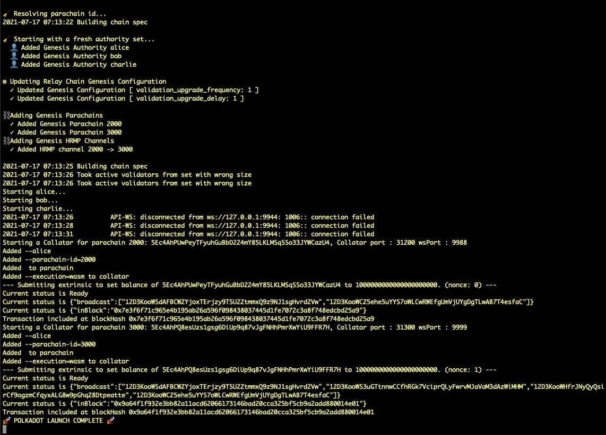

## NOTE: BREAKING CHANGES

> The following is for **reference only**.
> There is a temporary breaking issue in the launch tool that is traced in https://github.com/substrate-developer-hub/substrate-docs/issues/634 .
> Thus the examples below are not expected to work!

The final part of the workshop will step you through how to use the [`polkadot-launch`](https://github.com/paritytech/polkadot-launch) tool to automate the launch of a full parachain testnet with multiple parachains and a common relay chain.

> It is still **_highly recommended_** to understand [the manual process](/tutorials/v3/cumulus/start-relay), as this script is not a perfect fit for all use cases.
> When things go wrong with `polkadot-launch`, you know how to troubleshoot.

## Learning outcomes

- Use `polkadot-launch` to configure and deploy a parachain testnet

## Installation

### Option A: Global install

For most cases, you do not need to modify `polkadot-launch` itself.
Run the following command to install the script globally in your environment:

```bash
yarn global add polkadot-launch
# Check install:
polkadot-launch --version
# 1.8.0
```

### Option B: Clone & run locally

If you want to edit the tool, or otherwise would like to build this yourself:

```bash
git clone git@github.com:paritytech/polkadot-launch.git
cd polkadot-launch
# You need node v14+ -- https://www.geeksforgeeks.org/how-to-update-node-js-and-npm-to-next-version/
yarn install
# The entry point is `cl.js`
node dist/cli.js --version
# 1.8.0
```

> If you think your edits are valuable, please consider [opening a PR](https://github.com/paritytech/polkadot-launch)!

## How `polkadot-launch` works

At a high level, this tool **automates** the steps you learned previously to spin up multiple relay
chain nodes and parachain nodes in a single local machine.
It also leverages on Polkadot-JS API to connect to these spawned nodes over their web socket endpoints and make a few calls to the nodes on your network to configure as you specify.

Specifically, you will perform the following to use `polkadot-launch`:

1. Compile and have your relay chain node and parachain collator binaries ready.
   [Instructions here](/tutorials/v3/cumulus/start-relay).
   Beware to match their corresponding tagged version.

1. Write a config file for `polkadot-launch` to fit your needs.

1. Launch (your initial registration tasks automatically).

The important new aspect here is the config file in step 2. Here is one to get started:

- <a
    href="/assets/tutorials/cumulus/polkadot-launch-config/relay-3-validators--2paras-1collator.json"
    download
  >
    relay-3-validators--2paras-1collator.json
  </a>

Let's take a brief look inside the file. Inside the `relaychain` section, there are:

- `bin`: where the relay chain binary is located.
- `chain`: the type of the relay chain we are launching.
- `nodes`: number of nodes we have and their respective config.
  As mentioned, 3 nodes will be deployed using the well-known addresses as session keys.
  We also specify their respective websocket port (`wsPort`) and TCP port (`port`) they listen to.

Inside the `parachains` section, **two parachains** are defined, each with:

- `bin`: where the parachain binary is located.
- `id`: the para ID of each chain.
- `balance`: initial balance to be set for the well-known accounts.
- `nodes`: the node setting for the corresponding parachains.

Each parachain has one node setup.

## Launch a network

Now update the `bin` location for the relay chain and parachains to an absolute path where your binaries are located.
For the two parachains, use the same parachain template binary.

Start with:

```bash
mkdir polkadot-config
cd polkadot-config

# 1. Download the `relay-3-validators--2paras-1collator.json` file into this directory.
# 2. Update the relay chain and parachains binary

polkadot-launch relay-3-validators--2paras-1collator.json
```

If everything goes well, you should see messages similar to:



Now in your **current working directory** you will find the relay chain node logs are written to `alice.log`, `bob.log`, and `charlie.log` for your three validators.
While the parachain logs are indicated by the websocket port numbers they are listening to, `9988.log`and `9999.log`.
There are also customized chain spec files used to launch the networks.

If you wish to monitor the logs in real time, you can do so with:

```bash
# While `polkadot-launch` is running...
# Open a new terminal for each node and monitor logs with:
tail -f <log file>
```

Another way to verify the setup is by going to:
[Polkadot-JS Apps > Network > Parachains](https://polkadot.js.org/apps/#/parachains).

After configuring the Apps to connect to the local **relay chain node**, you should see the UI showing two parachains being connected to the relay chain.

<Message
  type={`green`}
  title={`All done!`}
  text={`
You have automated the launch of a 3-node relay chain, and two parachains with a single node using \`polkadot-launch\` CLI utility and avoided all the initial manual overhead of starting nodes and registering parachains!
`}
/>

Next, we will go through in details the configuration parameters that `polkadot-launch` recognizes in the config file.

## `polkadot-launch` configuration files

The config file can be broadly divided into five sections as shown below.

```json
{
  "relaychain": {
    //...
  },
  "parachains": [
    {
      //...
    },
    {
      //...
    }
  ],
  "simpleParachains": [
    {
      //...
    },
    {
      //...
    }
  ],
  "hrmpChannels": [
    {
      //...
    }
  ],
  "types": {},
  "finalization": false
}
```

### `relaychain` section

This section of JSON specifies how the relaychain should be launched.
The full config looks like the following:

```json
"relaychain": {
  "bin": "./bin/polkadot",
  "chain": "rococo-local",
  "nodes": [
    {
      "name": "alice",
      "wsPort": 9944,
      "port": 30444,
      "basePath": "/tmp/alice",
      "flags": ""
    },
    {
      //...
    }
  ],
  "genesis": {
    "runtime": {
      "runtime_genesis_config": {
        "parachainsConfiguration": {
          "config": {
            "validation_upgrade_frequency": 1,
            "validation_upgrade_delay": 1
          }
        }
      }
    }
  }
}
```

- `bin`: where the relay chain binary is located.
- `chain`: the type of the chain to be launched.
  The full list of supported types is [specified here](https://github.com/paritytech/polkadot/blob/master/cli/src/command.rs#L94-L135).
  Typically we want to use `rococo-local` for testing and development.

For each node inside `nodes`, the following properties can be added:

- `name`: one of well-known account names, e.g. `alice`, `bob`, `charlie`, or `dave`.
- `wsPort`: the websocket port this node listens to.
- `port`: the TCP port this node listens to.
- `basePath`: location of where the chain database is going to be saved.
  If unspecified, the node is launched with `--tmp` flag.
- `flags`: any additional flags that would be passed to the node.

Finally, there is `genesis` property.
It is a JSON object with properties you want to modify from the default genesis configuration.
Regarding the `genesis` value, it is the same as all the values shown in the chain spec when generated by the following command:

```bash
./polkadot build-spec --chain=rococo-local --disable-default-bootnode
```

### `parachains` section

`parachains` is an array of objects, configuring how one or more parachains are to be launched.
It looks like the following:

```json
"parachains": [
  {
    "bin": "./bin/parachain-collator",
    "id": "2000",
    "balance": "1000000000000000000000",
    "nodes": [
      {
        "wsPort": 9988,
        "port": 31200,
        "name": "alice",
        "flags": ["--", "--execution=wasm"]
      }
    ]
  },
  {
    // ...
  }
]
```

- `bin`: where the parachain collator binary is located.
- `id`: the para ID assigned to this parachain. It must be unique among the network.
- `balance`: (optional) configure a starting amount of balance on the relay chain for this chain's account ID.
- For each node in `nodes`, it has the same configuration as node config in the relay chain.

### `simpleParachains` section

This is similar to parachains but for "simple" collators like [adder-collator](https://github.com/paritytech/polkadot/tree/master/parachain/test-parachains/adder/collator), a simple collator that lives in the polkadot repo for testing.
It supports a subset of configuration values, and is meant to run with a single node only.

```json
"simpleParachains": [
  {
    "bin": "./bin/adder-collator",
    "id": "400",
    "balance": "1000000000000000000000",
    "port": "31400",
    "name": "alice"
  }
]
```

Note that since a simple parachain only has one node, configs that was originally in `nodes` property are flattened into one level now.

### `hrmpChannels` section

This section config how the Horizontal Relay-routed Message Passing (HRMP) channels are open between the specified parachain pair so they can send messages to each others.
Keep in mind that an HRMP channel is unidirectional only, so you need to open channels in both directions to enable them communicating both ways.

`hrmpChannels` property is defined as follows.

```json
"hrmpChannels": [
  {
    "sender": 2000,
    "recipient": 3000,
    "maxCapacity": 8,
    "maxMessageSize": 512
  }
]
```

- `sender`: chain para ID messages are sent from.
- `recipient`: chain para ID messages are sent to.
- `maxCapacity`: number of messages that can be sent before they are acknowledged by the recipient chain.
- `maxMessageSize`: maximum size of a message that can be sent across.

### Remaining configurable items

Finally, we have `types`, and `finalization`.

- `types`: [custom Substrate types](https://polkadot.js.org/docs/api/start/types.extend) to be fed into Polkadot-JS API.
- `finalization`: either `true` or `false`, whether you want transactions submitted to the network to wait for finalization.

## Next steps

Now we have the ability to configure complex networks to thoroughly test locally.
But what about transitioning to a production system?
How do you connect to a relay chain that exists already and get a parachain slot there?

This is the purpose of the **Rococo Testnet **! The process to obtain a parachain slot is outlined in the [Connect to the Rococo Public Testnet](/how-to-guides/v3/parachains/rococo) How-to Guide.
