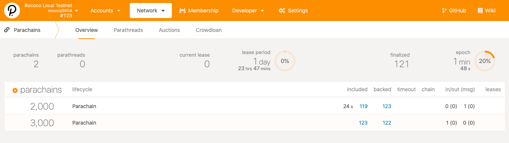

The final part of the workshop will step you through how to use `polkadot-launch` to test a
parachain in a development environment.

<TutorialObjective
  data={{
    textLineOne: '1. Using polkadot-launch',
    url: '#using-polkadot-launch',
  }}
/>
<TutorialObjective
  data={{
    textLineOne: '2. Parachain Node Template',
    url: '#parachain-node-template',
  }}
/>

## Learning outcomes

- Use `polkadot-launch` to run a parachain environment

## Using polkadot-launch

Now that we have gone through the procedure of manually launching a relay chain of a few nodes and
a parachain, we can actually automate launching such network environments for development and
testing using [`polkadot-launch`](https://github.com/paritytech/polkadot-launch). Note that it is
still recommended to understand [the manual process](../pt1#build-environment--compilation), as this
script is not a perfect fit for all use cases, and when things go wrong, you know how to
troubleshoot.

Now, let's install the utility and try it out.

### Installation

#### Option A: Global install

For most cases, you do not need to edit `polkadot-launch`. Run the following command to install the
script globally in your environment:

```bash
yarn global add polkadot-launch
# Check install:
polkadot-launch --version
# 1.7.0
```

#### Option B: Clone & run locally

If you find you need to edit the script, or otherwise would like to build this yourself, do:

```bash
git clone git@github.com:paritytech/polkadot-launch.git
cd polkadot-launch
# You need node v14+ -- https://www.geeksforgeeks.org/how-to-update-node-js-and-npm-to-next-version/
yarn install
# The entry point is `cl.js`
node dist/cli.js --version
# 1.7.0
```

If you think your edits are valuable, please consider <ExternalLink url="https://github.com/paritytech/polkadot-launch">opening a PR</ExternalLink>.

### Basic configuration

In this exercise, we will launch a **Polkadot relay chain of three nodes and two parachains, each
with one node only**.

#### Prerequisites

1. Get the Polkadot and Parachain Template cloned and compiled.

   1. Build Polkadot, instructions [here](../pt1#2-building-the-polkadot-relay-chain-node).
   2. Build the Parachain Template, instructions [here](../pt1#3-building-the-parachain-template).

2. Write a config file for `polkadot-launch` to fit your needs. Here is one to get us started:

   <ExternalLink url="/assets/tutorials/cumulus/polkadot-launch-config/relay-3-validators--2paras-1collator.json">
     relay-3-validators--2paras-1collator.json
   </ExternalLink>

   Let's take a brief look inside the file. Inside the `relaychain` section, there are:

   - `bin`: where the relay chain binary is located.
   - `chain`: the type of the relay chain we are launching.
   - `nodes`: number of nodes we have and their respective config. As mentioned, 3 nodes will be
     deployed using the well-known addresses as session keys. We also specify their respective
     websocket port (`wsPort`) and TCP port (`port`) they listen to.

   Inside the `parachains` section, **two parachains** are defined, each with:

   - `bin`: where the parachain binary is located.
   - `id`: the Para ID of each chain.
   - `balance`: initial balance to be set for the well-known accounts.
   - `nodes`: the node setting for the corresponding parachains.

   Each parachain has one node setup.

3. Update the `bin` location for the relaychain and parachains to an absolute path where your
   binaries are located. For the two parachains, use the same Parachain Template binary.

#### Launch a network

Now you can start your network with the next commands:

```bash
mkdir polkadot-config
cd polkadot-config
# download the `relay-3-validators--2paras-1collator.json` file into this directory.
polkadot-launch relay-3-validators--2paras-1collator.json
```

If everything goes well, you should see messages similar to the following:


Now in your current working directory you will find the relay chain node logs are written to
`alice.log`, `bob.log`, and `charlie.log` for your three validators. While the parachain logs are
indicated with the websocket port numbers they are listening to, `9988.log`and `9999.log`. There
are also customized chain spec files used to launch the networks.

If you wish to monitor the logs in real time, you can do so with:

```bash
# While `polkadot-launch` is running...
# Open a new terminal for each node and monitor logs with:
tail -f <logfile>
```

Another way to verify the setup is correct is by going to:

<ExternalLink url="https://polkadot.js.org/apps/#/parachains">
  Polkadot-JS Apps > Network > Parachains
</ExternalLink>

After configure the Apps to connect to the local **relay chain node**, you should see the UI
showing two parachains being connected to the relay chain.



<Message
  type={`green`}
  title={`Congratulation`}
  text={`You have automated the launch of a 3-node relay chain, and two parachains with a
single node using \`polkadot-launch\` CLI utility.`}
/>

Next, we will go through in details the configuration parameters that `polkadot-launch` recognizes
in the config file.

### Polkadot Launch configuration

The config file can broadly divided into five sections as shown below.

```json
{
  "relaychain": {
    //...
  },
  "parachains": [
    {
      //...
    },
    {
      //...
    }
  ],
  "simpleParachains": [
    {
      //...
    },
    {
      //...
    }
  ],
  "hrmpChannels": [
    {
      //...
    }
  ],
  "types": {},
  "finalization": false
}
```

#### `relaychain` section

This section of JSON specifies how the relaychain should be launched. The full config looks like
the following:

```json
"relaychain": {
  "bin": "./bin/polkadot",
  "chain": "rococo-local",
  "nodes": [
    {
      "name": "alice",
      "wsPort": 9944,
      "port": 30444,
      "basePath": "/tmp/alice",
      "flags": ""
    },
    {
      //...
    }
  ],
  "genesis": {
    "runtime": {
      "runtime_genesis_config": {
        "parachainsConfiguration": {
          "config": {
            "validation_upgrade_frequency": 1,
            "validation_upgrade_delay": 1
          }
        }
      }
    }
  }
}
```

- `bin`: where the relay chain binary is located.
- `chain`: the type of the chain to be launched. The full list of supported types is
  [specified here](https://github.com/paritytech/polkadot/blob/master/cli/src/command.rs#L94-L135).
  Typically we want to use `rococo-local` for testing and development.

For each node inside `nodes`, the following properties can be added:

- `name`: one of well-known account names, e.g. `alice`, `bob`, `charlie`, or `dave`.
- `wsPort`: the websocket port this node listens to.
- `port`: the TCP port this node listens to.
- `basePath`: location of where the chain database is going to be saved. If unspecified, the node
  is launched with `--tmp` flag.
- `flags`: any addition flags that would be passed to the node.

Finally, there is `genesis` property. It is a JSON object with properties you want to modify from
the default genesis configuration. Regarding the `genesis` value, it is the same as all the values
shown in the chain spec when generated by the following command:

```bash
./polkadot build-spec --chain=rococo-local --disable-default-bootnode
```

#### `parachains` section

`parachains` is an array of objects, configuring how one or more parachains are to be launched. It
looks like the following:

```json
"parachains": [
  {
    "bin": "./bin/parachain-collator",
    "id": "2000",
    "balance": "1000000000000000000000",
    "nodes": [
      {
        "wsPort": 9988,
        "port": 31200,
        "name": "alice",
        "flags": ["--", "--execution=wasm"]
      }
    ]
  },
  {
    // ...
  }
]
```

- `bin`: where the parachain collator binary is located.
- `id`: the Para ID assigned to this parachain. Must be unique among the network.
- `balance`: (optional) configure a starting amount of balance on the relay chain for this chain's
  account ID.
- For each node in `nodes`, it has the same configuration as node config in the relay chain.

#### `simpleParachains` section

This is similar to parachains but for "simple" collators like

<ExternalLink url="https://github.com/paritytech/polkadot/tree/master/parachain/test-parachains/adder/collator">
  adder-collator
</ExternalLink>
, a simple collator that lives in the polkadot repo for testing. It supports a subset of configuration
values, and is meant to run with a single node only.

```json
"simpleParachains": [
  {
    "bin": "./bin/adder-collator",
    "id": "400",
    "balance": "1000000000000000000000",
    "port": "31400",
    "name": "alice"
  }
]
```

Their meanings are similar to their counterparts in [`parachains` section](). Note that since
a simple parachain only has one node, configs that was originally in `nodes` property are flattened
into one level now.

#### `hrmpChannels` section

This section config how the Horizontal Relay-routed Message Passing (HRMP) channels are open
between the specified parachain pair so they can send messages to each others. Keep in mind that
an HRMP channel is unidirectional and you need to open channels in both directions to enable them
communicating both ways.

`hrmpChannels` property is defined as follows.

```json
"hrmpChannels": [
  {
    "sender": 2000,
    "recipient": 3000,
    "maxCapacity": 8,
    "maxMessageSize": 512
  }
]
```

- `sender`: chain Para ID messages are sent from.
- `recipient`: chain Para ID messages are sent to.
- `maxCapacity`: number of messages that can be sent before they are acknowledged by
  the recipient chain.
- `maxMessageSize`: maximum size of a message that can be sent across.

#### Remaining

Finally, we have `types`, and `finalization`.

- `types`: [custom Substrate types](https://polkadot.js.org/docs/api/start/types.extend/) to be fed
  into Polkadot-JS API.
- `finalization`: either `true` or `false`, whether you want transactions submitted to the network
  to wait for finalization.

### How it works

This tool automates the steps you learned previously to spin up multiple relay chain nodes and
parachain nodes in a single local machine. It also leverages on Polkadot-JS API to connect to
these spawned nodes over their WebSocket endpoints.

### Conclusion

In this chapter we have covered about `polkadot-launch` utility. You are now able to setup your own
config file and launch a relay chain / parachains network all in just a single command.

This is a good basis to get to our next subject, actual parachain development.

<!-- FIXME TODO - docker for this is presently not maintained. this was simply copied from the compilation page. Needs to be updated to be used! -->

<!--

## Launching a Testnet with Docker

If you intend to use this material for a live workshop you may shorten it by cutting steps off of
the end. If your workshop will not cover writing your own parachains, you may skip all the
compilation by using the provided docker images.

If you prefer to focus primarily on development in your workshop, you may also skip initial relay
chain setup by performing those steps yourself in preparation for the workshop or using the public
rococo testnet. See [Setting Up The Bootnode](../SettingUpTheBootnode.md) for notes on setting up a
cloud-based relay chain.

---

#### Using the Docker Images

> You may skip this step if you have built the nodes locally

The two docker images available for this workshop run the exact same binaries that we described
building in the previous section.

- `joshyorndorff/cumulus-polkadot` is the relay chain node.
- `joshyorndorff/cumulus-parachain-collator` is the parachain node.

Because these containers will need to communicate with each other, you will need to handle
networking. <ExternalLink url="https://docs.docker.com/network/">Networking in Docker</ExternalLink> is beyond the scope of this
tutorial, and there are many valid options. I'll briefly describe one simple option here that will
help many beginners get up and running fast.

"Host Networking" is the simplest technique and allows commands that look most similar to the ones
given in the workshop. It tells docker to run the nodes without isolating the containers; just like
if you were running local binaries.

```bash
# Instead of running
polkadot --my-args

# You should run
docker run --network host joshyorndorff/cumulus-polkadot --my-args
```

```bash
# Instead of running
parachain-collator --para-args -- --relay-args

# You should run
docker run --network host joshyorndorff/cumulus-parachain-collator --para-args -- --relay-args
```

Throughout this workshop when we need to run nodes we will refer to them simply as `polkadot` and
`parachain-collator`. You will need to transform these commands into appropriate docker commands.

-->
