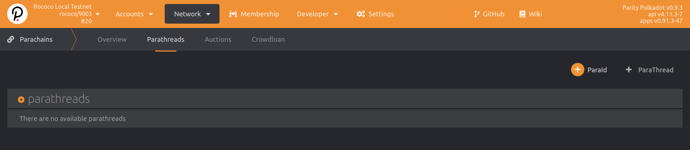
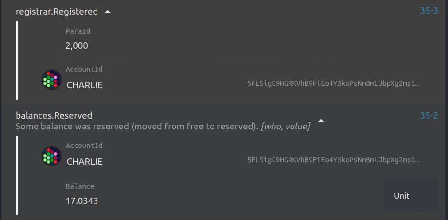

Rococo is Parity's official test network for cumulus-based parachains.
This section of the workshop steps through how you can onboard your parachain to it.

NOTE: We're continually improving the onboarding procedure and documentation.
Please feel free to reach out in the [Parachain Technical matrix channel](https://matrix.to/#/#parachain-technical:matrix.parity.io) if you're facing any issues connecting your parachain.

<!--
TODO:FIXME: once we open again, we need to update versions and instruct on how to
check what you need on a production network (maybe as a HTG)
https://github.com/substrate-developer-hub/substrate-docs/issues/241
-->

## Before you begin

Make sure you have successfully completed the [previous section](/tutorials/v3/cumulus/connect-parachain) of this workshop and tested your parachain on your local machine.
This implies that:
- You're familiar with registering and reserving your unique para ID.
- You have your parachain's genesis state exported as a JSON file.
- You have your parachain's runtime Wasm blob.

In addition, you will need 5 ROCs from the [Rococo faucet](https://matrix.to/#/#rococo-faucet:matrix.org) to register a para ID.

## Register as a parathread 

To get started with registering your chain as a parathread:

1. Go to [the Polkadot-JS Apps](https://polkadot.js.org/apps/?rpc=wss%3A%2F%2Frococo-rpc.polkadot.io#/parachains/parathreads) parathreads section for Rococo.

1. Reserve a unique para ID. You will be assigned to the next available ID.

  

1. After successfully reserving your para ID, you can now register as a **parathread**.

  

1. Once your extrinsic succeeds, you will see a `registrar.Registered` event emitted.

  

1. Go to the [Parachains -> Parathreads](https://polkadot.js.org/apps/#/parachains/parathreads) page and you will see that your parathread registration is **Onboarding**:

  

After the extrinsic succeeds, it takes 2 sessions for the chain to fully onboard as a parathread.

## Request your parachain slot

Once the parachain is active as a parathread, the related project team should request either a **permanent** or a **temporary parachain slot** on Rococo.

- **Permanent slots** are parachain slots assigned to teams who currently have a parachain slot on Polkadot (following a successful slot lease auction)
and thus have the needs for continuously testing their codebase for compatibility with the latest bleeding edge features in a real-world live environment (Rococo).
There is a limited number of permanent slots made available (see note below).

- **Temporary slots** are parachain slots that are dynamically allocated in a continuous rollover manner.
Concretely, at every start of a lease period, a certain number of parathreads (up to a maximum defined in the relay chain's configuration)
will be automatically upgraded to parachains for a certain duration. The parachains that were active during the ending
lease period will be automatically downgraded to parathreads to free the slots for others to use in the subsequent one.
The temporary slots are meant to be used by teams who do not have a parachain slot yet on Polkadot, and are aiming for one in the near future.

The goal of this more dynamic allocations aims at helping teams to test their runtimes more often, and in a more streamlined manner.
At this point, requesting a permanent or temporary parachain slot still a privileged (sudo) operation to be performed by the test chain's
operator (using a call to the `assignedSlots` pallet's dispatchable functions) but the long-term plan is to make it a community-driven process
via the chain's governance framework.

For this tutorial, follow these steps to request a temporary slot:

1. In the [Polkadot-JS Apps for Rococo](https://polkadot.js.org/apps/?rpc=wss%3A%2F%2Frococo-rpc.polkadot.io#), go to `Developer -> Extrinsics`.
1. Select the account with enough ROC balance that you wish to use to submit a transaction with.
1. Select the `assignedSlots` pallet.
1. Choose the `assignTempParachainSlot` function. 
1. Insert your reserved para ID. Make sure this matches the one you reserved from the previous section!
1. Select `Current` for the `LeasePeriodStart`. If the current slot is full, you will be assigned the next available slot.
1. Sign and submit the transaction.

<Message
  type={`gray`}
  title={`Assigned parachain slots on Rococo`}
  text={`
Given a period lease duration of 1 day, the current settings for assigned parachain slots on Rococo are as follows:
- **Permanent slot least duration**: 1 year (365 days)
- **Temporary slot least duration**: 3 days
- **Maximum number of permanent slots**: up to 25 permanent slots
- **Maximum number of temporary slots**: up to 20 temporary slots
- **Maximum temporary slots allocated per leased period**: up to 5 temporary slots per 3-day temporary lease periods
`}
/>

🎉**_Congratulations!_**🎉  
You're now able to test your parachain on the Rococo test net. 