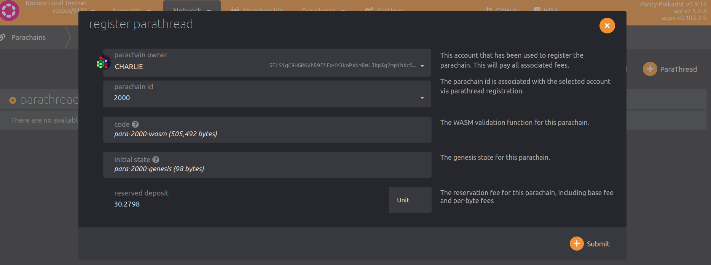

Rococo is Parity's official test network for cumulus-based parachains.

<Message
  type={`yellow`}
  title={`NEW ROCOCO SLOTS PRESENTLY DISABLED FOR COMMUNITY CHAINS`}
  text={`
  The core team is very actively working on _breaking changes_ in [disputes logic](https://github.com/paritytech/polkadot/blob/master/runtime/parachains/src/disputes.rs) (following the [implementers guide](https://github.com/paritytech/polkadot/blob/master/roadmap/implementers-guide/src/runtime/disputes.md)) and testing these on Rococo.
  This is causing instability in running parachains on Rococo, and thus **temporarily** _new slots are not typically available_.
  \n
  Come ask the team in [Parachain Technical matrix channel](https://matrix.to/#/#parachain-technical:matrix.parity.io) about the status and your needs to connect to a larger testnet and we can discuss options.
  `}
/>

<Message
  type={`red`}
  title={`TEST!`}
  text={`
  As parachains are being developed at a fast pace, you need to use the corresponding tagged version of Cumulus and Polkadot for the relay-chain and parachain compatible to each others.
  \n
  Please test registering your parachain locally before attempting to connect to Rococo!
  `}
/>

<!--
TODO:FIXME: once we open again, we need to update versions and instruct on how to
check what you need on a production network (maybe as a HTG)
https://github.com/substrate-developer-hub/substrate-docs/issues/241
-->

- [Polkadot `master` branch](https://github.com/paritytech/polkadot/tree/master)
- [Cumulus `master` branch](https://github.com/paritytech/cumulus/tree/master)

### Request ROC Tokens

ROC is the native currency on the Rococo test network.
You will need some ROC in order to register your Rococo parachain.

You need to register on Rococo as a parathread before able to experiment on Rococo testnet.

<Message
  type={`gray`}
  title={`Note`}
  text={`
  If you have any questions and comments regarding Rococo testnet, please join the [Rococo channel](https://matrix.to/#/#rococo:matrix.parity.io).
	On requesting the ROC tokens, please join the [Rococo faucet channel](https://matrix.to/#/#rococo-faucet:matrix.org).
  `}
/>

### Register as a Parathread

All parachains will need to register as a parathread first.
You will need:

- **5 ROCs** deposit to register a para ID.

- Reserve a unique para ID. This will be assigned to the next available ID.
  This integer will be greater than `2000`, as `0-999` are reserved for [system parachains](https://wiki.polkadot.network/docs/learn-common-goods#system-level-chains) and `1000-1999` are reserved for [public utility parachains](https://wiki.polkadot.network/docs/learn-common-goods#public-utility-chains).

- Your parachain genesis state.
  Refer to the genesis state export process, earlier in the Cumulus tutorial.

- Your parachain Wasm runtime.
  Refer to the Wasm runtime export process, earlier in the Cumulus tutorial.

The procedure will be as followed:

- Goto Polkadot-JS Apps Rococo parathreads section [here](https://polkadot.js.org/apps/?rpc=wss%3A%2F%2Frococo-rpc.polkadot.io#/parachains/parathreads).

- Reserve for the next available para ID.

  

- After successfully reserving your para ID, you can now register as a **Parathread**.

  

- Once your extrinsic succeeds, you will see the `registrar.Registered` event being emitted.

  

- Also in the Polkadot-JS Apps [Parachains -> Parathreads](https://polkadot.js.org/apps/#/parachains/parathreads) page and you will see your parathread registration is **Onboarding**:

  

After the extrinsic succeeds, it takes [**2 sessions**](#relevant-settings) for the chain to fully onboard as a parathread.

### Parachain Slot Auction

Parathread can then be transformed to parachain by winning a parachain slot auction.
This guarantees the now parachain will always have their block data hashed and included in the relay chain block (called Proof of Validation, or short for **PoV**), during the slot duration they are alloted.

Only fully-onboarded Rococo parathreads are eligible to bid in a Rococo parachain slot auction.
Common goods chains can bypass auctions and become parachains through on-chain governance decision.

#### Relevant Settings

> **Following are setting in the Rococo testnet that affect timing behavior on some parachain operations, and are subject to change!**

- Session length: 10 mins
- Lease Period Length: 14,400 Blocks (1 day)
- Ending Period: 600 Blocks (60 mins)
- Current Lease Period Index = Current Block Number / 14400

Note that transitions of a parachain/Parathread into a different state will take at least 2 sessions, including on-boarding, off-boarding, upgrading, downgrading, etc.

#### Bidding

Anyone with a fully onboarded parathread can make a bid to win a parachain slot for their para ID.
They need to out-bid all others participating in the slot auction.

You can do so in Polkadot-JS App [Network -> Parachains -> Auctions](https://polkadot.js.org/apps/?rpc=wss%3A%2F%2Frococo-rpc.polkadot.io#/parachains/auctions) page.

Pick your para ID, how much you want to bid, and the slots you want to bid for:

### Crowdloans

You may also choose to harness your community and get their supports in winning the parachain slot auction.
In this case, you would start a crowdloan campaign so your supporters can loan your project their tokens to win the auction.
These tokens will be held in custody during the auction process, and if won, the whole slot leasing duration also.

You will not do this for a testnet parachain slot, but you may consider this option for a mainnet parachain slot.

#### Start a Crowdloan Campaign

In the following, we are getting ready to submit an extrinsic to start a crowdloan.

Notes on the parameters:

- `parachain id`: You can only create a crowdloan campaign for a para ID that you registered.

- `crowdfund cap`: The maximum amount your crowdloan campaign can collect.
  This is just a responsible measure for getting external support.

- `ending block`: This is when you want your crowdloan to end.
  If you know an auction will start in 3 days, and last for 5 days, you probably want to set your crowdloan to end in 10 days, a time with a little buffer at the end.
  This way you will be sure that your crowdloan is active during the entire auction process.
  On the other hand, you don't want to set your crowdloan period to be too long, or else prolong the community funds lock up period unnecessarily and discouraging them to participate in your campaign.

- `first period` / `last period`: The slot duration you want to bid for.
  So if the current auction has slots 3 - 6 open, these values can be any number in between.

- You can cancel a crowdloan as long as you have not received a contribution.

If your extrinsic succeeds, you can see your new crowdloan entry in [Network -> Parachains -> Crowdloan page](https://polkadot.js.org/apps/#/parachains/crowdloan):

#### Fund a Crowdloan Campaign

Any accounts with a free balance and elect to contribute to your campaign, including the same account that started this campaign.

You can goto the same [Crowdloan page](https://polkadot.js.org/apps/#/parachains/crowdloan) above, and choose **+ Contribute** on the campaign you want to support.

You will see an extrinsic pop up similar to the following:

Input the funding amount your want to support and submit the transaction.
