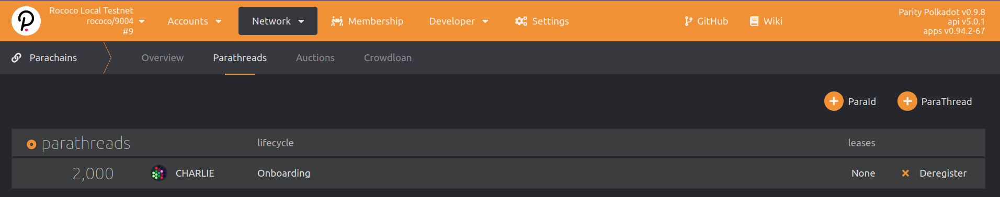

Rococo is Parity's official test network for cumulus-based parachains.

<Message
  type={`yellow`}
  title={`NEW Rococo Revamp – Becoming a Community Parachain Testbed has started`}
  text={`
Rococo got restarted multiple times over the last weeks in preparation for the [Rococo Revamp – Becoming a Community Parachain Testbed](https://polkadot.network/blog/rococo-revamp-becoming-a-community-parachain-testbed/) and is now ready to onboard community parachains. There is also a [Rococo Faucet](https://matrix.to/#/#rococo-faucet:matrix.org) room to get ROCs. We're continually improving the onboarding procedure and documentation, but please expect things to break and feel free to reach out and ask in [Parachain Technical matrix channel](https://matrix.to/#/#parachain-technical:matrix.parity.io).
`}
/>

<Message
  type={`red`}
  title={`TEST!`}
  text={`
As parachains are being developed at a fast pace, you need to use the corresponding tagged version of Cumulus and Polkadot for the relay-chain and parachain compatible to each others.
\n
Please test registering your parachain locally before attempting to connect to Rococo!
`}
/>

<!--
TODO:FIXME: once we open again, we need to update versions and instruct on how to
check what you need on a production network (maybe as a HTG)
https://github.com/substrate-developer-hub/substrate-docs/issues/241
-->

- [Polkadot `master` branch](https://github.com/paritytech/polkadot/tree/master)
- [Cumulus `master` branch](https://github.com/paritytech/cumulus/tree/master)

### Request ROC Tokens

ROC is the native currency on the Rococo test network.
You will need some ROC in order to register your Rococo parachain.

You need to register on Rococo as a parathread before able to experiment on Rococo testnet.

<Message
  type={`gray`}
  title={`Note`}
  text={`
If you have any questions and comments regarding Rococo testnet, please join the [Parachain Technical](https://matrix.to/#/#parachain-technical:matrix.parity.io) Element channel.
On requesting the ROC tokens, please join the [Rococo faucet channel](https://matrix.to/#/#rococo-faucet:matrix.org).
`}
/>

### Register as a Parathread

All parachains will need to register as a parathread first.
You will need:

- **5 ROCs** deposit to register a para ID.

- Reserve a unique para ID. This will be assigned to the next available ID.
  This integer will be greater than `2000`, as `0-999` are reserved for [system parachains](https://wiki.polkadot.network/docs/learn-common-goods#system-level-chains) and `1000-1999` are reserved for [public utility parachains](https://wiki.polkadot.network/docs/learn-common-goods#public-utility-chains).

- Your parachain genesis state.
  Refer to the genesis state export process, earlier in the Cumulus tutorial.

- Your parachain Wasm runtime.
  Refer to the Wasm runtime export process, earlier in the Cumulus tutorial.

The procedure will be as followed:

- Goto Polkadot-JS Apps Rococo parathreads section [here](https://polkadot.js.org/apps/?rpc=wss%3A%2F%2Frococo-rpc.polkadot.io#/parachains/parathreads).

- Reserve for the next available para ID.

  

- After successfully reserving your para ID, you can now register as a **Parathread**.

  

- Once your extrinsic succeeds, you will see the `registrar.Registered` event being emitted.

  

- Also in the Polkadot-JS Apps [Parachains -> Parathreads](https://polkadot.js.org/apps/#/parachains/parathreads) page and you will see your parathread registration is **Onboarding**:

  

After the extrinsic succeeds, it takes [**2 sessions**](#relevant-settings) for the chain to fully onboard as a parathread.

### Request a permanent or temporary parachain slot

Once the para is active as a parathread, the related project team should request either a **permanent** or a **temporary parachain slot** on Rococo.

- **Permanent slots** are parachain slots assigned to teams who currently have a parachain slot on Polkadot (following a successful slot lease auction)
and thus have the needs for continuously testing their codebase for compatibility with the latest bleeding edge features in a real-world live environment (Rococo).
There is a limited number of permanent slots made available (see note below).

- **Temporary slots** are parachain slots that are dynamically allocated in a continuous rollover manner.
Concretely, at every start of a lease period, a certain number of parathreads (up to a maximum defined in the relay chain's configuration)
will be automatically upgraded to parachains for a certain duration. The parachains that were active during the ending
lease period will be automatically downgraded to parathreads to free the slots for others to use in the subsequent one.
The temporary slots are meant to be used by teams who do not have a parachain slot yet on Polkadot, and are aiming for one in the near future.

The goal of this more dynamic allocations aims at helping teams to test their runtimes more often, and in a more streamlined manner.
At this point, requesting a permanent or temporary parachain slot still a privileged (sudo) operation to be performed by the test chain's
operator (using a call to the `assignedSlots` pallet's dispatchable functions) but the long-term plan is to make it a community-driven process
via the chain's governance framework.

<Message
  type={`gray`}
  title={`Assigned parachain slots on Rococo`}
  text={`
Given a period lease duration of 1 day, the current settings for assigned parachain slots on Rococo are as follows:
- **Permanent slot least duration**: 1 year (365 days)
- **Temporary slot least duration**: 3 days
- **Maximum number of permanent slots**: up to 25 permanent slots
- **Maximum number of temporary slots**: up to 20 temporary slots
- **Maximum temporary slots allocated per leased period**: up to 5 temporary slots per 3-day temporary lease periods
`}
/>