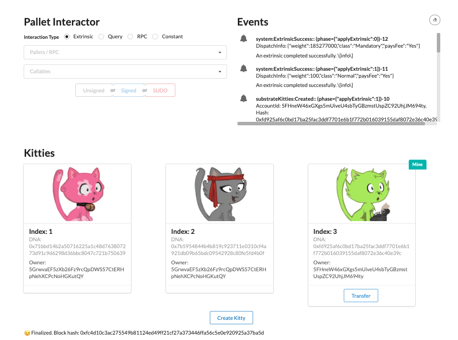

Welcome to the Substrate Kitties workshop.
This workshop teaches you everything you need to know about building a blockchain that handles the creation and ownership of non-fungible tokens (NFTs) called Substrate Kitties.
The workshop is split into two parts:

Part I describes how to build the Kitties pallet, including the functionality to interact with the Kitties you create.
[Part II](/tutorials/v3/kitties/pt2) describes how to develop a front-end to interact with the Substrate Kitties blockchain from Part I.

## Tutorial objectives

- Learn basic patterns for building and running a Substrate node.
- Write and integrate a custom FRAME pallet to your runtime.
- Learn how to create and update storage items.
- Write pallet extrinsics and helper functions.
- Use the PolkadotJS API to connect a Substrate node to a custom a front-end.

This tutorial assumes that you have already installed the prerequisites for building with Substrate on your machine.
Make sure you have configured your environment for Substrate development by installing [Rust and the Rust toolchain](/v3/getting-started/installation).

### What we're building

We'll intentionally keep things simple so that you can decide on how you'd like to improve your Substrate Kitties chain later on.
For the purposes of what we're building, Kitties really can only do the following things:

- Be created either by some original source or by being bred using existing Kitties.

- Be sold at a price set by their owner.

- Be transferred from one owner to another.

### What we won't cover

The following items fall outside the scope of this tutorial:

- Writing tests for our pallet.
- Using correct weight values.

You can refer to the [how-to guides](/how-to-guides/v3) on how to integrate these once you've completed this workshop.

Follow each step at your own pace &mdash; the goal is for you to learn and the best way to do that is to try it yourself!
Before moving on from one section to the next, make sure your pallet builds without any error.
Use the [template files](https://github.com/substrate-developer-hub/substrate-docs/tree/main/static/assets/tutorials/kitties-tutorial) to help you complete each part.
If you are stuck you can refer to the complete source code on the [Substrate node template repository \`tutorials/solutions/kitties\` branch](https://github.com/substrate-developer-hub/substrate-node-template/tree/tutorials/solutions/kitties).
Most of the code changes will be in `/pallets/kitties/src/lib.rs`.

## Basic set-up

Before we can start making Kitties, we first need to do a little groundwork.
This part covers the basic patterns involved with using the Substrate node template to set up a custom pallet and include a simple storage item.

### Set-up your template node

The [Substrate node template][substrate-node-template] provides us with an customizable blockchain node, with built-in networking and consensus layers included.
All we need to focus on is building out the logic of our [runtime][runtime-kb] and [pallets][pallets-kb].

To kick things off, we need to set-up our project name and dependencies.
We'll use a CLI tool called [kickstart][kickstart-tool] to easily rename our node template.

1. Install it by running `cargo install kickstart`.

1. Once `kickstart` is installed, in the root directory of your local workspace run the following command:

   ```bash
   kickstart https://github.com/sacha-l/kickstart-substrate
   ```

   This command will clone a copy of the most recent node template and ask how you would like to call your node and pallet.

1. Type in:

   - `kitties` - as the name of our node. The node will be named as `node-kitties`.
   - `kitties` - as the name of your pallet. The pallet will be named as `pallet-kitties`.

   This will create a directory called `kitties` with a copy of the [Substrate node template][substrate-node-template] containing the name changes that correspond our template node, runtime, and pallet.

1. Open the `kitties` directory in your favorite code editor and rename it as `kitties-tutorial` &mdash; or whatever name you like to help keep your work organized.

   Notice the directories that the `kickstart` command modified:

   - **/node/** - This folder contains all the logic that allows your node to interact with your runtime and RPC clients.
   - **/pallets/** - Here's where all your custom pallets live.
   - **/runtime/** - This folder is where all pallets (both custom "internal" and "external" ones) are aggregated and implemented for the chain's runtime.

1. In `runtime/src/lib.rs`, you'll also notice that the instance of our modified template pallet name remains `TemplateModule`.
   Change it to `SubstrateKitties`:

   ```rust
   construct_runtime!(
   	// --snip
   	{
   	    // --snip
   	    SubstrateKitties: pallet_kitties,
   	}
   );
   ```

### Write the `pallet_kitties` scaffold

Let's take a glance at the folder structure of our workspace:

```bash
kitties-tutorial           <--  The name of our project directory
|
+-- node
|
+-- pallets
|   |
|   +-- kitties
|       |
|       +-- Cargo.toml
|       |
|       +-- src
|           |
|           +-- benchmarking.rs     <-- Remove file
|           |
|           +-- lib.rs              <-- Remove contents
|           |
|           +-- mock.rs             <-- Remove file
|           |
|           +-- tests.rs            <-- Remove file
|
+-- Cargo.toml
```

> You can go ahead and remove `benchmarking.rs`, `mock.rs` and `tests.rs`.
> **We won't be learning about using these in this tutorial.**
> Have a look at [this how-to guide](/how-to-guides/v3/testing/transfer-function) if you're curious to learn how testing works.

[Pallets][pallets-kb] in Substrate are used to define runtime logic.
In our case, we'll be creating a single pallet that manages all of the logic of our Substrate Kitties application.

Notice that our pallet's directory `/pallets/kitties/` is not the same as our pallet's name.
The name of our pallet as Cargo understands it is `pallet-kitties`.

Let's lay out the basic structure of our pallet by outlining the parts inside `pallets/kitties/src/lib.rs`.

Every FRAME pallet has:

- A set of `frame_support` and `frame_system` dependencies.
- Required [attribute macros][macros-kb] (i.e. configuration traits, storage items and function calls).

<Message
  type={`yellow`}
  title={`Information`}
  text={`
We'll be updating additional dependencies as we progress through the next parts of this tutorial.
  `}
/>

Here's the most bare-bones version of the Kitties pallet we will be building in this tutorial.
It contains the starting point for adding code for the next sections of this tutorial.
Just like the [helper files](https://github.com/substrate-developer-hub/substrate-docs/tree/main/static/assets/tutorials/kitties-tutorial) for this tutorial, it contains comments marked with **TODO** to indicate code we will be writing later, and **ACTION** to indicate code that will be written in the current section.

1. Paste the following code in `/pallets/kitties/src/lib.rs`:

   ```rust
   #![cfg_attr(not(feature = "std"), no_std)]

   pub use pallet::*;

   #[frame_support::pallet]
   pub mod pallet {
   	use frame_support::{
   		sp_runtime::traits::{Hash, Zero},
   		dispatch::{DispatchResultWithPostInfo, DispatchResult},
   		traits::{Currency, ExistenceRequirement, Randomness},
   		pallet_prelude::*
   	};
   	use frame_system::pallet_prelude::*;
   	use sp_io::hashing::blake2_128;

   	// TODO Part II: Struct for holding Kitty information.

   	// TODO Part II: Enum and implementation to handle Gender type in Kitty struct.

   	#[pallet::pallet]
   	#[pallet::generate_store(pub(super) trait Store)]
   	pub struct Pallet<T>(_);

   	/// Configure the pallet by specifying the parameters and types it depends on.
   	#[pallet::config]
   	pub trait Config: frame_system::Config {
   		/// Because this pallet emits events, it depends on the runtime's definition of an event.
   		type Event: From<Event<Self>> + IsType<<Self as frame_system::Config>::Event>;

   		/// The Currency handler for the Kitties pallet.
   		type Currency: Currency<Self::AccountId>;

   		// TODO Part II: Specify the custom types for our runtime.

   	}

   	// Errors.
   	#[pallet::error]
   	pub enum Error<T> {
   		// TODO Part III
   	}

   	#[pallet::event]
   	#[pallet::generate_deposit(pub(super) fn deposit_event)]
   	pub enum Event<T: Config> {
   		// TODO Part III
   	}

   	// ACTION: Storage item to keep a count of all existing Kitties.

   	// TODO Part II: Remaining storage items.

   	// TODO Part III: Our pallet's genesis configuration.

   	#[pallet::call]
   	impl<T: Config> Pallet<T> {

   		// TODO Part III: create_kitty

   		// TODO Part III: set_price

   		// TODO Part III: transfer

   		// TODO Part III: buy_kitty

   		// TODO Part III: breed_kitty
   	}

   	// TODO Parts II: helper function for Kitty struct

   	impl<T: Config> Pallet<T> {
   		// TODO Part III: helper functions for dispatchable functions

   		// TODO: increment_nonce, random_hash, mint, transfer_from

   	}
   }
   ```

1. Notice that we're using `sp_io` in our pallet.
   Ensure that this is declared as a dependency in your pallet's `Cargo.toml` file:

   ```toml
   [dependencies.sp-io]
   default-features = false
   git = 'https://github.com/paritytech/substrate.git'
   tag = 'devhub/latest'
   version = '4.0.0-dev'
   ```

1. Now try running the following command to build your pallet. We won't build the entire chain just yet because we haven't yet implemented the `Currency` type in our runtime.
   At least we can check that there are no errors in our pallet so far:

   ```bash
   cargo build -p pallet-kitties
   ```

You'll notice the Rust compiler giving you warnings about unused imports.
That's fine!
Just ignore them &mdash; we're going to be using those imports in the later parts of the tutorial.

### Add storage items

Let's add the most simple logic we can to our runtime: a function that stores a variable in our runtime.
To do this we'll use [`StorageValue`][storagevalue-rustdocs] from Substrate's [storage API][storage-api-rustdocs] which is a trait that depends on the [storage macro][storage-macro-kb].

All that means for our purposes is that for any storage item we want to declare, we must include the `#[pallet::storage]` macro beforehand.
Learn more about declaring storage items [here](/v3/runtime/storage#declaring-storage-items).

In `pallets/kitties/src/lib.rs`, replace the ACTION line with:

```rust
#[pallet::storage]
#[pallet::getter(fn kitty_cnt)]
/// Keeps track of the number of Kitties in existence.
pub(super) type KittyCnt<T: Config> = StorageValue<_, u64, ValueQuery>;
```

This creates a storage item for our pallet to keep track of the total count of Kitties in existence.

### Add Currency implementation

Before we proceed with building our node, we need to add the Currency type to our pallet's runtime implementation. In `runtime/src/lib.rs`, add the following:

```rust
impl pallet_kitties::Config for Runtime {
	type Event = Event;
	type Currency = Balances; // <-- Add this line
}
```

Now build your node and make sure you don't have any errors. This will take a little while at first.

```bash
cargo build --release
```

🎉**_Congratulations!_**🎉

You've completed the first part of this series.
At this stage, you've learnt the various patterns for:

- Customizing the Substrate node template and including a custom pallet.
- Building a Substrate chain and checking that a target pallet compiles.
- Declaring a single value \`u64\` storage item.

## Uniqueness, custom types and storage maps

You're ready to dive into some pillar concepts for developing pallets with FRAME (**Framework for Runtime Aggregation of Modularized Entities**), including writing [a storage struct](/how-to-guides/v3/pallet-design/storage-value) and [implementing the randomness trait](/how-to-guides/v3/pallet-design/randomness).

Use the [helper code](https://github.com/substrate-developer-hub/substrate-docs/tree/main/static/assets/tutorials/kitties-tutorial/02-create-kitties.rs) provided below to help you complete each step.
This will be the basis of the next few steps.

Update your pallet code with the following code snip (skip this step if you prefer not to use the template code):

```rust
#![cfg_attr(not(feature = "std"), no_std)]

pub use pallet::*;

#[frame_support::pallet]
pub mod pallet {
	use frame_support::pallet_prelude::*;
	use frame_system::pallet_prelude::*;
	use frame_support::{
		sp_runtime::traits::Hash,
		traits::{ Randomness, Currency, tokens::ExistenceRequirement },
		transactional
	};
	use sp_io::hashing::blake2_128;

	#[cfg(feature = "std")]
	use frame_support::serde::{Deserialize, Serialize};

	// ACTION #1: Write a Struct to hold Kitty information.

	// ACTION #2: Enum declaration for Gender.

	// ACTION #3: Implementation to handle Gender type in Kitty struct.

	#[pallet::pallet]
	#[pallet::generate_store(pub(super) trait Store)]
	pub struct Pallet<T>(_);

	/// Configure the pallet by specifying the parameters and types it depends on.
	#[pallet::config]
	pub trait Config: frame_system::Config {
		/// Because this pallet emits events, it depends on the runtime's definition of an event.
		type Event: From<Event<Self>> + IsType<<Self as frame_system::Config>::Event>;

		/// The Currency handler for the Kitties pallet.
		type Currency: Currency<Self::AccountId>;

		// ACTION #5: Specify the type for Randomness we want to specify for runtime.

		// ACTION #9: Add MaxKittyOwned constant
	}

	// Errors.
	#[pallet::error]
	pub enum Error<T> {
		// TODO Part III
	}

	// Events.
	#[pallet::event]
	#[pallet::generate_deposit(pub(super) fn deposit_event)]
	pub enum Event<T: Config> {
		// TODO Part III
	}

	#[pallet::storage]
	#[pallet::getter(fn kitty_cnt)]
	pub(super) type KittyCnt<T: Config> = StorageValue<_, u64, ValueQuery>;

	// ACTION #7: Remaining storage items.

	// TODO Part IV: Our pallet's genesis configuration.

	#[pallet::call]
	impl<T: Config> Pallet<T> {

		// TODO Part III: create_kitty

		// TODO Part IV: set_price

		// TODO Part IV: transfer

		// TODO Part IV: buy_kitty

		// TODO Part IV: breed_kitty
	}

	//** Our helper functions.**//

	impl<T: Config> Pallet<T> {

		// ACTION #4: helper function for Kitty struct

		// TODO Part III: helper functions for dispatchable functions

		// ACTION #6: funtion to randomly generate DNA

		// TODO Part III: mint

		// TODO Part IV: transfer_kitty_to
	}
}
```

Along with this code, we'll need to import `serde`.
Add this to your pallet's Cargo.toml file:

```toml
[dependencies.serde]
version =  '1.0.129'
```

### Scaffold Kitty struct

A Struct in Rust is a useful construct to help store data that have things in common.
For our purposes, our Kitty will carry multiple properties which we can store in a single struct instead of using separate storage items.
This comes in handy when trying to optimize for storage reads and writes so our runtime can perform less read/writes to update multiple values.
Read more about storage best practices [here][storage-best-practice-kb].

#### What information to include

Let's first go over what information a single Kitty will carry:

- **`dna`**: the hash used to identify the DNA of a Kitty, which corresponds to its unique features.
  DNA is also used to breed new Kitties and to keep track of different Kitty generations.
- **`price`**: this is a balance that corresponds to the amount needed to buy a Kitty and
  set by its owner.
- **`gender`**: an enum that can be either `Male` or `Female`.
- **`owner`**: an account ID designating a single owner.

#### Sketching out the types held by our struct

Looking at the items of our struct from above, we can deduce the following types:

- **`[u8; 16]`** for `dna` - to use 16 bytes to represent a Kitty's DNA.
- **`BalanceOf`** for `price` - this is a custom type using FRAME's [`Currency` trait][currency-frame].
- **`Gender`** for `gender` - we are going to create this!

First, we will need to add in our custom types for `BalanceOf` and `AccountOf` before we declare our struct.
Replace ACTION #1 with the following snippet:

```rust
type AccountOf<T> = <T as frame_system::Config>::AccountId;
type BalanceOf<T> =
	<<T as Config>::Currency as Currency<<T as frame_system::Config>::AccountId>>::Balance;

// Struct for holding Kitty information.
#[derive(Clone, Encode, Decode, PartialEq, RuntimeDebug, TypeInfo)]
#[scale_info(skip_type_params(T))]
pub struct Kitty<T: Config> {
	pub dna: [u8; 16],
	pub price: Option<BalanceOf<T>>,
	pub gender: Gender,
	pub owner: AccountOf<T>,
}
```

<br />
<Message
  type="gray"
  title="Note"
  text={`
We define \`<BalanceOf<T>>\` and \`AccountOf<T>\` types, and use them in the \`Kitty\`. If you
wonder what the first line means in Rust, it is to define a type alias \`AccountOf<T>\` which is
just a shorthand pointing to the associated type \`AccountId\` of trait \`frame_system::Config\`
that generic type \`T\` is required to be bound of.\n\n
More about this type of syntax is covered in [the Rust book](https://doc.rust-lang.org/book/ch19-03-advanced-traits.html#specifying-placeholder-types-in-trait-definitions-with-associated-types).
`}
/>

Notice how we use the `derive` macro to include [various helper traits][prelude-traits-rustdocs] for using our struct.
We'll need to add `TypeInfo` in order to give our struct access to this trait.
Add the following line at the top of your pallet:

```rust
use scale_info::TypeInfo;
```

For type `Gender`, we will need to build out our own custom enum and helper functions.

### Write a custom type for `Gender`

We have just created a struct that requires a custom type called `Gender`.
This type will handle an enum defining our Kitty's gender.
To create it, you'll build out the following parts:

- **An enum declaration**, which specifies `Male` and `Female` values.
- **Implement a helper function** for our Kitty struct.

1. #### Declare the custom enum

   Replace ACTION item #2 with the following enum declaration:

   ```rust
   #[derive(Clone, Encode, Decode, PartialEq, RuntimeDebug, TypeInfo)]
   #[scale_info(skip_type_params(T))]
   #[cfg_attr(feature = "std", derive(Serialize, Deserialize))]
   pub enum Gender {
   	Male,
   	Female,
   }
   ```

   Notice the use of the [derive macro][derive-macro-rust] which must precede the enum declaration.
   This wraps our enum in the data structures it will need to interface with other types in our runtime.
   In order to use `Serialize` and `Deserialize`, you will need to add the `serde` crate in `pallets/kitties/Cargo.toml`:

   ```toml
   [dependencies.serde]
   default-features = false
   version = '1.0.119'
   ```

   Great, we now know how to create a custom struct.
   But what about providing a way for a Kitty struct to be _assigned_ a gender value?
   For that we need to learn one more thing.

1. #### Implement a helper function for our Kitty struct

   Configuring a struct is useful in order to pre-define a value in our struct.
   For example, when setting a value in relation to what another function returns.
   In our case we have a similar situation where we need to configure our Kitty struct in such a way that sets `Gender` according to a Kitty's DNA.

   We'll only be using this function when we get to [creating Kitties](#write-the-create_kitty-dispatchable).
   Regardless, let us learn how to write it now and get it out of the way.
   We'll create a public function called `gen_gender` that returns the `Gender` type and uses a random function to choose between `Gender` enum values.

   Replace ACTION #4 with the following code snippet:

   ```rust
   fn gen_gender() -> Gender {
   	let random = T::KittyRandomness::random(&b"gender"[..]).0;
   	match random.as_ref()[0] % 2 {
   		0 => Gender::Male,
   		_ => Gender::Female,
   	}
   }
   ```

   Now whenever `gen_gender()` is called inside our pallet, it will return a pseudo random enum value for `Gender`.

### Implement on-chain randomness

If we want to be able to tell these Kitties apart, we need to start giving them unique properties!
In the previous step, we've made use of `KittyRandomness` which we haven't actually defined yet.
Let's get to it.

We'll be using the [Randomness trait][randomness-rustdocs] from `frame_support` to do this.
It will be able to generate a random seed which we'll create unique Kitties with as well as breed new ones.

1. In your pallet's configuration trait, define a new type bound by the `Randomness` trait.

   The `Randomness` trait from `frame_support` requires specifying it with a paramater to replace the `Output` and `BlockNumber` generics.
   Take a look at [the documentation][randomness-rustdocs] and the source code implementation to understand how this works.
   For our purposes, we want the output of functions using this trait to be [`Blake2 128-bit hash`][blake2-rustdocs] which you'll notice should already be declared at the top of your working codebase.

   Replace the ACTION #5 line with:

   ```rust
   type KittyRandomness: Randomness<Self::Hash, Self::BlockNumber>;
   ```

1. Specify the actual type in your runtime.

   Given that we have added a new type in the configuration of our pallet, we need to config our runtime to set its concrete type.
   This could come in handy if ever we want to change the algorithm that `KittyRandomness` is using, without needing to modify where it's used inside our pallet.

   To showcase this point, we're going to set the `KittyRandomness` type to an instance of [FRAME's `RandomnessCollectiveFlip`][randomness-collective-flip-frame].
   Conveniently, the node template already has an instance of the `RandomnessCollectiveFlip` pallet.
   All you need to do is **set the `KittyRandomness` type in your runtime, inside `runtime/src/lib.rs`**:

   ```rust
   impl pallet_kitties::Config for Runtime {
   	type Event = Event;
   	type Currency = Balances;
   	type KittyRandomness = RandomnessCollectiveFlip; // <-- ACTION: add this line.
   }
   ```

   Here we have abstracted out the randomness generation implementation (`RandomnessCollectiveFlip`) from its interface (`Randomness<Self::Hash, Self::BlockNumber>` trait).
   Check out this [how-to guide](/how-to-guides/v3/pallet-design/randomness) on implementing randomness in case you get stuck.

1. Generate random DNA

   Generating DNA is similar to using randomness to randomly assign a gender type.
   The difference is that we'll be making use of `blake2_128` we imported in the previous part.
   We will also be using the [extrinsic_index](https://docs.rs/frame-system/latest/frame_system/pallet/struct.Pallet.html#method.extrinsic_index) from the `frame_system` pallet in order to generate different hashes if we call this function more then once within the same block.
   Replace the ACTION #6 line with:

   ```rust
   fn gen_dna() -> [u8; 16] {
   	let payload = (
   		T::KittyRandomness::random(&b"dna"[..]).0,
		<frame_system::Pallet<T>>::extrinsic_index().unwrap_or_default(),
   		<frame_system::Pallet<T>>::block_number(),
   	);
   	payload.using_encoded(blake2_128)
   }
   ```

### Write remaining storage items

To easily track all of our kitties, we're going to standardize our logic to use a unique ID as the global key for our storage items.
This means that a single unique key will point to our Kitty object (i.e. the struct we previously declared).

In order for this to work, we need to make sure that the ID for a new Kitty is always unique.
We can do this with a new storage item `Kitties` which will be a mapping from an ID (Hash) to the Kitty object.

With this object, we can easily check for collisions by simply checking whether this storage item already contains a mapping using a particular ID.
For example, from inside a dispatchable function we could check using:

```rust
ensure!(!<Kitties<T>>::exists(new_id), "This new id already exists");
```

Our runtime needs to be made aware of:

- Unique assets, like currency or Kitties (this will be held by a storage map called `Kitties`).
- Ownership of those assets, like account IDs (this will be handled a new storage map called `KittiesOwned`).

To create a storage instance for the `Kitty` struct, we'll be using[`StorageMap`][storage-map-kb] &mdash; a hash-map provided to us by FRAME.

Here's what the `Kitties` storage item looks like:

```rust
#[pallet::storage]
#[pallet::getter(fn kitties)]
pub(super) type Kitties<T: Config> = StorageMap<
	_,
	Twox64Concat,
	T::Hash,
	Kitty<T>,
>;
```

Breaking it down, we declare the storage type and assign a `StorageMap` that takes:

       - The [`Twox64Concat`][2x64-rustdocs] hashing algorithm.
       - A key of type `T::Hash`.
       - A value of type `Kitty<T>`.

The `KittiesOwned` storage item is similar except that we'll be using a `BoundedVec` to keep track of some maximum number of Kitties we'll configure in `runtime/src/lib.s`.

```rust
#[pallet::storage]
#[pallet::getter(fn kitties_owned)]
/// Keeps track of what accounts own what Kitty.
pub(super) type KittiesOwned<T: Config> = StorageMap<
	_,
	Twox64Concat,
	T::AccountId,
	BoundedVec<T::Hash, T::MaxKittyOwned>,
	ValueQuery,
>;
```

Your turn! Copy the two code snippets above to replace line ACTION #7.

Before we can check our pallet compiles, we need to add a new type `MaxKittyOwned` in the config trait, which is a pallet constant type (similar to `KittyRandomness` in the previous steps).
Replace ACTION #9 with:

```rust
#[pallet::constant]
type MaxKittyOwned: Get<u32>;
```

Finally, we define `MaxKittyOwned` type in `runtime/src/lib.rs`.
This is the same pattern as we followed for `Currency` and `KittyRandomness` except we'll be adding a fixed `u32` using the `parameter_types!` macro:

```rust
parameter_types! {              // <- add this macro
	// One can own at most 9,999 Kitties
	pub const MaxKittyOwned: u32 = 9999;
}

/// Configure the pallet-kitties in pallets/kitties.
impl pallet_kitties::Config for Runtime {
	type Event = Event;
	type Currency = Balances;
	type KittyRandomness = RandomnessCollectiveFlip;
	type MaxKittyOwned = MaxKittyOwned; // <- add this line
}
```

Now is a good time to check that your Kitties blockchain compiles!

```bash
cargo build --release
```

Running into difficulties? Check your solution against the [completed helper code](https://github.com/substrate-developer-hub/substrate-docs/tree/main/static/assets/tutorials/kitties-tutorial/03-dispatchables-and-events.rs) for this part of the tutorial.

## Dispatchables, events, and errors

In the previous section of this tutorial, we laid down the foundations geared to manage the ownership of our Kitties &mdash; even though they don't really exist yet!
In this part we'll be putting these foundations to use by giving our pallet the ability to create a Kitty using the storage items we've declared.
Breaking things down a little, we're going to write:

- **`create_kitty`**: a dispatchable or publicly callable function allowing an account to mint
  a Kitty.
- **`mint()`**: a helper function that updates our pallet's storage items and performs error
  checks, called by `create_kitty`.
- **pallet `Events`**: using FRAME's `#[pallet::event]` attribute.

At the end of this part, we'll check that everything compiles without error and call our
`create_kitty` extrinsic using the PolkadotJS Apps UI.

<Message
  type={`yellow`}
  title={`Information`}
  text={`
If you're feeling confident, you can continue building on your codebase from the previous part.
Otherwise, refer to our starting base code at [here](https://github.com/substrate-developer-hub/substrate-docs/tree/main/static/assets/tutorials/kitties-tutorial/03-dispatchables-and-events.rs).
It also uses various "ACTION" items as a way to guide you through this section.
  `}
/>

### Public and private functions

Before we dive right in, it's important to understand the pallet design decisions we'll be making around coding up our Kitty pallet's minting and ownership management capabilities.

As developers, we want to make sure the code we write is efficient and elegant.
Oftentimes, optimizing for one optimizes for the other.
The way we're going to set up our pallet to optimize for both will be to break-up the "heavy lifting" logic into private helper functions.
This improves code readability and reusability too.
As we'll see, we can create private functions which can be called by multiple dispatchable functions without compromising on security.
In fact, building this way can be considered an additive security feature.
Check out [this how-to guide](/how-to-guides/v3/basics/helper-functions) about writing and using helper functions to learn more.

Before jumping into implementing this approach, let's first paint the big picture of what combining dispatchables and helper functions looks like.

**`create_kitty`** is a dispatchable function or extrinsic that:

- checks the origin is signed
- generates a random hash with the signing account
- creates a new Kitty object using the random hash
- calls a private `mint()` function

**`mint`** is a private helper function that:

- checks that the Kitty doesn't already exist
- updates storage with the new Kitty ID (for all Kitties and for the owner's account)
- updates the new total Kitty count for storage and the new owner's account
- deposits an Event to signal that a Kitty has successfully been created

### Write the `create_kitty` dispatchable

A [dispatchable][dispatchable-kb] in FRAME always follows the same structure.
All pallet dispatchables live under the `#[pallet::call]` macro which requires declaring the dispatchables section with ` impl<T: Config> Pallet<T> {}`.
Read the [documentation][frame-macros-kb] on these FRAME macros to learn how they work.
All we need to know here is that they're a useful feature of FRAME that minimizes the code required to write for pallets to be properly integrated in a Substrate chain's runtime.

#### Weights

As per the requirement for `#[pallet::call]` described in its documentation, every dispatchable function must have an associated weight to it.
Weights are an important part of developing with Substrate as they provide safe-guards around the amount of computation to fit in a block at execution time.

[Substrate's weighting system][weights-kb] forces developers to think about the computational complexity each [extrinsic][extrinsics-kb] carries before it is called.
This allows a node to account for worst case execution time, avoiding lagging the network with extrinsics that may take longer than the specified block time.
Weights are also intimately linked to the [fee system][txn-fees-kb] for any signed extrinsic.

As this is just a tutorial, we're going to default all weights to 100 to keep things simple.

Assuming you've now replaced the contents of `pallets/kitties/src/lib.rs` with [the helper file](https://github.com/substrate-developer-hub/substrate-docs/tree/main/static/assets/tutorials/kitties-tutorial/03-dispatchables-and-events.rs) for this section, find ACTION #1 and complete the beginning of the function with the lines below:

```rust
#[pallet::weight(100)]
pub fn create_kitty(origin: OriginFor<T>) -> DispatchResult {
	let sender = ensure_signed(origin)?; // <- add this line
	let kitty_id = Self::mint(&sender, None, None)?; // <- add this line
	// Logging to the console
	log::info!("A kitty is born with ID: {:?}.", kitty_id); // <- add this line

	// ACTION #4: Deposit `Created` event

	Ok(())
}
```

We won't go into [debugging](/v3/runtime/debugging/), but logging to the console is a useful tip to make sure your pallet is behaving as expected.
In order to use `log::info`, add this to your pallet's `Cargo.toml` file:

```toml
[dependencies.log]
default-features = false
version = '0.4.14'
```

### Write the `mint()` function

As seen when we wrote `create_kitty` in the previous section, we'll need to create `mint()` for writing our new unique Kitty object to the various storage items declared in Part II of this tutorial.

Let's get right to it. Our `mint()` function will take the following arguments:

- **`owner`**: of type `&T::AccountId` - this indicates whom the kitty belongs to.
- **`dna`**: of type `Option<[u8; 16]>` - this specifies the DNA of the kitty going to be minted.
  If `None` is passed in, a random DNA will be generated.
- **`gender`**: of type `Option<Gender>` - ditto.

And it will return `Result<T::Hash, Error<T>>`.

Paste in the following code snippet to write the `mint` function, replacing ACTION #2 in the working codebase:

```rust
// Helper to mint a Kitty.
pub fn mint(
	owner: &T::AccountId,
	dna: Option<[u8; 16]>,
	gender: Option<Gender>,
) -> Result<T::Hash, Error<T>> {
	let kitty = Kitty::<T> {
		dna: dna.unwrap_or_else(Self::gen_dna),
		price: None,
		gender: gender.unwrap_or_else(Self::gen_gender),
		owner: owner.clone(),
	};

	let kitty_id = T::Hashing::hash_of(&kitty);

	// Performs this operation first as it may fail
	let new_cnt = Self::kitty_cnt().checked_add(1)
		.ok_or(<Error<T>>::KittyCntOverflow)?;

	// Check if the kitty does not already exist in our storage map
	ensure!(Self::kitties(&kitty_id) == None, <Error<T>>::KittyExists);

	// Performs this operation first because as it may fail
	<KittiesOwned<T>>::try_mutate(&owner, |kitty_vec| {
		kitty_vec.try_push(kitty_id)
	}).map_err(|_| <Error<T>>::ExceedMaxKittyOwned)?;

	<Kitties<T>>::insert(kitty_id, kitty);
	<KittyCnt<T>>::put(new_cnt);
	Ok(kitty_id)
}
```

Let's go over what the above code is doing.

The first thing we're doing is creating a new Kitty object.
Then, we create a unique `kitty_id` using a hashing function based on the current properties of the kitty.

Next, we increment the `KittyCnt` using the storage getter function `Self::kitty_cnt()`.
We also checking for overflow with `check_add()` function.

Our last validation is to make sure the `kitty_id` does not already exist in our `Kitties` StorageMap.
This is to avoid any possible hash key duplication insertions.

Once our checks have passed, we proceed with updating our storage items by:

1. Making use of [`try_mutate`](/rustdocs/latest/frame_support/storage/trait.StorageMap.html#tymethod.try_mutate) to update the kitty's owner vector.
2. Using the [`insert`][insert-rustdocs] method provided by Substrate's StorageMap API to store the actually Kitty object and associate it with its `kitty_id`.
3. Using [`put`](/rustdocs/latest/frame_support/storage/trait.StorageValue.html#tymethod.put) provided by the StorageValue API to store the latest Kitty count.

<Message
  type="gray"
  title="A quick recap of our storage items"
  text={`
- **\`<Kitties<T>>\`**: Stores a Kitty's unique traits and price, by storing the Kitty object and
  associating it with its Kitty ID.
- **\`<KittyOwned<T>>\`**: Keeps track of what accounts own what Kitties.
- **\`<KittyCnt<T>>\`**: A count of all Kitties in existence.
`}
/>

### Implement pallet `Events`

Our pallet can also emit [Events][events-kb] at the end of the function.
This not only reports the success of a function's execution, but also tells the "off-chain world" that some particular state transition has happened.

FRAME helps us easily manage and declare our pallet's events using the [`#[pallet::event]`][events-rustdocs] attribute.
With FRAME macros, events are just an enum declared like this:

```rust
#[pallet::event]
#[pallet::generate_deposit(pub(super) fn deposit_event)]
pub enum Event<T: Config>{
	/// A function succeeded. [time, day]
	Success(T::Time, T::Day),
}
```

As you can see in the above snippet, we use attribute macro:

`#[pallet::generate_deposit(pub(super) fn deposit_event)]`

This allows us to deposit a specific event using the pattern below:

```rust
Self::deposit_event(Event::Success(var_time, var_day));
```

In order to use events inside our pallet, we need to add a new associated type `Event` inside our pallet's configuration trait `Config`.
Additionally &mdash; just as when adding any type to our pallet's `Config` trait &mdash; we also need to define it in our runtime `runtime/src/lib.rs`.

This pattern is the same as when we added the `KittyRandomness` type to our pallet's configuration trait [earlier in this tutorial](#implement-on-chain-randomness) and has already been included from the initial scaffolding of our codebase:

```rust
/// Configure the pallet by specifying the parameters and types it depends on.
#[pallet::config]
pub trait Config: frame_system::Config {
	/// Because this pallet emits events, it depends on the runtime's definition of an event.
	type Event: From<Event<Self>> + IsType<<Self as frame_system::Config>::Event>;
	//--snip--//
}
```

Declare your pallet events by replacing the ACTION #3 line with:

```rust
/// A new Kitty was successfully created. \[sender, kitty_id\]
Created(T::AccountId, T::Hash),
/// Kitty price was successfully set. \[sender, kitty_id, new_price\]
PriceSet(T::AccountId, T::Hash, Option<BalanceOf<T>>),
/// A Kitty was successfully transferred. \[from, to, kitty_id\]
Transferred(T::AccountId, T::AccountId, T::Hash),
/// A Kitty was successfully bought. \[buyer, seller, kitty_id, bid_price\]
Bought(T::AccountId, T::AccountId, T::Hash, BalanceOf<T>),
```

We'll be using most of these events in the last section of this tutorial.
For now let's use the relevant event for our `create_kitty` dispatchable.

Complete it by replacing ACTION #4 with:

```rust
Self::deposit_event(Event::Created(sender, kitty_id));
```

<br />
<Message
  type={`gray`}
  title={`Note`}
  text={`
If you're building your codebase from the previous part (and haven't been using the helper file
for this part) you'll need to add \`Ok(())\` and properly close the \`create_kitty\` dispatchable.
  `}
/>

### Error handling

FRAME provides us with an error handling system using [`[#pallet::error]`][errors-kb] which allows us to specify errors for our pallet and use them across our pallet's functions.

Declare all possible errors using the provided FRAME macro under `#[pallet::error]`, replace line ACTION #5a with:

```rust
/// Handles arithmetic overflow when incrementing the Kitty counter.
KittyCntOverflow,
/// An account cannot own more Kitties than `MaxKittyCount`.
ExceedMaxKittyOwned,
/// Buyer cannot be the owner.
BuyerIsKittyOwner,
/// Cannot transfer a kitty to its owner.
TransferToSelf,
/// Handles checking whether the Kitty exists.
KittyNotExist,
/// Handles checking that the Kitty is owned by the account transferring, buying or setting a price for it.
NotKittyOwner,
/// Ensures the Kitty is for sale.
KittyNotForSale,
/// Ensures that the buying price is greater than the asking price.
KittyBidPriceTooLow,
/// Ensures that an account has enough funds to purchase a Kitty.
NotEnoughBalance,
```

We'll be using these errors once we write the interactive functions in the next section.
Notice that we've already used `KittyCntOverflow` and `ExceedMaxKittyOwned` in our `mint` function.

Now's a good time to see if your chain can compile.
Instead of only checking if your pallet compiles, run the following command to see if everything can build:

```rust
cargo build --release
```

<br />
<Message
  type={`yellow`}
  title={`Information`}
  text={`
If you ran into errors, scroll to the first error message in your terminal, identify what line
is giving an error and check whether you've followed each step correctly. Sometimes a mismatch of
curly brackets will unleash a whole bunch of errors that are difficult to understand &mdash; double
check your code!
  `}
/>

Did that build fine...?

🎉**_Congratulations!_**🎉

That's the core functionality of our Kitties pallet.
In the next section you'll be able to see everything you've built so far in action.

### Testing with Polkadot-JS Apps UI

1. Run your chain and use the [PolkadotJS Apps UI](https://polkadot.js.org/apps/#/explorer) to interact with it.
   In your project directory, run:

   ```bash
   ./target/release/node-kitties --tmp --dev
   ```

   By doing this, we're specifying to run a temporary chain in developer mode, so as not to need to purge storage each time we want to start a fresh chain.
   You should be seeing block finalization happening in your terminal.

1. Head over to [Polkadot.js Apps UI][polkadotjsapps].

1. Click on the top left circular network icon, open the "Development" section, and choose "Local Node".
   Your node is default to be `127.0.0.1.:9944`.

1. Go to: _"Developer"_ -> _"Extrinsics"_ and submit a signed extrinsic using _substrateKitties_ by calling the `createKitty` dispatchable.
   Make 3 different transactions from Alice, Bob and Charlie's accounts.

1. Check for the associated event _"Created"_ by going to "_Network_" -> "_Explorer_".
   You should be able to see the events emitted and query their block details.

1. Check your newly created Kitty's details by going to "_Developer_" -> "_Chain State_".
   Select the _substrateKitties_ pallet and query `Kitties(Hash): Kitty`.

   Be sure to uncheck the "include option" box and you should be able to see the details of your newly minted Kitty in the following format:

   ```json
   substrateKitties.kitties: Option<Kitty>
   [
     [
       [
         0x15cb95604033af239640125a30c45b671a282f3ef42c6fc48a78eb18464b30a9
       ],
       {
         dna: 0xaf2f2b3f77e110a56933903a38cde1eb,
         price: null,
         gender: Female,
         owner: 5GrwvaEF5zXb26Fz9rcQpDWS57CtERHpNehXCPcNoHGKutQY
       }
     ]
   ]
   ```

1. Check that other storage items correctly reflect the creation of additional Kitties.

## Interacting with your Kitties

Up until this point in the tutorial, you've built a chain capable of only creating and tracking the ownership of Kitties.
Now that that's done, we want to make our runtime more like a game by introducing other functions like buying and selling Kitties.
In order to achieve this, we'll first need to enable users to mark and update the price of their Kitties.
Then we can add functionality to enable users to transfer, buy, and breed Kitties.

### Set a price for each Kitty

In [the helper file for this part of the tutorial](https://github.com/substrate-developer-hub/substrate-docs/tree/main/static/assets/tutorials/kitties-tutorial/04-interacting-functions.rs), you'll notice that the structure of `set_price` is already laid out.

Your job is to replace ACTION lines #1a, #1b, #2 and #3 with what you'll learn in sections A-D below.

#### A. Checking Kitty owner

As we create functions which modify objects in storage, we should always check first that only the appropriate users can successfully execute the logic in these dispatchable functions.

The general pattern for an ownership check will look something like this:

```rust
let owner = Self::owner_of(object_id).ok_or("No owner for this object")?;

ensure!(owner == sender, "You are not the owner");
```

The first line checks if `Self::owner_of(object_id)` return a `Some(val)`. If yes, it is
transformed into `Result::Ok(val)`, and finally extract `val` out from `Result`. If not, it is
transformed into `Result::Err()` with provided error message, and return early with the error
object.

The second line checks if `owner == sender`. If true, the program execution continues to the next
line. If not, `Result::Err("You are not the owner")` error object is immediately returned from the
function.

**Your turn!**

Paste in this code snippet to replace ACTION #1a:

```rust
ensure!(Self::is_kitty_owner(&kitty_id, &sender)?, <Error<T>>::NotKittyOwner);
```

Paste the following in ACTION #1b:

```rust
pub fn is_kitty_owner(kitty_id: &T::Hash, acct: &T::AccountId) -> Result<bool, Error<T>> {
	match Self::kitties(kitty_id) {
		Some(kitty) => Ok(kitty.owner == *acct),
		None => Err(<Error<T>>::KittyNotExist)
	}
}
```

The line pasted in ACTION #1b is actually combining two checks together.
In case `Self::is_kitty_owner()` returns an error object `Err(<Error<T>>::KittyNotExist)`, it is returned early with `<Error<T>>::KittyNotExist` by the `?`.
If it returns `Ok(bool_val)`, the `bool_val` is extracted, and if false, returns `<Error<T>>::NotKittyOwner` error.

#### B. Updating the price of our Kitty object

Every Kitty object has a price attribute that we've set to `None` as a default value inside the `mint` function [earlier in this tutorial](#write-the-mint-function):

```rust
let kitty = Kitty::<T> {
	dna: dna.unwrap_or_else(Self::gen_dna),
	price: None,                           //<-- 👀 here
	gender: gender.unwrap_or_else(Self::gen_gender),
	owner: owner.clone(),
};
```

To update the price of a Kitty, we'll need to:

- Get the Kitty object in storage.
- Update the object with the new price.
- Save it back into storage.

Changing a value in an existing object in storage would be written in the following way:

```rust
let mut object = Self::get_object(object_id);
object.value = new_value;

<Object<T>>::insert(object_id, object);
```

<br />
<Message
  type="gray"
  title="Note"
  text={`
Rust expects you to declare a variable as mutable (using the \`mut\` keyword) whenever its value is
going to be updated.
`}
/>

**Your turn!**

Paste in the following snippet to replace the ACTION #2 line:

```rust
kitty.price = new_price.clone();
<Kitties<T>>::insert(&kitty_id, kitty);
```

#### D. Deposit an Event

Once all checks are passed and the new price is written to storage, we can deposit an event [just like we did before](#implement-pallet-events).
Replace the line marked as ACTION #3 with:

```rust
// Deposit a "PriceSet" event.
Self::deposit_event(Event::PriceSet(sender, kitty_id, new_price));
```

Now whenever the `set_price` dispatchable is called successfully, it will emit a `PriceSet` event.

### Transfer a Kitty

Based on the `create_kitty` function we built earlier, you already have the tools and knowledge you'll need to create the transfer functionality.
The main difference is that there are **two parts** to achieving this:

1. A **dispatchable function** called `transfer()`: this is a publicly callable dispatchable exposed by your pallet.
2. A **private helper function** called `transfer_kitty_to()`: this will be a private helper function called by `transfer()` to handle all storage updates when transferring a Kitty.

Separating the logic this way makes the private `transfer_kitty_to()` function reusable by other dispatchable functions of our pallet without needing to duplicate code.
In our case, we're going to reuse it for the `buy_kitty` dispatchable we'll be creating next.

#### `transfer`

Paste in the following snippet to replace ACTION #4 in the template code:

```rust
#[pallet::weight(100)]
pub fn transfer(
	origin: OriginFor<T>,
	to: T::AccountId,
	kitty_id: T::Hash
) -> DispatchResult {
	let from = ensure_signed(origin)?;

	// Ensure the kitty exists and is called by the kitty owner
	ensure!(Self::is_kitty_owner(&kitty_id, &from)?, <Error<T>>::NotKittyOwner);

	// Verify the kitty is not transferring back to its owner.
	ensure!(from != to, <Error<T>>::TransferToSelf);

	// Verify the recipient has the capacity to receive one more kitty
	let to_owned = <KittiesOwned<T>>::get(&to);
	ensure!((to_owned.len() as u32) < T::MaxKittyOwned::get(), <Error<T>>::ExceedMaxKittyOwned);

	Self::transfer_kitty_to(&kitty_id, &to)?;

	Self::deposit_event(Event::Transferred(from, to, kitty_id));

	Ok(())
}
```

By now the above pattern should be familiar.
We always check that the transaction is signed; then we verify that:

1. The Kitty being transferred is owned by the sender of this transaction.
2. The Kitty is not transferred to its owner (a redundant operation).
3. The recipient has the capacity to receive one more kitty.

Lastly we call the `transfer_kitty_to` helper to update all storage items appropriately.

#### `transfer_kitty_to`

The `transfer_kitty_to` function will be a helper to perform all storage updates once a Kitty is transferred (and it is going to be called when a kitty is bought and sold too).
All it needs to do is perform safety checks and update the following storage items:

- `KittiesOwned`: to update the owner of the Kitty.
- `Kitties`: to reset the price in the Kitty object to `None`.

Copy the following to replace ACTION #5:

```rust
#[transactional]
pub fn transfer_kitty_to(
	kitty_id: &T::Hash,
	to: &T::AccountId,
) -> Result<(), Error<T>> {
	let mut kitty = Self::kitties(&kitty_id).ok_or(<Error<T>>::KittyNotExist)?;

	let prev_owner = kitty.owner.clone();

	// Remove `kitty_id` from the KittyOwned vector of `prev_kitty_owner`
	<KittiesOwned<T>>::try_mutate(&prev_owner, |owned| {
		if let Some(ind) = owned.iter().position(|&id| id == *kitty_id) {
			owned.swap_remove(ind);
			return Ok(());
		}
		Err(())
	}).map_err(|_| <Error<T>>::KittyNotExist)?;

	// Update the kitty owner
	kitty.owner = to.clone();
	// Reset the ask price so the kitty is not for sale until `set_price()` is called
	// by the current owner.
	kitty.price = None;

	<Kitties<T>>::insert(kitty_id, kitty);

	<KittiesOwned<T>>::try_mutate(to, |vec| {
		vec.try_push(*kitty_id)
	}).map_err(|_| <Error<T>>::ExceedMaxKittyOwned)?;

	Ok(())
}
```

Notice the use of [`#[transactional]`](/rustdocs/latest/frame_support/attr.transactional.html) which we imported at the very beginning of this tutorial.
It allows us to write dispatchable functions that commit changes to the storage only if the annotated function returns `Ok`.
Otherwise all changes are discarded.

### Buy a Kitty

We'll need to ensure two things before we can allow the user of this function to purchase a Kitty:

- Check that the Kitty is for sale.
- Check whether the Kitty's current price is within the user's budget and whether the user has enough free balance.

Replace line ACTION #6 to check whether a Kitty is for sale:

```rust
// Check the kitty is for sale and the kitty ask price <= bid_price
if let Some(ask_price) = kitty.price {
	ensure!(ask_price <= bid_price, <Error<T>>::KittyBidPriceTooLow);
} else {
	Err(<Error<T>>::KittyNotForSale)?;
}

// Check the buyer has enough free balance
ensure!(T::Currency::free_balance(&buyer) >= bid_price, <Error<T>>::NotEnoughBalance);
```

In a similar vain, we have to verify whether the user has the capacity to receive a Kitty.
Remember we're using a [`BoundedVec`](/rustdocs/latest/frame_support/storage/bounded_vec/struct.BoundedVec.html) that can only hold a fixed number of Kitties, defined in our pallet's `MaxKittyOwned` constant.
Replace ACTION #7 with:

```rust
// Verify the buyer has the capacity to receive one more kitty
let to_owned = <KittiesOwned<T>>::get(&buyer);
ensure!((to_owned.len() as u32) < T::MaxKittyOwned::get(), <Error<T>>::ExceedMaxKittyOwned);

let seller = kitty.owner.clone();
```

We'll use [FRAME's Currency trait][currency-frame-rustdocs] to adjust account balances using its [`transfer` method][transfer-currency-rustdocs].
It's useful to understand why it's important to use the `transfer` method in particular and how we'll be accessing it:

- The reason we'll be using it is to ensure our runtime has the same understanding of currency throughout the pallets it interacts with.
  The way that we ensure this is to use the `Currency` trait given to us by `frame_support`.

- Conveniently, it handles a [`Balance`][currency-balances-rustdocs] type, making it compatible with `BalanceOf` type we created for `kitty.price`.
  Take a look at how the `transfer` function we'll be using [is structured][currency-transfer-rustdocs]:

  ```rust
  fn transfer(
  	source: &AccountId,
  	dest: &AccountId,
  	value: Self::Balance,
  	existence_requirement: ExistenceRequirement
  ) -> DispatchResult
  ```

Now we can make use of the `Currency` type in our pallet's `Config` trait and `ExistenceRequirement` that we [initially started with in the first section](#write-out-pallet_kitties-scaffold).

Update the balances of both the caller of this function and the receiver, replacing ACTION #8:

```rust
// Transfer the amount from buyer to seller
T::Currency::transfer(&buyer, &seller, bid_price, ExistenceRequirement::KeepAlive)?;

// Transfer the kitty from seller to buyer
Self::transfer_kitty_to(&kitty_id, &buyer)?;

// Deposit relevant Event
Self::deposit_event(Event::Bought(buyer, seller, kitty_id, bid_price));
```

<br />
<Message
  type="gray"
  title="Note"
  text={`
Both of the above operations, \`T::Currency::transfer()\`, and \`Self::transfer_kitty_to()\` could
fail which is why we check for the returned result in each case. If \`Err\` is returned, we also return from the
function immediately. In order to keep the storage consistent with these potential changes, we also annotate this function as
\`#[transactional]\`.
`}
/>

### Breed Kitties

The logic behind breeding two Kitties is to multiply each corresponding DNA segment from two Kitties, which will produce a new DNA sequence.
Then, that DNA is used when minting a new Kitty.
This helper function is already provided for you in the template file for this section.

Paste in the following to complete the `breed_kitty` function, replacing line ACTION #9:

```rust
let new_dna = Self::breed_dna(&parent1, &parent2)?;
```

Don't forget to add `breed_dna(&parent1, &parent2)` helper function (peep it's definition in [the helper file](https://github.com/substrate-developer-hub/substrate-docs/blob/main/static/assets/tutorials/kitties-tutorial/04-interacting-functions.rs#L227)).

Now that we've used the user inputs of Kitty IDs and combined them to create a new unique Kitty ID, we can use the `mint()` function to write that new Kitty to storage.
Replace line ACTION #10 to complete the `breed_kitty` extrinsic:

```rust
Self::mint(&sender, Some(new_dna), None)?;
```

### Genesis configuration

The final step before our pallet is ready to be used is to set the genesis state of our storage items.
We'll make use of FRAME's `#[pallet::genesis_config]` to do this.
Essentially, this allows us to declare what the Kitties object in storage contains in the genesis block.

Copy the following code to replace ACTION #11:

```rust
// Our pallet's genesis configuration.
#[pallet::genesis_config]
pub struct GenesisConfig<T: Config> {
	pub kitties: Vec<(T::AccountId, [u8; 16], Gender)>,
}

// Required to implement default for GenesisConfig.
#[cfg(feature = "std")]
impl<T: Config> Default for GenesisConfig<T> {
	fn default() -> GenesisConfig<T> {
		GenesisConfig { kitties: vec![] }
	}
}

#[pallet::genesis_build]
impl<T: Config> GenesisBuild<T> for GenesisConfig<T> {
	fn build(&self) {
		// When building a kitty from genesis config, we require the dna and gender to be supplied.
		for (acct, dna, gender) in &self.kitties {
			let _ = <Pallet<T>>::mint(acct, Some(dna.clone()), Some(gender.clone()));
		}
	}
}
```

To let our chain know about our pallet's genesis configuration, we need to modify the `chain_spec.rs` file in our project's `node` folder.
It's important you make sure you use the name of the pallet instance in `runtime/src/lib.rs`, which in our case was `SubstrateKitties`.
Go to `node/src/chain_spec.rs`, add `use node_kitties_runtime::SubstrateKittiesConfig;` at the top of the file and add the following snippet inside the `testnet_genesis` function:

```rust
//-- snip --
substrate_kitties: SubstrateKittiesConfig {
	kitties: vec![],
},
//-- snip --
```

### Build, run and interact with your Kitties

If you've completed all of the preceding parts and steps of this tutorial, you're ready to run your chain and start interacting with all the new capabilities of your Kitties pallet!

Build and run your chain using the following commands:

```bash
cargo build --release
./target/release/node-kitties --dev --tmp
```

Now check your work using the Polkadot-JS Apps just like [we did previously](#testing-with-polkadot-js-apps-ui).
Once your chain is running and connected to the PolkadotJS Apps UI, perform these manual checks:

- Fund multiple users with tokens so they can all participate
- Have each user create multiple Kitties
- Try to transfer a Kitty from one user to another using the right and wrong owner
- Try to set the price of a Kitty using the right and wrong owner
- Buy a Kitty using an owner and another user
- Use too little funds to purchase a Kitty
- Overspend on the cost of the Kitty and ensure that the balance is reduced appropriately
- Breed a Kitty and check that the new DNA is a mix of the old and new

After all of these actions, confirm that all users have the correct number of Kitties; that the total Kitty count is correct; and any other storage variables are correctly represented.

🎉**_Congratulations!_**🎉
You've successfully created the backend of a fully functional Substrate chain capable of creating and managing Substrate Kitties.
The basic capabilities of our Kitties application could also be abstracted to other NFT-like use cases.
Most importantly, at this point in the tutorial you should have all the knowledge you need to start creating your own pallet logic and dispatchable functions.

## Next steps

Move on to [Part II](/tutorials/v3/kitties/pt2/) to connect your chain to the front-end template and create a user interface to visualize and interact with your Kitties!

[transfer-currency-rustdocs]: https://crates.parity.io/frame_support/traits/tokens/currency/trait.Currency.html#tymethod.transfer
[frame-balances-rustdocs]: https://crates.parity.io/frame_support/traits/tokens/currency/trait.Currency.html
[polkadotjs-ui]: https://polkadot.js.org/apps/#/explorer
[rust-u8]: https://doc.rust-lang.org/std/primitive.u8.html
[currency-frame-rustdocs]: /rustdocs/latest/frame_support/traits/tokens/currency/index.html
[currency-balances-rustdocs]: /rustdocs/latest/frame_support/traits/tokens/currency/trait.Currency.html#associatedtype.Balance
[balances-frame]: /rustdocs/latest/pallet_balances/index.html
[currency-transfer-rustdocs]: /rustdocs/latest/frame_support/traits/tokens/currency/trait.Currency.html#tymethod.transfer
[installation]: /v3/getting-started/installation
[substrate-node-template]: https://github.com/substrate-developer-hub/substrate-node-template
[pallets-kb]: /v3/runtime/frame#pallets
[macros-kb]: /v3/runtime/macros#frame-macros-and-attributes
[storagevalue-rustdocs]: /rustdocs/latest/frame_support/storage/trait.StorageValue.html
[storage-api-rustdocs]: /rustdocs/latest/frame_support/storage/index.html
[template-code]: https://github.com/substrate-developer-hub/substrate-how-to-guides/tree/main/static/code/kitties-tutorial
[runtime-kb]: /v3/concepts/runtime
[kickstart-tool]: https://github.com/Keats/kickstart
[storage-macro-kb]: /v3/runtime/macros#palletstorage
[default-rustdocs]: https://doc.rust-lang.org/std/default/trait.Default.html
[randomness-rustdocs]: /rustdocs/latest/frame_support/traits/trait.Randomness.html
[hash-rustdocs]: /rustdocs/latest/sp_runtime/traits/trait.Hash.html
[blake2-rustdocs]: /rustdocs/latest/sp_core/hashing/fn.blake2_128.html
[randomness-collective-flip-frame]: /rustdocs/latest/pallet_randomness_collective_flip/index.html
[nonce-rustdocs]: /rustdocs/latest/frame_system/struct.AccountInfo.html#structfield.nonce
[2x64-rustdocs]: /rustdocs/latest/frame_support/struct.Twox64Concat.html
[prelude-traits-rustdocs]: /rustdocs/latest/sp_std/prelude/index.html#traits
[derive-macro-rust]: https://doc.rust-lang.org/reference/procedural-macros.html#derive-macros
[storage-best-practice-kb]: /v3/runtime/storage#best-practices
[storage-map-kb]: /v3/runtime/storage/#storage-map
[storage-value-kb]: /v3/runtime/storage#storage-value
[currency-frame]: /rustdocs/latest/frame_support/traits/tokens/currency/trait.Currency.html#associatedtype.Balance
[frame-macros-kb]: /v3/runtime/macros#palletcall
[txn-fees-kb]: /v3/runtime/weights-and-fees
[weights-kb]: /v3/concepts/weight
[contains-key-rustdocs]: /rustdocs/latest/frame_support/storage/trait.StorageMap.html#tymethod.contains_key
[insert-rustdocs]: /rustdocs/latest/frame_support/storage/trait.StorageMap.html#tymethod.insert
[storage-value-rustdocs]: /rustdocs/latest/frame_support/storage/types/struct.StorageValue.html#method.put
[storagemap-rustdocs]: /rustdocs/latest/frame_support/storage/types/struct.StorageMap.html#method.insert
[events-rustdocs]: /rustdocs/latest/frame_support/attr.pallet.html#event-palletevent-optional
[events-kb]: /v3/runtime/events-and-errors
[polkadotjsapps]: https://polkadot.js.org/apps/#/explorer
[dispatchresult-rustdocs]: /rustdocs/latest/frame_support/dispatch/type.DispatchResult.html
[dispatchable-kb]: /v3/getting-started/glossary#dispatch
[extrinsics-kb]: /v3/concepts/execution#executing-extrinsics
[errors-kb]: /v3/runtime/events-and-errors
