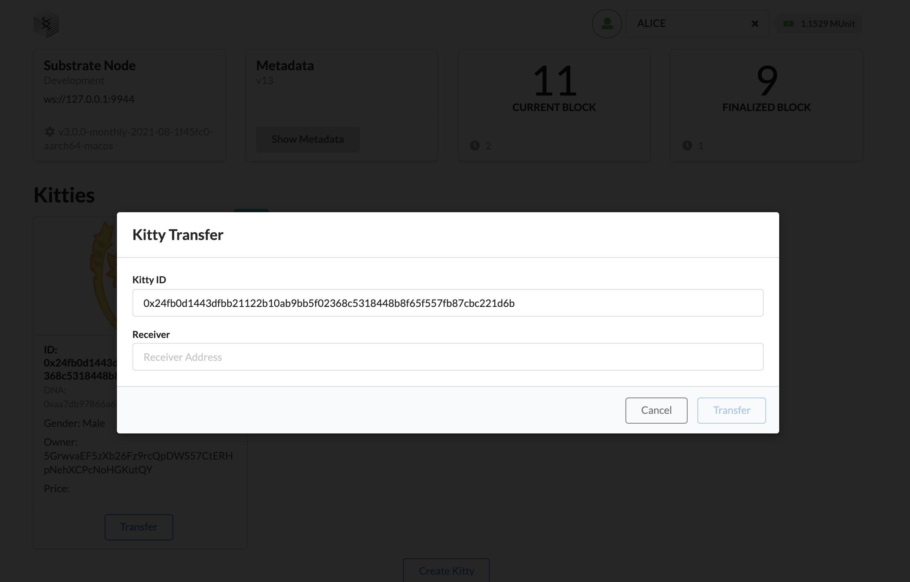

<Message
  type="gray"
  title="Note"
  text={`If you haven't completed [Part I](/tutorials/v3/kitties/pt2) and just want to focus on building the Kitties front-end, 
clone the Kitty node solution from [this branch](https://github.com/substrate-developer-hub/substrate-node-template/tree/tutorials/kitties) 
and use that to follow this part of the tutorial.`}
/>

In Part I we created all of the back-end portion of our Kitties application. In this part, it's
time to build a user interface which can access and interact with our custom storage items and
functions. We'll be using:

- [Polkadot-JS API](https://polkadot.js.org/docs/api/)
- The [Substrate Front-end Template](https://github.com/substrate-developer-hub/substrate-front-end-template), a [React app](https://reactjs.org/)
  that wraps Polkadot-JS API to make it easier to make RPC's to our chain's runtime.
- A [library for generating Cat avatars](https://framagit.org/Deevad/cat-avatar-generator),
  licensed under [CC-By 4.0](https://creativecommons.org/licenses/by/4.0/) attribution. Thank you
  [David Revoy's](https://framagit.org/Deevad) for making this available.

In Part 2, there will only be two main sections: the first focussing on setting up the Front-end
Template and the second focussing on building custom React components that can interact with our
Kitty node.

In case you get stuck, the complete solution for this part of the tutorial
can be found [here](https://github.com/substrate-developer-hub/substrate-front-end-template/tree/tutorials/kitties).

## Getting started

The first step of this tutorial is to familiarize yourself with the Substrate Front-end template.
In this step we will go through an overview of what our React app will look like and the different
components we'll be building. Start by [installing the Front-end Template][substrate-frontend-template]
from your terminal:

```bash
git clone https://github.com/substrate-developer-hub/substrate-front-end-template.git
cd substrate-front-end-template
yarn install
```

Open the template in a code editor. You'll notice the following structure (we're only including the directories we care about for this
tutorial):

```
substrate-front-end-template
|
+-- public
|   |
|   +-- assets              <-- Kitty avatar PNG files
|
+-- src                     <-- our React components
|   |
|   +-- __tests__
|   |
|   +-- config              <-- where to specify our custom types
|   |
|   +-- substrate-lib       <-- lib to give access to PolkadotJS API
|   |   |
|   |   +-- components      <-- contains TxButton, used throughout our application
|   |
|   ...
...
```

In a separate terminal, start an instance of `node-kitties` that you built in Part I (or use the [Kitty node
solution](https://github.com/substrate-developer-hub/substrate-node-template/tree/tutorials/kitties)
instead if you haven't completed part I):

```bash
# Launch `node-kitties` from its directory.
cd kitties/
./target/release/node-kitties --dev --tmp
```

Now, in the same directory as where you installed the Front-end template, launch it:

```bash
yarn start
```

You should see a tab open up with the front-end template displaying basic features of your chain.
Notice that it comes with a number of prebuilt components to provide basic interactions with a Substrate
Node Template blockchain.

### Specifying types

An important starting point when setting up a custom front-end for a Substrate node is creating a
JSON file with all of the node's custom types. These are types that we created in our pallet that
the Polkadot JS API doesn't know about. Learn more about [Extending types](https://polkadot.js.org/docs/api/start/types.extend/)
in the Polkadot JS API documentation.

In our case, we have two custom types we'll need to add: the `Gender` enum and the `Kitty` struct.

To do this, go into `src/config/types.json` and replace the whole file with:

```json
{
  "Gender": {
    "_enum": ["Male", "Female"]
  },
  "Kitty": {
    "dna": "[u8; 16]",
    "price": "Option<Balance>",
    "gender": "Gender",
    "owner": "AccountId"
  }
}
```

### Sketching out our components

[Substrate Frontend Template][substrate-frontend-template] components use Polkadot-JS API and an
RPC endpoints to communicate with a Substrate node. This allows us to use it to read storage items,
and make extrinsics by calling our pallet's dispatchable functions. Before we get to that, let's
sketch out the different parts of our application.

We'll be building out a total of 3 components:

1. `Kitties.js`: this will render the Kitty pane, and contains the logics of fetching all kitties
   information from the connecting Substrate node.

2. `KittyCards.js`: this will render a React card component containing a Kitty's relevant
   information, avatar and buttons to interact with it.

3. `KittyAvatar.js`: this will handle the logic to map Kitty DNA to the library of PNGs we're using
   to create unique Kitty avatars.

### Polkadot JS API Basics

Before moving on to the next section, we reccommend you read a little Polkadot JS API documentation
to understand the basics of how we will be querying storage and triggering transactions. Here are
some good resources:

- [Basics and Metadata](https://polkadot.js.org/docs/api/start/basics)
- [RPC queries](https://polkadot.js.org/docs/api/start/api.rpc)
- [Storage methods](https://polkadot.js.org/docs/substrate/storage) such as
  `api.query.<pallet>.<method>` to access a pallet instance in a runtime
- [Extrinsics methods](https://polkadot.js.org/docs/substrate/extrinsics) such as
  `api.tx.<pallet>.<method>` to trigger a transaction.

[substrate-frontend-template]: https://github.com/substrate-developer-hub/substrate-front-end-template

## Creating custom components

### Create `Kitties.js`

This is the component that will get rendered by `Apps.js`, the top-most level component. So it does
the heavy lifting, with the help of `KittyAvatar.js` and `KittCards.js`.

1.  Start by creating a file called `Kitties.js` in `src` and paste the following imports:

    ````js
    import React, { useEffect, useState } from 'react';
    import { Form, Grid } from 'semantic-ui-react';

    import { useSubstrate } from './substrate-lib';
    import { TxButton } from './substrate-lib/components';

    import KittyCards from './KittyCards';
    ```

    The way our custom components make use of Polkadot-JS API is by using `substrate-lib`, which is a
    wrapper around [Polkadot JS API instance](https://polkadot.js.org/docs/api/start/create/) and
    allows us to retrieve account keys from the [Polkadot-JS keyring](https://polkadot.js.org/docs/api/start/keyring).
    This is why we use `useSubstrate` which is exported by `src/substrate-lib/SubstrateContext.js` and
    used to create the wrapper.

    ````

1.  Proceed by pasting in the following code snippet:

    ```js
    // Construct a Kitty ID from storage key
    const convertToKittyHash = entry =>
      `0x${entry[0].toJSON().slice(-64)}`;

    // Construct a Kitty object
    const constructKitty = (hash, { dna, price, gender, owner }) => ({
      id: hash,
      dna,
      price: price.toJSON(),
      gender: gender.toJSON(),
      owner: owner.toJSON()
    });

    // Use React hooks
    export default function Kitties (props) {
      const { api, keyring } = useSubstrate();
      const { accountPair } = props;

      const [kittyHashes, setKittyHashes] = useState([]);
      const [kitties, setKitties] = useState([]);
      const [status, setStatus] = useState('');
    // snip
    ```

    The above code handles a few important things for our application:

        - `convertToKittyHash` helps construct a Kitty ID from its storage key
        - `constructKitty` is a function to hold all Kitty objects
        - `Kitties` enables us to subscribe to chain storage item changes and use the `useEffect`
        React hook to update the state of our other components.

    There are two things our app needs to subscribe to: storage changes in the amount of Kitties and
    changes in Kitty objects. To do this we'll create [a subscription](https://reactjs.org/docs/hooks-reference.html#useeffect)
    function for each.

    We'll use `api.query.substrateKitties.kittyCnt` to listen for a change in the amount of Kitties,
    which will query `KittyCnt` from our Kitties pallet storage item. Then,
    we'll use the `entries()` method from Polkadot-JS API to get Kitty IDs and transform them
    with the `convertToKittyHash` function.

1.  To enable this, paste the following snippet:

    ```js
    // Subscription function for setting Kitty IDs
    const subscribeKittyCnt = () => {
      let unsub = null

      const asyncFetch = async () => {
        // Query KittyCnt from runtime
        unsub = await api.query.substrateKitties.kittyCnt(async cnt => {
          // Fetch all Kitty objects using entries()
          const entries = await api.query.substrateKitties.kitties.entries()
          // Retrieve only the Kitty ID and set to state
          const hashes = entries.map(convertToKittyHash)
          setKittyHashes(hashes)
        })
      }

      asyncFetch()

      // return the unsubscription cleanup function
      return () => {
        unsub && unsub()
      }
    }
    ```

    <br />
    <Message
      type={`green`}
      title={`Learn More`}
      text={`
       \`entries()\` is a Polkadot-JS API function that gives us the entire storage map of \`Kitties\` that
       we defined in Part I. If there's nothing in the storage, it returns \`None\`. All functions that
       interact with a chain will always return a **Promise** in Polkadot-JS API. So we wait for it to be
       resolved, and return us all the map keys and objects.\n
       You can see this in action if you go to the console of your browser running a node Front-end and
       entering \`entries\`, or get the first Kitty object in storage by doing: \`entries[0][1].toJSON()\`.
    `}
    />

1.  Similarly for `subscribeKitties`, paste the following code snippet:

    ```js
    // Subscription function to construct a Kitty object
    const subscribeKitties = () => {
      let unsub = null

      const asyncFetch = async () => {
        // Get Kitty objects from storage
        unsub = await api.query.substrateKitties.kitties.multi(kittyHashes, kitties => {
          // Create an array of Kitty objects from `constructKitty`
          const kittyArr = kitties.map((kitty, ind) =>
            constructKitty(kittyHashes[ind], kitty.value)
          )
          // Set the array of Kitty objects to state
          setKitties(kittyArr)
        })
      }

      asyncFetch()

      // return the unsubscription cleanup function
      return () => {
        unsub && unsub()
      }
    }
    ```

    A Substrate [storage item key](/v3/advanced/storage#storage-value-keys) is composed of a concatenation
    of the hash of the pallet name, the hash of the storage item name, and finally the hash of the key
    used in the map. Now we want to extract only the key for the map, so we extract the last 64 bytes
    out in our `convertToKittyHash` function.

1.  Use `convertToKittyHash` helper function (declared at step 2) in the subscription function to transform an entry to its corresponding hash:

    ```js
    const asyncFetch = async () => {
      unsub = await api.query.substrateKitties.kitties.kittyCnt(async cnt => {
        // Fetch all kitty keys
        const entries =
          await api.query.substrateKitties.kitties.kitties.entries()
        const hashes = entries.map(convertToKittyHash)
        setKittyHashes(hashes)
      })
    }
    ```

    In `asyncFetch` we have subscribed to the Kitties storage. When the component is teared down, we
    want to make sure the subscription is cleaned up (unsubscribed). So we return a clean up function
    for the effect hook. Refer to
    [Effects with Cleanup](https://reactjs.org/docs/hooks-effect.html#effects-with-cleanup) to learn more
    about cleanup functions.

1.  Return the clean-up function:

    ```js
      // return the unsubscription cleanup function
        return () => {
          unsub && unsub();
        };
      };
    ```

    In `asyncFetch` we have subscribed to the Kitties storage.
    When the component is teared down, we want to make sure the subscription is cleaned up (unsubscribed).
    So we return a clean up function for the effect hook.
    Refer to [Effects with Cleanup](https://reactjs.org/docs/hooks-effect.html#effects-with-cleanup) to learn more about cleanup functions.

1.  Now all that's left to do for our component to listen for changes in our node's runtime storage is to pass in `subscribeKittyCnt` and `subscribeKitties` to React's `useEffect` function.
    Add these lines to enable this:

    ```js
    useEffect(subscribeKittyCnt, [api, keyring])
    useEffect(subscribeKitties, [api, kittyHashes])
    ```

Congratulations! We have setup the ground work of accessing the chain and saving all Kitty information
internally using React. We'll come back to the `Kitties.js` component later once we create all the missing
components of our application to complete it.

### Create `KittyAvatar.js`

In this component, all we're doing is mapping a library of PNG images to the bytes of our Kitty DNA.
Since it's mostly all Javascript, we won't be going into much detail.

1. Create a file called `KittyAvatar.js` in the `src` folder of your project and paste in the following
   code:

   ```js
   import React from 'react'

   // Generate an array [start, start + 1, ..., end] inclusively
   const genArray = (start, end) =>
     Array.from(Array(end - start + 1).keys()).map(v => v + start)

   const IMAGES = {
     accessory: genArray(1, 20).map(
       n => `${process.env.PUBLIC_URL}/assets/KittyAvatar/accessorie_${n}.png`
     ),
     body: genArray(1, 15).map(
       n => `${process.env.PUBLIC_URL}/assets/KittyAvatar/body_${n}.png`
     ),
     eyes: genArray(1, 15).map(
       n => `${process.env.PUBLIC_URL}/assets/KittyAvatar/eyes_${n}.png`
     ),
     mouth: genArray(1, 10).map(
       n => `${process.env.PUBLIC_URL}/assets/KittyAvatar/mouth_${n}.png`
     ),
     fur: genArray(1, 10).map(
       n => `${process.env.PUBLIC_URL}/assets/KittyAvatar/fur_${n}.png`
     ),
   }

   const dnaToAttributes = dna => {
     const attribute = (index, type) =>
       IMAGES[type][dna[index] % IMAGES[type].length]

     return {
       body: attribute(0, 'body'),
       eyes: attribute(1, 'eyes'),
       accessory: attribute(2, 'accessory'),
       fur: attribute(3, 'fur'),
       mouth: attribute(4, 'mouth'),
     }
   }

   const KittyAvatar = props => {
     const outerStyle = { height: '160px', position: 'relative', width: '50%' }
     const innerStyle = {
       height: '150px',
       position: 'absolute',
       top: '3%',
       left: '50%',
     }
     const { dna } = props

     if (!dna) return null

     const cat = dnaToAttributes(dna)
     return (
       <div style={outerStyle}>
         
         
         
         
         
       </div>
     )
   }

   export default KittyAvatar
   ```

   Notice that the only property being passed in is `dna`, which will be passed from `KittyCards.js`.

1. The logic in this component is based on a specific Cat Avatar library of PNGs.
   [Download it](https://framagit.org/Deevad/cat-avatar-generator/-/tree/master/avatars/cat)
   and paste the contents of `avatars/cat` inside a new folder called "KittyAvatar" in your project's `public/assets`
   folder.

1. Save and close `KittyAvatar.js`.

### Write `TransferModal` in `KittyCards.js`

Our `KittyCards.js` component will have three sections to it:

- `TransferModal`: a modal that uses the `TxButton` component.

- `KittyCard`: a card that renders the Kitty avatar using the `KittyAvatar` component as well
  as all other Kitty information (id, dna, owner, gender and price).

- `KittyCards`: a component that renders a grid for `KittyCard` (yes, singular!) described above.

1.  As a preliminary step, create a new file called `KittyCards.js` and add the following imports:

    ```js
    import React from 'react'
    import {
      Button,
      Card,
      Grid,
      Message,
      Modal,
      Form,
      Label,
    } from 'semantic-ui-react'

    import KittyAvatar from './KittyAvatar'
    import { TxButton } from './substrate-lib/components'
    ```

    Let's outline what the `TransferModal` will do. Conveniently, the Substrate Front-end Template comes
    with a component called `TxButton` which is a useful way to include a transfer button that interacts
    with a node. This component will allow us to send a transaction into our node and trigger a
    signed extrinsic for the Kitties pallet.

    The way it is built can be broken down into the following pieces:

        - A "transfer" button exists, which opens up a modal upon being clicked.
        - This modal, we'll call "Kitty Transfer" is a `Form` containing (1) the Kitty ID and (2) an input
        field for a receiving address.
        - It also contains a "transfer" and "cancel" button.

    See the screenshot for reference:

    

1.  The first thing we'll do is to extract the properties (or "props") we need using React hooks.
    These are: `kitty`, `accountPair` and `setStatus`. Do this by pasting in the following code snippet:

    ```js
    const TransferModal = props => {
      const { kitty, accountPair, setStatus } = props;
      const [open, setOpen] = React.useState(false);
      const [formValue, setFormValue] = React.useState({});

      const formChange = key => (ev, el) => {
        setFormValue({ ...formValue, [key]: el.value });
      };
    ```

    We also need a `confirmAndClose` function to be passed into the `TxButton` component, being called
    when a confirmation action is triggered. This function will receive an unsubscription function from
    `TxButton`. In addition to calling this function for clean up, we will just close the modal dialog box.
    Paste the following snippet:

    ```js
    const confirmAndClose = unsub => {
      unsub()
      setOpen(false)
    }
    ```

    Our Kitty Card has a "transfer" button that opens up a
    modal where a user can choose an address to send their Kitty to. That modal will have:

    - a Title
    - an read-only field for a Kitty ID
    - an input field for an Account ID
    - a "Cancel" button which closes the Transfer modal
    - the `TxButton` React component to trigger the transaction

1.  Paste this in to complete `TransferModal` and read the
    comments to follow what each piece of code is doing:

    ```js
    return <Modal onClose={() => setOpen(false)} onOpen={() => setOpen(true)} open={open}
        trigger={<Button basic color='blue'>Transfer</Button>}>

        {/* The title of the modal */}
        <Modal.Header>Kitty Transfer</Modal.Header>

        <Modal.Content><Form>
          {/* The modal's inputs fields */}
          <Form.Input fluid label='Kitty ID' readOnly value={kitty.id}/>
          <Form.Input fluid label='Receiver' placeholder='Receiver Address' onChange={formChange('target')}/>
        </Form></Modal.Content>

        <Modal.Actions>
          {/* The cancel button */}
          <Button basic color='grey' onClick={() => setOpen(false)}>Cancel</Button>
          {/* The TxButton component */}
          <TxButton
            accountPair={accountPair} label='Transfer' type='SIGNED-TX' setStatus={setStatus}
            onClick={confirmAndClose}
            attrs={{
              palletRpc: 'substrateKitties',
              callable: 'transfer',
              inputParams: [formValue.target, kitty.id],
              paramFields: [true, true]
            }}
          />
        </Modal.Actions>
      </Modal>;
    };
    ```

The next part of our `KittyCards.js` component is to create the part that renders the
`KittyAvatar.js` component and the data passed in from the `kitties` props in `Kitty.js`.

### Write `KittyCard` in `KittyCards.js`

We'll use React's `Card` component to create a card that renders the Kitty avatar as well as the
Kitty ID, DNA, gender, owner and price.

1. As you might have guessed, we'll use React props to pass in data to our KittyCard. Paste the
   following code snippet:

   ```js
   // Use props
   const KittyCard = props => {
     const { kitty, accountPair, setStatus } = props;
     const { id = null, dna = null, owner = null, gender = null, price = null } = kitty;
     const displayDna = dna && dna.toJSON();
     const isSelf = accountPair.address === kitty.owner;
   ```

1. Write out the contents for the `Card` component. Paste the following and read the comments to
   understand what each line is doing:

   ```js
   return <Card>
     { isSelf && <Label as='a' floating color='teal'>Mine</Label> }
     {/* Render the Kitty Avatar */}
     <KittyAvatar dna={dna.toU8a()} />
     <Card.Content>
       {/* Display the Kitty ID */}
       <Card.Header style={{ fontSize: '1em', overflowWrap: 'break-word' }}>
         ID: {id}
       </Card.Header>
       {/* Display the Kitty DNA */}
       <Card.Meta style={{ fontSize: '.9em', overflowWrap: 'break-word' }}>
         DNA: {displayDna}
       </Card.Meta>
       {/* Display the Kitty ID, Gender, Owner and Price */}
       <Card.Description>
         <p style={{ overflowWrap: 'break-word' }}>
           Gender: {gender}
         </p>
         <p style={{ overflowWrap: 'break-word' }}>
           Owner: {owner}
         </p>
         <p style={{ overflowWrap: 'break-word' }}>
           Price: {price}
         </p>
       </Card.Description>
     </Card.Content>
     // ...
   ```

   Before closing the `<Card/>` component we want to render the `TransferModal` we previously built
   &mdash; **only if the Kitty is transferrable by its owner**. Paste this code snippet to handle this
   functionality:

   ```js
     {/* Render the transfer button using TransferModal */}
     <Card.Content extra style={{ textAlign: 'center' }}>{
       owner === accountPair.address
         ? <TransferModal kitty={kitty} accountPair={accountPair} setStatus={setStatus}/>
         : ''
     }</Card.Content>
   </Card>;
   };
   ```

1. It's time to put all the pieces we've built together. We need a function to:

   - Check whether there are any Kitties to render and render a _"No Kitty found here... Create one now!"_
     message if there aren't any.
   - If there are, render them in a 3 column grid.

   Have a look at the comments to understand the parts of this code snippet and paste it in `KittyCards.js`:

   ```js
   const KittyCards = props => {
     const { kitties, accountPair, setStatus } = props

     {
       /* Check the number of Kitties */
     }
     if (kitties.length === 0) {
       return (
         <Message info>
           <Message.Header>
             No Kitty found here... Create one now!&nbsp;
             <span role="img" aria-label="point-down">
               👇
             </span>
           </Message.Header>
         </Message>
       )
     }
     {
       /* Render Kitties using Kitty Card in a grid */
     }
     return (
       <Grid columns={3}>
         {kitties.map((kitty, i) => (
           <Grid.Column key={`kitty-${i}`}>
             <KittyCard
               kitty={kitty}
               accountPair={accountPair}
               setStatus={setStatus}
             />
           </Grid.Column>
         ))}
       </Grid>
     )
   }
   ```

1. Complete the component by adding:

   ```js
   export default KittyCards
   ```

### Complete `Kitties.js`

Now that we've built all the bits for our front-end application, we can piece everything together.

1. Go back to the incompleted `Kitties.js` file and paste this code snippet to render the
   `KittyCard.js` component inside a `<Grid/>`:

   ```js
   return <Grid.Column width={16}>
     <h1>Kitties</h1>
     <KittyCards kitties={kitties} accountPair={accountPair} setStatus={setStatus}/>
   ```

1. Now we'll use the `<Form/>` component to render our application's `TxButton` component. Paste in the following
   snippet:

   ```js
       <Form style={{ margin: '1em 0' }}>
         <Form.Field style={{ textAlign: 'center' }}>
           <TxButton
             accountPair={accountPair} label='Create Kitty' type='SIGNED-TX' setStatus={setStatus}
             attrs={{
               palletRpc: 'substrateKitties',
               callable: 'createKitty',
               inputParams: [],
               paramFields: []
             }}
           />
         </Form.Field>
       </Form>
       <div style={{ overflowWrap: 'break-word' }}>{status}</div>
     </Grid.Column>;
   }
   ```

### Update App.js

Now all that's left to do is connect our custom components to the main application.

1. In `App.js`, import the `Kitties.js` component:

   ```js
   import Kitties from './Kitties'
   ```

1. Finally, to render `Kitties.js`, add a new row to `<Container/>`:

   ```js
   <Grid.Row>
     <Kitties accountPair={accountPair} />
   </Grid.Row>
   ```

If you get stuck in any of the above section. You can refer back to the complete source code of:

- [`src/kitties.js`](https://github.com/substrate-developer-hub/substrate-front-end-template/blob/tutorials%2Fkitties/src/Kitties.js)
- [`src/kittyCards.js`](https://github.com/substrate-developer-hub/substrate-front-end-template/blob/tutorials%2Fkitties/src/KittyCards.js)
- [`src/kittyAvatar.js`](https://github.com/substrate-developer-hub/substrate-front-end-template/blob/tutorials%2Fkitties/src/KittyAvatar.js)

**🎉\***Congratulations!**\*🎉** You have finished the Substrate Kitties front-end tutorial!
We encourage you to write additional functions for other capabilities exposed by your runtime, such as "Set Price", "Buy" or "Breed".
In [our solution](https://github.com/substrate-developer-hub/substrate-front-end-template/blob/tutorials%2Fkitties/src/KittyCards.js), we implemented the Set Price modal for you to use as an additional example.
There are lots of ways you can extend what you've learnt here, such as creating a marketplace for different types of avatars, or recreating this front-end with your own UI components.

## Next steps

- Explore the Polkadot JS API [cookbook](https://polkadot.js.org/docs/api/cookbook)
- Read about creating [custom RPCs](/v3/runtime/custom-rpcs) in Substrate
- Learn more about how "Effect Hooks" work in [React's documentation](https://reactjs.org/docs/hooks-effect.html)
